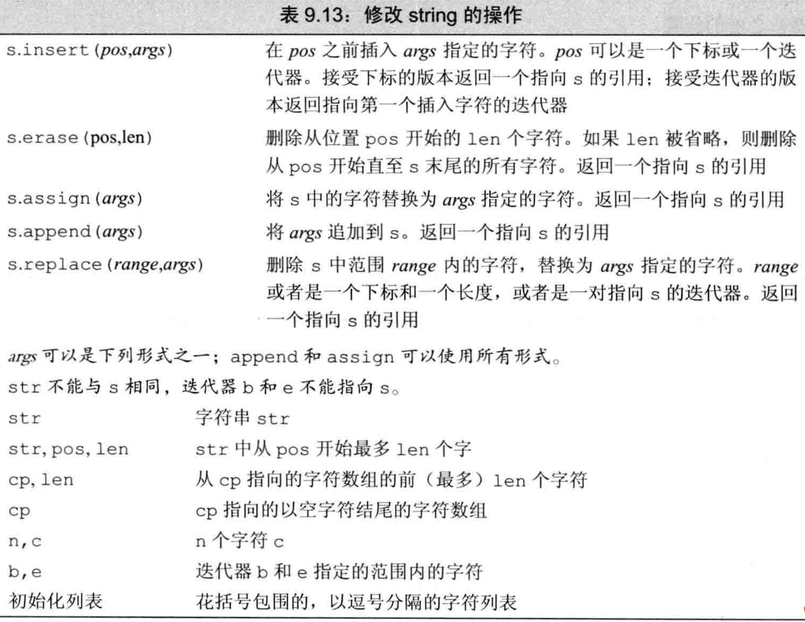
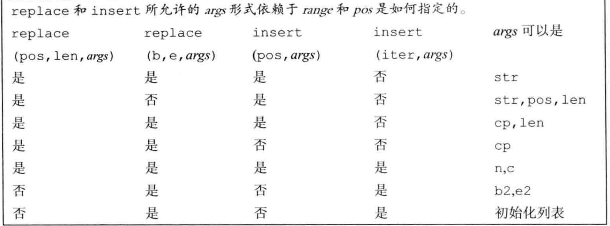
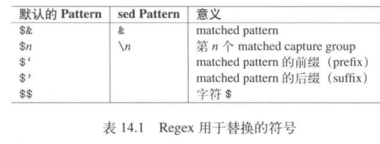

C++的字符串操作非常多，功能也非常多样化，熟练使用标准库提供的字符串操作函数能够高效提升我们编写代码的效率和可读性。除了常用的<string>库中包含的几项基本操作之外，本文总结了几项特别好用而又不为人所知的高级操作。
<!-- more -->

## 常见的基本操作回顾

必须指明，<string>中字符串方法可以按照输入参数的类型不同调用不同的重载方法，这些函数名相同，但是参数类型和顺序完全不同，返回值也略有差别。

部分函数，包括insert和erase等函数可分为两类，如果输入的位置参数`pos`为整数`int`，此时返回值为**被插入字符串**的引用；而输入的位置参数类型为迭代器`iterator`，则会调用返回迭代器的函数，该迭代器**指向被插入部分的头部**。

而且<string>部分函数为了兼容C原生字符串，提供了一批适用于C String构造接口，这又产生了一大批只有参数顺序不同的同名函数。比如对于string构造方法上，输入原生string和输入C String的参数含义完全不同。

这些同名、功能相似但不同参数的函数使得C++新人学习标准库时容易产生极大的困扰。

### 1. 构造string

```cpp
const char * cp = "Hello World!!!";
char noNull[] = {'H', 'i'};
```

输入一个char类型的指针，以及偏移量。转换从指针开始的偏移量个字符。  
如果未指定偏移量，则默认转化到碰到'\0'为止。  
没有'\0'结尾则该行为未定义。  

```cpp
string s1(cp); // 从C风格字符串转化
string s2(noNull, 2); // 指定转化的字符个数
string s3(noNull); // 未定义，因为noNull不是以空字符结尾
string s4(cp + 6, 5); 
```

拷贝构造函数，从其他string拷贝  
指定拷贝位置和拷贝字符个数  
不指定pos则默认从头拷贝  
不指定len则默认从pos开始全拷贝  
pos越界则抛出异常  
len越界没问题，只到'\0'  

```cpp
string s5(s1, 6, 5);
string s6(s1, 6);
string s7(s1, 6, 20);
string s8(s1, 16);
```

substr函数，输入pos和len  
返回由该字符串的第pos位置拷贝len个字符组成的新子串  

```cpp
string s9 = s1.substr(0, 5);
```

### 2. 改变string

以insert为例，简单介绍不同参数重载的不同insert。

insert除了接受迭代器的版本之外，还有直接接受下标的版本。返回值为被插入字符串的引用。
s.insert(pos, count, char)
s.insert(pos, char_ptr, len)
s.insert(pos, string, pos, len)

第一个位置总会是pos，表示被插入位置；

第二个参数如果是个数，那么你调用的是第一个insert函数，其含义为重复插入第三个参数char所制定的内容；

第二个参数如果是C风格字符串，那么第三个参数可以指出插入长度，不指名就默认把该C风格字符串全插到pos的位置；

第二个参数如果是string，那么你还需在string参数后指定从哪个pos开始插，并且指定len表示插入多少个。相对于插入C风格字符串的insert来说，插入string更灵活。

其他函数及其说明见下表。




## 搜索字符串

<string>定义了六种不同的搜索方法，每种方法拥有四个重载版本。


需要注意的有两点：
1. 搜索函数返回类型为string::size_type，为无符号整数类型。
2. 搜索失败时，返回string::npos，该值为-1，也就是无符号整数最大的值。

## 正则表达式库

正则表达式是字符串匹配的有力工具。C++11加入了对正则表达式的支持，具体定义位于<regex>头文件中。

在C++中，正则表达式可以做的工作有：
- Match 将整个输入拿来比对（匹配）某个正则表达式
- Search 查找与正则表达式吻合的子串
- Tokenize 根据正则表达式切分字符串
- Replace 根据正则表达式替换字符串

### 第一种应用：Match和Search

具体流程可概括为：定义、匹配、判断
```cpp
regex reg("<.*>.*</.*>"); // 定义
bool isExist = regex_match(string, reg); // 匹配整体
//or
bool isExist = regex_search(string, reg); // 匹配部分
cout << boolalpha << isExist << endl; // 判断
```

你可能已经注意到了，regex_match和regex_search返回的仅仅是一个bool值，表明是否匹配。我们还需要匹配的位置。此时我们需要一个`match`对象来保存结果。`match`对象的方法如下所示。

```cpp
smatch m;
bool isExist = regex_search(string, m, reg); // 结果保存在m中
m.empty()
m.size() // 返回匹配个数
m.str(i) // 类似于python中group，返回第i个匹配位置的字符串。i=0则返回全部
m.length(i) // 同上，返回第i个匹配字符串的长度
m.position(i) // 同上，返回第i个匹配字符串的位置
m.prefix().str() // 已匹配位置之前的字符串，字符串前缀
m.suffix().str() // 已匹配位置之后的字符串，字符串后缀
for (auto pos = m.begin(); pos != m.end(); ++pos) {
    cout << *pos << endl;
}

代码中的参数i，代表了正则表达式中存在分组，i为提取分组i的被匹配内容。类似python中的group。分组操作是正则表达式的语法，本文不再赘述。

```
`match`对象根据保存内容类型不同分成
- `smatch` 匹配string
- `cmatch` 匹配C风格字符串
- `wsmatch` 匹配wstring
- `wcmatch` 匹配const wchar_t*

### 第二种应用：Regex Iterator

data可能很长，reg可能会多次匹配。为了迭代所有的匹配成果，我们可以使用regex_iterator。根据类型不同，分别是
`sregex_iterator`
`cregex_iterator`
`wsregex_iterator`
`wcregex_iterator`

```cpp
regex reg("...");
sregex_iterator pos(data.cbegin(), data.cend(), reg);
sregex_iterator end;
for (; pos != end; ++pos) {
    cout << pos->str() << endl;
}
```

### 第三种应用：Regex Token Iterator

你可能关注的不是被匹配的字符串，而是其余的字符串。此时正则表达式串就像是切割刀一样，将data分割成不含被匹配串的几部分。我们可以利用此功能实现C++中一直没能实现的字符串分割函数split。

```cpp
string data = "qqq www    eee rrr";
regex r("\\s+");
sregex_token_iterator pos(data.cbegin(), data.cend(), r, -1); // -1代表你对正则表达式匹配的内容不感兴趣
sregex_token_iterator end;
for (; pos != end; ++pos) {
    cout << *pos << endl;
}
```

### 第四种应用：替换

下面的代码将
```html
<person><first>Nico</first></person>
```
替换成
```html
<person><first value="Nico"/></person>
```
```cpp
string data = "<person><first>Nico</first></person>"
regex reg("<(.*)>(.*)</(\\1)>");
string replace_pattern = "<$1 value=\"$2\"/>";
cout << regex_replace(data, reg, replace_pattern) << endl;
```

模式替换串用$n指定第几个匹配部分group(n)
$1 value=$2 含义即为原来是group(1)的部分替换成group(2)的内容。



## string_view

C++17加入了string_view对象，能够避免string类型的复制临时对象操作。

- string_view对象由两部分组成，分别是**数据的起始指针**和**数据的长度**。有点类似于带其他语言表示字符串的方法，不依赖`'\0'`在结尾，而是通过一个变量记忆长度。
- string_view只读，不能修改。可以很好地作为函数的参数和返回值

```cpp
//使用string的拷贝操作
string s(1000, '0');
string sub_s = s.substr(100, 200); // O(n)
//使用view则不需要拷贝
string_view sv(s); // no copy
string_view sv2 = sv.substr(100, 200); // O(1)
```