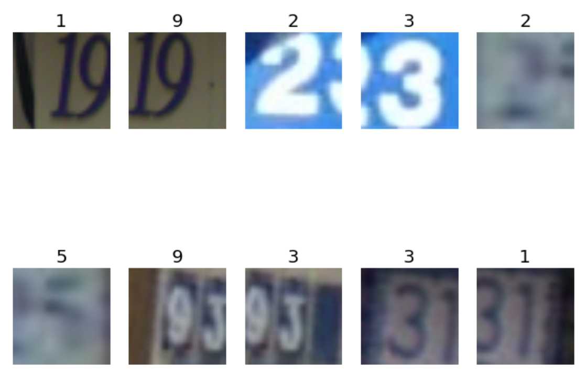
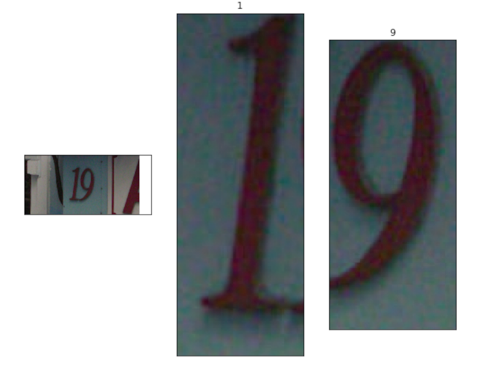

本次新人赛是Datawhale与天池联合发起的0基础入门系列赛事第二场 —— 零基础入门CV之街景字符识别比赛。
<!--more--->
# Datawhale小组学习之街景字符编码识别任务——Task01：赛题理解

## 1. 大赛简介

本次新人赛是Datawhale与天池联合发起的0基础入门系列赛事第二场 —— 零基础入门CV之街景字符识别比赛。

### 1.1 赛题数据介绍

赛题来源自Google街景图像中的门牌号数据集（The Street View House Numbers Dataset, SVHN），该数据来自真实场景的门牌号。

训练集数据包括3W张照片，验证集数据包括1W张照片，每张照片包括颜色图像和对应的编码类别和具体位置

### 1.2 参赛规则

- 比赛允许使用CIFAR-10和ImageNet数据集的预训练模型，不允许使用其他任何预训练模型和任何外部数据；
- 报名成功后，选手下载数据，在本地调试算法，提交结果；
- 提交后将进行实时评测；每天排行榜更新时间为12:00和20:00，按照评测指标得分从高到低排序；排行榜将选择历史最优成绩进行展示。

### 1.3 数据集简介

所有的数据（训练集、验证集和测试集）的标注使用JSON格式，并使用文件名进行索引。
 
| Field  | Description|
| --------- | --------|
| top	| 左上角坐标X |
| height | 字符高度 |
| left   | 左上角最表Y |
| width  | 字符宽度 |
| label  | 字符编码 |

字符的坐标具体如下所示：
  

在比赛数据（训练集和验证集）中，同一张图片中可能包括一个或者多个字符，因此在比赛数据的JSON标注中，会有两个字符的边框信息： 
|原始图片|图片JSON标注|
|----|-----|
    |   |

在[SVHN官网](http://ufldl.stanford.edu/housenumbers/)上下载数据集的话，有两种格式可供选择：

#### 第一种格式

第一种格式的数据集，除了原始图像之外还包括边界框信息。每个tar.gz文件都包含png格式的原始图像，以及一个digitStruct.mat文件。边界框信息存储在digitStruct.mat文件中，而不是直接绘制在数据集中的图像上。以`.mat`结尾的文件是matlab专用文件，可以使用python的scipy库打开，内部装的是类似json的字典。

digitStruct中的每个元素都有以下字段：
* name是一个字符串，其中包含相应图像的文件名。
* bbox是一个结构数组，包含图像中每个数字边界框的位置，大小和标签。

例如：digitStruct（300）.bbox（2）.height则是第300张图片中第二个数字边界框的高度。

#### 第二种格式

为了降低难度，将上述第一种格式的图片都被剪切到只剩下有效字符，并被缩放至32*32像素的标准大小，以方便识别。图片的边界框经过适当的选择，避免出现扭曲等状况。尽管如此，这种处理还是可能导致引入一些错误信息。

train_32x32.mat和test_32x32.mat，`.mat`文件中包含两个变量,X是一个4D的矩阵，维度是(32,32,3,n),n是数据个数,y是label变量。看一下前十张图：

```python
import scipy.io as sio
import matplotlib.pyplot as plt

print ('Loading Matlab data.')
mat = sio.loadmat('train_32x32.mat')
data = mat['X']
label = mat['y']
for i in range(10):
    plt.subplot(2,5,i+1)
    plt.title(label[i][0])
    plt.imshow(data[...,i])
    plt.axis('off')
plt.show()
```


### 1.4 成绩评定方式

评价标准为准确率。
选手提交结果与实际图片的编码进行对比，以编码整体识别准确率为评价指标，结果越大越好，具体计算公式如下：
 
 Score=编码识别正确的数量/测试集图片数量   

### 1.5 结果提交格式

提交前请确保预测结果的格式与sample_submit.csv中的格式一致，以及提交文件后缀名为csv。  
形式如下： 
file_name, file_code  
0010000.jpg,451 
0010001.jpg,232
0010002.jpg,45
0010003.jpg,67
0010004.jpg,191
0010005.jpg,892 

## 2. 数据读取

JSON中标签的读取方式：  
 
```python
import json
train_json = json.load(open('../input/train.json'))

# 数据标注处理
def parse_json(d):
    arr = np.array([
        d['top'], d['height'], d['left'],  d['width'], d['label']
    ])
    arr = arr.astype(int)
    return arr

img = cv2.imread('../input/train/000000.png')
arr = parse_json(train_json['000000.png'])

plt.figure(figsize=(10, 10))
plt.subplot(1, arr.shape[1]+1, 1)
plt.imshow(img)
plt.xticks([]); plt.yticks([])

for idx in range(arr.shape[1]):
    plt.subplot(1, arr.shape[1]+1, idx+2)
    plt.imshow(img[arr[0, idx]:arr[0, idx]+arr[1, idx],arr[2, idx]:arr[2, idx]+arr[3, idx]])
    plt.title(arr[4, idx])
    plt.xticks([]); plt.yticks([])
```



## 3. 解题思路

赛题思路分析：赛题本质是分类问题，需要对图片的字符进行识别。但赛题给定的数据图片中不同图片中包含的字符数量不等，如下图所示。有的图片的字符个数为2，有的图片字符个数为3，有的图片字符个数为4。 
  
  |字符属性|图片|
 |----|-----|
 |字符：42   字符个数：2    |   |
 |字符：241   字符个数：3    |   |
 |字符：7358   字符个数：4    |   |
  
因此本次赛题的难点是需要对不定长的字符进行识别，与传统的图像分类任务有所不同。为了降低参赛难度，我们提供了一些解题思路供大家参考：
 
- 简单入门思路：定长字符识别    

可以将赛题抽象为一个定长字符识别问题，在赛题数据集中大部分图像中字符个数为2-4个，最多的字符    个数为6个。  
因此可以对于所有的图像都抽象为6个字符的识别问题，字符23填充为23XXXX，字符231填充为231XXX。 
   

经过填充之后，原始的赛题可以简化了6个字符的分类问题。在每个字符的分类中会进行11个类别的分类，假如分类为填充字符，则表明该字符为空。    
- 专业字符识别思路：不定长字符识别 
   
 
  
在字符识别研究中，有特定的方法来解决此种不定长的字符识别问题，比较典型的有CRNN字符识别模型。
在本次赛题中给定的图像数据都比较规整，可以视为一个单词或者一个句子。   

- 专业分类思路：检测再识别
 
在赛题数据中已经给出了训练集、验证集中所有图片中字符的位置，因此可以首先将字符的位置进行识别，利用物体检测的思路完成。   
 
 
  
此种思路需要参赛选手构建字符检测模型，对测试集中的字符进行识别。选手可以参考物体检测模型SSD或者YOLO来完成。    

## 4. Baseline思路：将不定长字符转换为定长字符的识别问题，并使用CNN完成训练和验证

###  4.1 运行环境及安装示例   

- 运行环境要求：Python2/3，Pytorch1.x，内存4G，有无GPU都可以。         
                        
下面给出python3.7+ torch1.3.1gpu版本的环境安装示例：      
                               
- 首先在Anaconda中创建一个专门用于本次天池练习赛的虚拟环境。          
>$conda create -n py37_torch131 python=3.7      
                                
- 激活环境，并安装pytorch1.3.1                                     
>$source activate py37_torch131                          
 $conda install pytorch=1.3.1 torchvision cudatoolkit=10.0                     
       
- 通过下面的命令一键安装所需其它依赖库     
>$pip install jupyter tqdm opencv-python matplotlib pandas                                  
       
- 启动notebook，即可开始baseline代码的学习                  
>$jupyter-notebook   
    
- 假设所有的赛题输入文件放在../input/目录下，首先导入常用的包：

```python
import os, sys, glob, shutil, json
os.environ["CUDA_VISIBLE_DEVICES"] = '0'
import cv2

from PIL import Image
import numpy as np

from tqdm import tqdm, tqdm_notebook

import torch
torch.manual_seed(0)
torch.backends.cudnn.deterministic = False
torch.backends.cudnn.benchmark = True

import torchvision.models as models
import torchvision.transforms as transforms
import torchvision.datasets as datasets
import torch.nn as nn
import torch.nn.functional as F
import torch.optim as optim
from torch.autograd import Variable
from torch.utils.data.dataset import Dataset
```

### 4.2 步骤

- 赛题数据读取（封装为Pytorch的Dataset和DataLoder）
- 构建CNN模型（使用Pytorch搭建）
- 模型训练与验证
- 模型结果预测

#### 步骤1：定义好读取图像的Dataset

```python
class SVHNDataset(Dataset):
    def __init__(self, img_path, img_label, transform=None):
        self.img_path = img_path
        self.img_label = img_label 
        if transform is not None:
            self.transform = transform
        else:
            self.transform = None

    def __getitem__(self, index):
        img = Image.open(self.img_path[index]).convert('RGB')

        if self.transform is not None:
            img = self.transform(img)
        
        # 设置最长的字符长度为5个
        lbl = np.array(self.img_label[index], dtype=np.int)
        lbl = list(lbl)  + (5 - len(lbl)) * [10]
        return img, torch.from_numpy(np.array(lbl[:5]))

    def __len__(self):
        return len(self.img_path)
```
     
#### 步骤2：定义好训练数据和验证数据的Dataset

```python
train_path = glob.glob('../input/train/*.png')
train_path.sort()
train_json = json.load(open('../input/train.json'))
train_label = [train_json[x]['label'] for x in train_json]
print(len(train_path), len(train_label))

train_loader = torch.utils.data.DataLoader(
    SVHNDataset(train_path, train_label,
                transforms.Compose([
                    transforms.Resize((64, 128)),
                    transforms.RandomCrop((60, 120)),
                    transforms.ColorJitter(0.3, 0.3, 0.2),
                    transforms.RandomRotation(5),
                    transforms.ToTensor(),
                    transforms.Normalize([0.485, 0.456, 0.406], [0.229, 0.224, 0.225])
    ])), 
    batch_size=40, 
    shuffle=True, 
    num_workers=10,
)

val_path = glob.glob('../input/val/*.png')
val_path.sort()
val_json = json.load(open('../input/val.json'))
val_label = [val_json[x]['label'] for x in val_json]
print(len(val_path), len(val_label))

val_loader = torch.utils.data.DataLoader(
    SVHNDataset(val_path, val_label,
                transforms.Compose([
                    transforms.Resize((60, 120)),
                    # transforms.ColorJitter(0.3, 0.3, 0.2),
                    # transforms.RandomRotation(5),
                    transforms.ToTensor(),
                    transforms.Normalize([0.485, 0.456, 0.406], [0.229, 0.224, 0.225])
    ])), 
    batch_size=40, 
    shuffle=False, 
    num_workers=10,
)
``` 

#### 步骤3：定义好字符分类模型，使用renset18的模型作为特征提取模块

```python
class SVHN_Model1(nn.Module):
    def __init__(self):
        super(SVHN_Model1, self).__init__()
                
        model_conv = models.resnet18(pretrained=True)
        model_conv.avgpool = nn.AdaptiveAvgPool2d(1)
        model_conv = nn.Sequential(*list(model_conv.children())[:-1])
        self.cnn = model_conv
        
        self.fc1 = nn.Linear(512, 11)
        self.fc2 = nn.Linear(512, 11)
        self.fc3 = nn.Linear(512, 11)
        self.fc4 = nn.Linear(512, 11)
        self.fc5 = nn.Linear(512, 11)
    
    def forward(self, img):        
        feat = self.cnn(img)
        # print(feat.shape)
        feat = feat.view(feat.shape[0], -1)
        c1 = self.fc1(feat)
        c2 = self.fc2(feat)
        c3 = self.fc3(feat)
        c4 = self.fc4(feat)
        c5 = self.fc5(feat)
        return c1, c2, c3, c4, c5
```
       
#### 步骤4：定义好训练、验证和预测模块

```python
def train(train_loader, model, criterion, optimizer):
    # 切换模型为训练模式
    model.train()
    train_loss = []
    
    for i, (input, target) in enumerate(train_loader):
        if use_cuda:
            input = input.cuda()
            target = target.cuda()
            
        c0, c1, c2, c3, c4 = model(input)
        loss = criterion(c0, target[:, 0]) + \
                criterion(c1, target[:, 1]) + \
                criterion(c2, target[:, 2]) + \
                criterion(c3, target[:, 3]) + \
                criterion(c4, target[:, 4])
        
        # loss /= 6
        optimizer.zero_grad()
        loss.backward()
        optimizer.step()
        
        if i % 100 == 0:
            print(loss.item())
        
        train_loss.append(loss.item())
    return np.mean(train_loss)

def validate(val_loader, model, criterion):
    # 切换模型为预测模型
    model.eval()
    val_loss = []

    # 不记录模型梯度信息
    with torch.no_grad():
        for i, (input, target) in enumerate(val_loader):
            if use_cuda:
                input = input.cuda()
                target = target.cuda()
            
            c0, c1, c2, c3, c4 = model(input)
            loss = criterion(c0, target[:, 0]) + \
                    criterion(c1, target[:, 1]) + \
                    criterion(c2, target[:, 2]) + \
                    criterion(c3, target[:, 3]) + \
                    criterion(c4, target[:, 4])
            # loss /= 6
            val_loss.append(loss.item())
    return np.mean(val_loss)

def predict(test_loader, model, tta=10):
    model.eval()
    test_pred_tta = None
    
    # TTA 次数
    for _ in range(tta):
        test_pred = []
    
        with torch.no_grad():
            for i, (input, target) in enumerate(test_loader):
                if use_cuda:
                    input = input.cuda()
                
                c0, c1, c2, c3, c4 = model(input)
                output = np.concatenate([
                    c0.data.numpy(), 
                    c1.data.numpy(),
                    c2.data.numpy(), 
                    c3.data.numpy(),
                    c4.data.numpy()], axis=1)
                test_pred.append(output)
        
        test_pred = np.vstack(test_pred)
        if test_pred_tta is None:
            test_pred_tta = test_pred
        else:
            test_pred_tta += test_pred
    
    return test_pred_tta
```
                 
#### 步骤5：迭代训练和验证模型

```python
model = SVHN_Model1()
criterion = nn.CrossEntropyLoss()
optimizer = torch.optim.Adam(model.parameters(), 0.001)
best_loss = 1000.0

use_cuda = False
if use_cuda:
    model = model.cuda()

for epoch in range(2):
    train_loss = train(train_loader, model, criterion, optimizer, epoch)
    val_loss = validate(val_loader, model, criterion)
    
    val_label = [''.join(map(str, x)) for x in val_loader.dataset.img_label]
    val_predict_label = predict(val_loader, model, 1)
    val_predict_label = np.vstack([
        val_predict_label[:, :11].argmax(1),
        val_predict_label[:, 11:22].argmax(1),
        val_predict_label[:, 22:33].argmax(1),
        val_predict_label[:, 33:44].argmax(1),
        val_predict_label[:, 44:55].argmax(1),
    ]).T
    val_label_pred = []
    for x in val_predict_label:
        val_label_pred.append(''.join(map(str, x[x!=10])))
    
    val_char_acc = np.mean(np.array(val_label_pred) == np.array(val_label))
    
    print('Epoch: {0}, Train loss: {1} \t Val loss: {2}'.format(epoch, train_loss, val_loss))
    print(val_char_acc)
    # 记录下验证集精度
    if val_loss < best_loss:
        best_loss = val_loss
        torch.save(model.state_dict(), './model.pt')
```
     
训练两个2 Epoch后，输出的训练日志为：
         
Epoch: 0, Train loss: 3.1 	 Val loss: 3.4 验证集精度：0.3439       
Epoch: 1, Train loss: 2.1 	 Val loss: 2.9 验证集精度：0.4346     

#### 步骤6：对测试集样本进行预测，生成提交文件      

```python
test_path = glob.glob('../input/test_a/*.png')
test_path.sort()
test_label = [[1]] * len(test_path)
print(len(val_path), len(val_label))

test_loader = torch.utils.data.DataLoader(
    SVHNDataset(test_path, test_label,
                transforms.Compose([
                    transforms.Resize((64, 128)),
                    transforms.RandomCrop((60, 120)),
                    # transforms.ColorJitter(0.3, 0.3, 0.2),
                    # transforms.RandomRotation(5),
                    transforms.ToTensor(),
                    transforms.Normalize([0.485, 0.456, 0.406], [0.229, 0.224, 0.225])
    ])), 
    batch_size=40, 
    shuffle=False, 
    num_workers=10,
)

test_predict_label = predict(test_loader, model, 1)

test_label = [''.join(map(str, x)) for x in test_loader.dataset.img_label]
test_predict_label = np.vstack([
    test_predict_label[:, :11].argmax(1),
    test_predict_label[:, 11:22].argmax(1),
    test_predict_label[:, 22:33].argmax(1),
    test_predict_label[:, 33:44].argmax(1),
    test_predict_label[:, 44:55].argmax(1),
]).T

test_label_pred = []
for x in test_predict_label:
    test_label_pred.append(''.join(map(str, x[x!=10])))
    
import pandas as pd
df_submit = pd.read_csv('../input/test_A_sample_submit.csv')
df_submit['file_code'] = test_label_pred
df_submit.to_csv('renset18.csv', index=None)
```

**在训练完成2个Epoch后，模型在测试集上的成绩应该在0.33左右。**    
