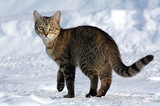
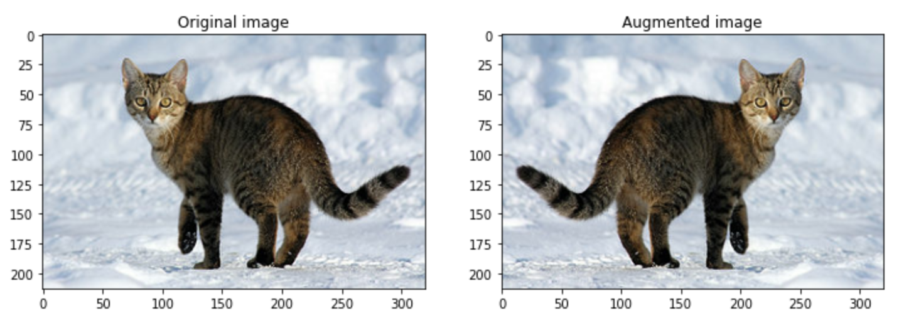
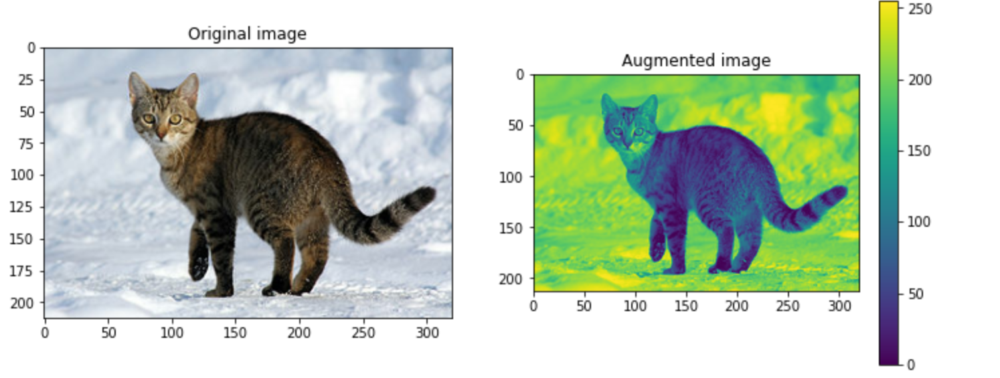
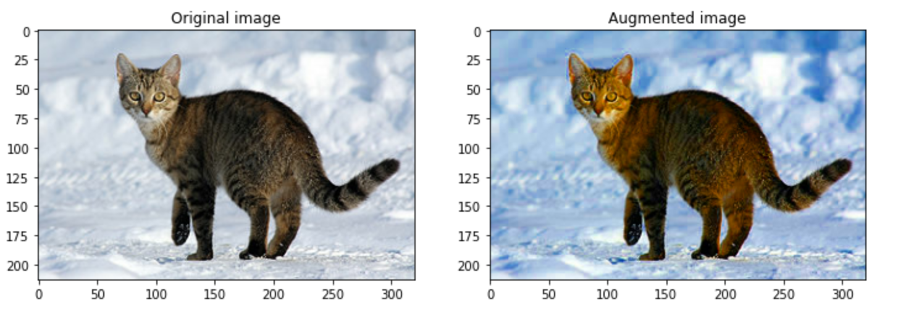
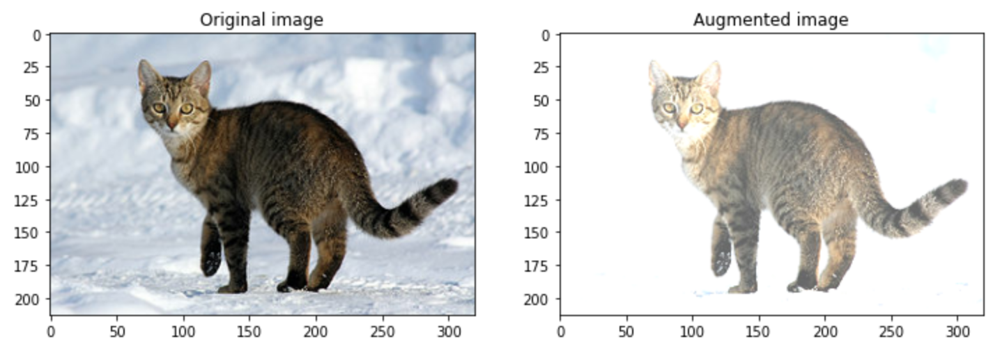
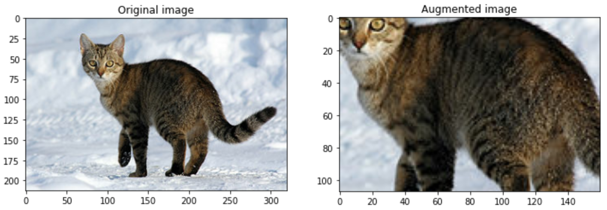
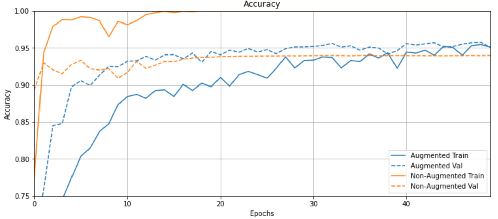

训练模型第一步、数据读取和扩增！
<!--more--->

## 数据读取

图像领域的数据读取方法，使用Pillow或者OpenCV内置的函数即可。

## 数据扩增

在读取图像时，还可以对原始图像添加扰动等，这就启发我们一件事：是不是对原数据增加一些扰动，就可以使其变成新的数据呢？

下面介绍利用该思想的数据扩增环节。

### 1. 数据扩增为什么会有用

数据扩增的最常见作用，是增加数据集，用以缓解样本量不足导致的模型过拟合现象，从而提升模型的泛化性能。

究其本质，还是扩展数据集的多样性。

试想一下，我们如果想要试图训练一个完美模型，必然要利用完美的架构+完美的训练集，这个完美的训练集必然要覆盖到样本空间的方方面面。

我们当然不可能真的搞到无限多的样本。所以为了尽可能趋近于这个目标，就要试图以有限的数据集覆盖无限的样本空间。

每个样本在样本空间中就是一个坐标点。通过添加扰动，就能生成许多个在该样本点附近的增强样本。

上一个利用样本空间中添加扰动、从而生成与原样本很相似的应用，叫做**生成对抗样本**。

数据增强和对抗样本生成之间的区别在于，数据增强要保证扰动之后样本不能和原样本有区别；然而对抗样本生成则保证**必须**与原样本有区别。

有一些学者也通过将对抗样本添加至模型重训练的方法，使模型的泛化性能得到了提高。这说明数据增强和对抗样本的生效原理是一样的，都是通过扩大样本覆盖的样本空间的程度，通俗来讲就是模型见多识广了，再碰到新的问题也不怕了。

可以参考这篇论文：[Do CNNs Encode Data Augmentations?](https://arxiv.org/abs/2003.08773)

### 2. 常见的数据扩增

#### 2.1 图像数据扩增

* 色彩抖动（Color Jittering）  
调整图片的亮度、饱和度、对比度，针对图像的颜色进行的数据增强。
对比度受限自适应直方图均衡化算法（Clahe），锐化（Sharpen），凸点（Emboss）

* 主成分噪声（PCA  Jittering）  
首先按照RGB三个颜色通道计算均值和标准差，对网络的输入数据进行规范化；再在整个训练集上计算协方差矩阵，进行特征分解，得到特征向量和特征值，最后做PCA Jittering；最后对RGB空间做PCA，然后对主成分做一个(0, 0.1)的高斯扰动。

* 弹性变换（Elastic Transform）

算法一开始是由Patrice等人在2003年的ICDAR上发表的《Best Practices for Convolutional Neural Networks Applied to Visual Document Analysis》提出的，最开始应用在mnist手写体数字识别数据集中。当前也有很多人把该方法应用到手写体汉字的识别问题中。

首先对于图像中的每个像素点，产生对应的随机数对$(\Delta x, \Delta y)$，大小介于-1~1之间，分别表示该像素点的x方向和y方向的移动距离；
然后生成一个以0为均值，以σ为标准差的高斯核$k_{nn}$，并用前面的随机数与之做卷积，并将结果作用于原图像。


参考：
https://www.kaggle.com/jiqiujia/elastic-transform-for-data-augmentation  
https://blog.csdn.net/lhanchao/article/details/54234490


还有诸如透视变换（Perspective Transform）、分段仿射变换（Piecewise Affine transforms）、枕形畸变（Pincushion Distortion）等不同的图像变换操作。

根据Datawhale大佬分享，对于本次题目（SVHN街道彩色数字识别），最常见的、最有效的数据扩增方法是：
* 随机改变大小（resize）
* 随机切割（randomcrop），即从原始图像中，随机的crop出一些图像。

鉴于本次数据集中的图片大小不一，一般一开始我们都需要resize到指定大小。但也有的文章中提到了，先对图片resize会使得图片长宽比发生变化，造成失真。所以我们要具体问题具体分析。

我在博客中也有分享过一篇讲述图像数据增强的[相关论文]()，大家可以看一下。

#### 2.2 文本数据增强

此部分参考我的[文本数据增强]()，而且由于本次赛题并不必进行文本数据增强，因此就不在这里赘述了。

### 3.. 数据扩增实战——使用tensorflow

大家都用的Pytorch吗？不会只有我自己用tensorflow吧。我来给大家介绍一下tensorflow是怎么做数据扩增的。

参考：[TensorFlow Core](https://www.tensorflow.org/tutorials/images/data_augmentation)

#### 1. 准备

```python
# 首先安装一个tensorflow_docs的库
!pip install git+https://github.com/tensorflow/docs

import urllib # 负责下载网上的图片

import tensorflow as tf
from tensorflow.keras.datasets import mnist
from tensorflow.keras import layers
AUTOTUNE = tf.data.experimental.AUTOTUNE

import tensorflow_docs as tfdocs
import tensorflow_docs.plots

import tensorflow_datasets as tfds

import PIL.Image # 大名鼎鼎PIL

import matplotlib.pyplot as plt
import matplotlib as mpl
mpl.rcParams['figure.figsize'] = (12, 5)

import numpy as np
```

下载一张示例图片：

```python
image_path = tf.keras.utils.get_file("cat.jpg", "https://storage.googleapis.com/download.tensorflow.org/example_images/320px-Felis_catus-cat_on_snow.jpg")
PIL.Image.open(image_path)
```



将该图片解析成tensor

```python
image_string=tf.io.read_file(image_path)
image=tf.image.decode_jpeg(image_string,channels=3)
```
定义一个函数，用于可视化图像。

```python
def visualize(original, augmented):
  fig = plt.figure()
  plt.subplot(1,2,1)
  plt.title('Original image')
  plt.imshow(original)

  plt.subplot(1,2,2)
  plt.title('Augmented image')
  plt.imshow(augmented)
```

#### 2. 执行数据扩增

**翻转图像**

```python
flipped = tf.image.flip_left_right(image)
visualize(image, flipped)
```


**灰度处理**

```python
grayscaled = tf.image.rgb_to_grayscale(image)
visualize(image, tf.squeeze(grayscaled))
plt.colorbar()
```


**改变图像饱和度**

```python
saturated = tf.image.adjust_saturation(image, 3)
visualize(image, saturated)
```



**改变图像亮度**

```python
bright = tf.image.adjust_brightness(image, 0.4)
visualize(image, bright)
```



**旋转图像**

```python
rotated = tf.image.rot90(image)
visualize(image, rotated)
```


**中心放大并裁剪图像**

```python
cropped = tf.image.central_crop(image, central_fraction=0.5)
visualize(image,cropped)
```



等等此类操作，不一而足。大家感兴趣的可以查阅tensorflow的`tf.image`文档。

#### 3. 使用扩增数据集训练

我们构造一个模型，该模型架构为纯全连接网络，数据集为MNIST手写数字识别数据集。我们可以直接在tensorflow_datasets这个库中使用这个数据集。

```python
dataset, info =  tfds.load('mnist', as_supervised=True, with_info=True)
train_dataset, test_dataset = dataset['train'], dataset['test']

num_train_examples= info.splits['train'].num_examples
```

编写函数执行对原来数据集的扩增操作。

```python
def convert(image, label):
  image = tf.image.convert_image_dtype(image, tf.float32) # Cast and normalize the image to [0,1]
  return image, label

def augment(image,label):
  image,label = convert(image, label)
  image = tf.image.convert_image_dtype(image, tf.float32) # Cast and normalize the image to [0,1]
  image = tf.image.resize_with_crop_or_pad(image, 34, 34) # Add 6 pixels of padding
  image = tf.image.random_crop(image, size=[28, 28, 1]) # Random crop back to 28x28
  image = tf.image.random_brightness(image, max_delta=0.5) # Random brightness

  return image,label
```

```python
BATCH_SIZE = 64
# Only use a subset of the data so it's easier to overfit, for this tutorial
NUM_EXAMPLES = 2048
```

创建扩增后的数据集

```python
augmented_train_batches = (
    train_dataset
    # Only train on a subset, so you can quickly see the effect.
    .take(NUM_EXAMPLES)
    .cache()
    .shuffle(num_train_examples//4)
    # The augmentation is added here.
    .map(augment, num_parallel_calls=AUTOTUNE)
    .batch(BATCH_SIZE)
    .prefetch(AUTOTUNE)
) 
```

为了对照，我们创建没有扩增的数据集。

```python
non_augmented_train_batches = (
    train_dataset
    # Only train on a subset, so you can quickly see the effect.
    .take(NUM_EXAMPLES)
    .cache()
    .shuffle(num_train_examples//4)
    # No augmentation.
    .map(convert, num_parallel_calls=AUTOTUNE)
    .batch(BATCH_SIZE)
    .prefetch(AUTOTUNE)
) 
```

设置验证集。验证集与数据增不增强无关，反正我们不使用验证机训练，只用于最后的打分。

```python
validation_batches = (
    test_dataset
    .map(convert, num_parallel_calls=AUTOTUNE)
    .batch(2*BATCH_SIZE)
)
```

建立模型。注意这个模型纯粹是为了体现数据扩增的效果而专门构建的，因为卷积网络CNN即便是不用数据扩增也能很好地解决MNIST手写数字识别问题，这样比较起来效果就不明显了。两层4096个神经元的全连接网络，激活函数为RELU。最后是一个softmax层分类。

```python
def make_model():
  model = tf.keras.Sequential([
      layers.Flatten(input_shape=(28, 28, 1)),
      layers.Dense(4096, activation='relu'),
      layers.Dense(4096, activation='relu'),
      layers.Dense(10)
  ])
  model.compile(optimizer = 'adam',
                loss=tf.losses.SparseCategoricalCrossentropy(from_logits=True),
                metrics=['accuracy'])
  return model
```

先使用**没有经过数据扩增**的数据训练模型，并记录其精度变化和loss变化：

```python
model_without_aug = make_model()

no_aug_history = model_without_aug.fit(non_augmented_train_batches, epochs=50, validation_data=validation_batches)
```

再使用**经过扩增的数据**训练模型，并记录。

```python
model_with_aug = make_model()

aug_history = model_with_aug.fit(augmented_train_batches, epochs=50, validation_data=validation_batches)
```

最后绘制图标，看一下表现。

首先是精度随着训练轮次的变化曲线：

```python
plotter = tfdocs.plots.HistoryPlotter()
plotter.plot({"Augmented": aug_history, "Non-Augmented": no_aug_history}, metric = "accuracy")
plt.title("Accuracy")
plt.ylim([0.75,1])
```



从图中可以看出，橙色线（没有数据增强的模型）在训练的时候很容易过拟合，但是在验证集上的精度不及蓝色线（数据增强的模型）。

再来看loss变化。

```python
plotter = tfdocs.plots.HistoryPlotter()
plotter.plot({"Augmented": aug_history, "Non-Augmented": no_aug_history}, metric = "loss")
plt.title("Loss")
plt.ylim([0,1])
```


这里看的就更明显了，橙色线在训练时的loss很快就下降到趋近0，这说明模型已经很难从未经增强的数据中学到东西了，产生了严重的过拟合。

而蓝色线直到最后也在逐步地学习之中，我们可以得出结论，数据增强的确有助于避免过拟合、增强模型的泛化性能。

