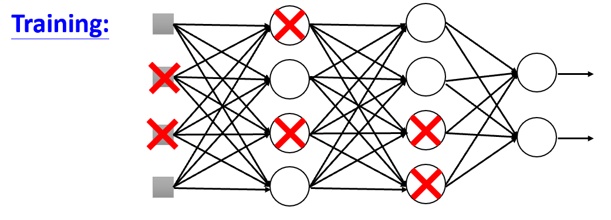

模型的训练和验证过程，基本到了最后咯。
<!--more--->

## 1. 集成学习

集成学习的一般结构，是首先产生一组“个体学习器”，再用**某种策略**将其结合起来。类似于“三个臭皮匠，顶个诸葛亮”的思想。

如果自己的**个体学习器**性能不是很令人满意，使用集成学习将能够提升一定的性能，集成学习器一般都能够获得比个体学习器要好的效果。

集成学习效果要提升，要尽可能满足两个条件：

1. 个体学习器性能不太差；
2. 个体学习器之间不能太相似，结构、所用数据差异越大越好。

可以证明，如果个体学习器之间的决策误差不存在关联，决策相互独立，那么随着个体学习器数量的增多，集成学习器的错误率将指数下降。

根据个体学习器的生成方式，目前的集成学习方法分成两大类：

1. 个体学习器之间存在强依赖关系、必须串行生成的序列化方法，代表为Boosting；
2. 学习器之间不存在强依赖关系、可以并行的方法，代表为Bagging和随机森林。

集成学习只能在一定程度上提高精度，并需要耗费较大的训练时间。具体的集成学习方法需要与验证集划分方法结合。

### 1.1 Boosting

Boosting算法是一类能将弱学习器提升为强学习器的算法。基本思想是：先利用初始训练集训练一个基本学习器，再基于基本学习器的表现，对训练样本做出调整，改变样本分布，使得先前被分类错误的训练样本在随后受到更多关注。如此重复训练，直到基学习器的数目达到指定的数值。最终将这几个基学习器进行加权结合。

### 1.2 Bagging

欲得到泛化性能强的集成学习模型，个体学习器之间应当相互独立。但是完全独立是做不到的，即便模型架构完全不同、训练数据完全不一样，这些个体学习器也是为了解决同一个任务而训练的，训练数据之间肯定存在关系，从而导致模型的决策存在相关性。因此Bagging算法就是想要尽可能提升个体学习器之间的差异性。

一种可能的做法是对训练样本进行采样，产生若干个不同的子集，每个子集都训练一个个体学习器。但是这样学习得到的个体学习器都没能获得足够的训练样本，因此我们可以进行折中，采用互相存在交集的分割方法分割数据集，然后训练模型。

随机森林本质上是许多决策树的集合，其中每棵树都和其他树略有不同。随机森林背后的思想是，每棵树的预测可能都相对较好，但可能对部分数据过拟合。如果构造很多树，并且每棵树的预测都很好，但都以不同的方式过拟合，那么我们可以对这些树的结果取平均值来降低过拟合。既能减少过拟合又能保持树的预测能力，这可以在数学上严格证明。

## 2. 深度学习中的集成方法

### 2.1 Dropout

每个训练批次中，在更新权重之前，随机让一部分的节点停止工作，增加模型训练时的精度提升难度。

需要注意的是，训练的时候加dropout，测试的时候以及实际使用时，是不需要dropout的。这就像平时训练的时候腿上绑上沙袋，战时就能够获得更卓越的效果。有效的缓解模型过拟合

直观来讲，Dropout法使得每个节点都无法单纯依赖其他节点而滥竽充数，因为随时随地自己的同伴就可能被dropout。这样训练时，每个节点都会学到更多的知识。从而提升整体学习器的性能。因此这也算是集成学习。

### 2.2 测试集数据扩增

测试集数据扩增（Test Time Augmentation，简称TTA）也是常用的集成学习技巧，数据扩增不仅可以在训练时候用，而且可以同样在预测时候进行数据扩增，对同一个样本预测三次，然后对三次结果进行平均。

## 3. 结果后处理

* 统计图片中每个位置字符出现的频率，使用规则修正结果；
* 单独训练一个字符长度预测模型，用来预测图片中字符个数，并修正结果。