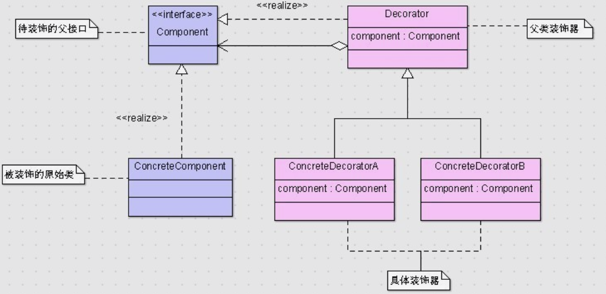

本文将介绍Python中的装饰器，以及设计模式中的装饰模式。
<!--more--->

从C/C++或Java迁移来的新Python程序员一定会对Python的装饰器功能感到陌生，尤其是在函数定义前加`@func`这一功能感到困惑。装饰器到底是什么？Python背后做了什么？在仔细研究网上的资料之后，我总结了此文，与大家分享。

[参考文章](https://www.liaoxuefeng.com/wiki/1016959663602400/1017451662295584)

## 1. 提出需求

我们想在函数增加一点功能，比如每次函数执行之前打印一段话，但是又不想更改函数的定义。

这种想要给原来函数增加需求的同时，不修改原来代码的行为，非常有“面向对象编程思想”内味儿，因为它符合“开放封闭原则”。

现在就有请大名鼎鼎的设计模式之——装饰器模式登场！

> 装饰器模式（Decorator Pattern）允许向一个现有的对象添加新的功能，同时又不改变其结构。这种类型的设计模式属于结构型模式，它是作为现有的类的一个包装。



## 2. Python中的装饰器模式

在Python中实现装饰器模式很方便。在Python中，有个功能模块直接就叫装饰器。在Python中的装饰器是指一个返回其他函数的函数。外部的高阶函数在执行内部的原函数的前后，再私藏一点干货，然后把修改后的函数对象赋值给原来的函数变量。这样就能在不修改原函数的基础上，增加一些功能。

总结下来，实现装饰器三步走：
1. 定义原函数
2. 定义高阶函数，在里面除了执行原函数之外，再添加一些功能
3. 将高阶函数对象赋值为原函数变量，以后调用原函数的时候都会执行高阶函数了

```python
def log(func):
    def wrapper(*args, **kw):
        print('call %s():' % func.__name__)
        return func(*args, **kw)
    return wrapper
```

上面的函数，输入参数为原函数变量，在内部构造了一个高阶函数对象wrapper，wrapper里面负责执行一个print语句。最后返回构造好的wrapper。

以后我们使用`func`的时候，只要使用`log(func)`就可以在执行`func`的同时，打印一段话了。

看起来不咋地啊，毕竟我们还是修改了代码，把`func`全都替换成`log(func)`才能执行。

或者我们来这样一句：

```python
func = log(func)
```

这个log函数就是一个装饰器，它现在装饰的是func函数。

## 3. Python的语法糖

借助Python的@语法，把decorator置于函数的定义处，我们可以直接完成`func = log(func)`的操作。

```python
@log
def basic_fun():
    print("basic_func")

```

以后使用basic_func就会默认执行log(basic_func)了。

## 4. 改函数名

Python的设计思想就是“一切皆对象”，就连函数也不例外。既然是对象，那么对象可以赋值给一个变量，也可以直接使用。通过变量也可以调用该函数对象。

```python
def f():
    return 0
f_obj = f # 注意，这里f为函数名，不加括号则为将函数对象赋值为变量
f_res = f() # f后面跟了括号，则此时执行函数，并把返回值赋值给变量
```

Python有个特别方便的功能，那就是函数对象可以在运行时打印自己的名字。接上面的代码：

```python
print(f.__name__) # f
print(f_obj.__name__) # 本质上还是调用上面的函数对象，结果仍为f
```

前面我们做了赋值操作`func = log(func)`，但是其变量代表的函数名称发生了变化。

```python
print(func.__name__) # func
func = log(func)
print(func.__name__) # wrapper
```

我们希望装饰器完全包裹原函数，也就是说令外界环境感觉不到内部逻辑的变化。那么就需要我们把函数名字也给保持住。这个功能不难，我们使用`functools`库中自带的装饰器`wraps`就可以保持函数名称了。

```python
import functools

def log(func):
    @functools.wraps(func) # 将被装饰函数名变成参数中函数名
    def wrapper(*args, **kw):
        print('call %s():' % func.__name__)
        return func(*args, **kw)
    return wrapper
```

## 5. 带参数的装饰器

在上面我们可以看到，装饰器也是可以带参数的。这是怎么做到的呢？

其实我们不难想到，只需装饰一个装饰器即可。比如下面这个问题：

**实现log(str)：在函数每次执行前打印str和函数名**

```python
@log('end')
def now():
    print(np.datetime64('today', 'D'))

>>> now()
end now():
2019-10-13
```

解法如下：

```python
import functools

def log(text):
    def decorator(func):
        @functools.wraps(func)
        def wrapper(*args, **kw):
            print('%s %s():' % (text, func.__name__))
            return func(*args, **kw)
        return wrapper
    return decorator
```
相当于`fun = log('text')(fun)`，实际上函数变成了`wrapper`
但是由于`@functools.wraps(func)`，函数的`__name__`不变