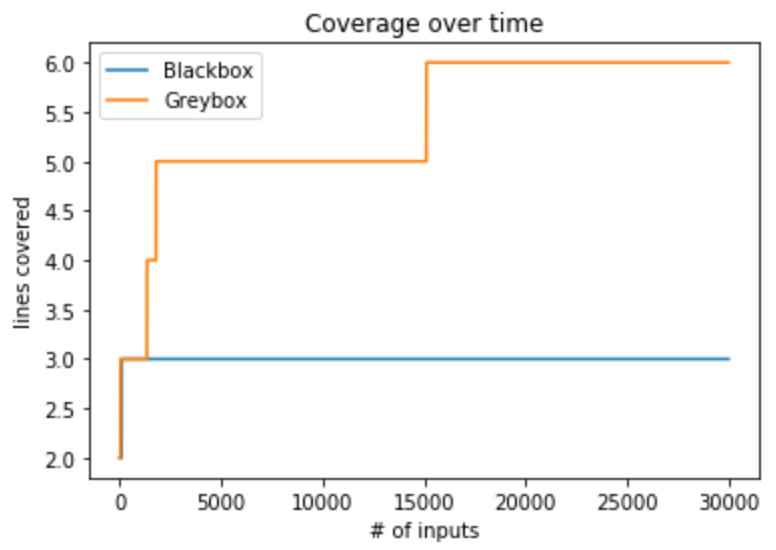

灰盒变异的模糊测试。
<!--more--->

普通fuzzing：从0开始构造测试用例
突变fuzzing：从seed开始构造测试用例
灰盒fuzzing：有引导的突变fuzzing

## 背景

上回书说到，AFL是突变fuzzer，通过把种子字符串进行些微修改，得到变异体；此外AFL还会将一个种子的前半部分与另一个种子的后半部分连接，形成变异体。

AFL也是个灰盒fuzzer，这是由于AFL需要使用程序内部信息（即覆盖率）。AFL不是白盒，因为AFL没有对程序进行约束求解、程序分析之类的，只是简单获取了一个覆盖率。如果生成的样本能够提升覆盖率，那么就将这个样本添加进种子队列以供下次突变使用（这就意味着突变体有重复突变的可能）。

AFL计算覆盖率的方法，是通过在每个分支的跳转指令后执行一段标记代码。这样就可以做到，监控每个输入导致的激活分支，以及每个分支被激活的大概频率。注入代码这个环节通常在编译时完成。对于Python，可以在未经处理的情况下执行覆盖率信息收集。

## 突变算法和种子

引入Mutator类。Mutator类是个过程类，包装了对输入inp的突变方法。

```py
class Mutator(object):
    def __init__(self):
        self.mutators = [
            self.delete_random_character,
            self.insert_random_character,
            self.flip_random_character

    def insert_random_character(self,s):
        """Returns s with a random character inserted"""
        pos = random.randint(0, len(s))
        random_character = chr(random.randrange(32, 127))
        return s[:pos] + random_character + s[pos:]

    def delete_random_character(self,s):
        """Returns s with a random character deleted"""
        if s == "":
            return self.insert_random_character(s)

        pos = random.randint(0, len(s) - 1)
        return s[:pos] + s[pos + 1:]

    def flip_random_character(self,s):
        """Returns s with a random bit flipped in a random position"""
        if s == "":
            return self.insert_random_character(s)

        pos = random.randint(0, len(s) - 1)
        c = s[pos]
        bit = 1 << random.randint(0, 6)
        new_c = chr(ord(c) ^ bit)
        return s[:pos] + new_c + s[pos + 1:]

    def mutate(self, inp):
        """Return s with a random mutation applied"""
        mutator = random.choice(self.mutators)
        return mutator(inp)
```

使用Mutator是只需实例化Mutator，然后调用mutate()方法即可。

```py
Mutator().mutate("good")
'cood'
```

## 精力分配（Power Schedule）

模糊测试是一种执行很慢的测试方法。既然并不是每个测试用例种子都值得分配同样的精力，那么试图发现那些更令人感兴趣的种子就是理所当然的选择了。

我们把一个种子从种群中被选中的可能性称为种子的能量（energy）。我们希望优先突变和执行那些更有希望发现待测程序错误的种子，不希望在无进步的种子身上浪费精力。

决定种子能量分配的算法称为“功率表”（Power Schedule）。AFL的功率表会将更多的能量分配给那些长度较短、执行速度较快、覆盖率增加较多的种子。

由此，每个种子需要额外维护其能量。构建Seed类如下：

```py
class Seed(object):    
    def __init__(self, data):
        """Set seed data"""
        self.data = data

    def __str__(self):
        """Returns data as string representation of the seed"""
        return self.data
    __repr__ = __str__
```

下面是功率表PowerSchedule类的定义：

```py
class PowerSchedule(object):    
    def assignEnergy(self, population):
        """Assigns each seed the same energy"""
        for seed in population:
            seed.energy = 1

    def normalizedEnergy(self, population):
        """Normalize energy"""
        energy = list(map(lambda seed: seed.energy, population))
        sum_energy = sum(energy)  # Add up all values in energy
        norm_energy = list(map(lambda nrg: nrg/sum_energy, energy))
        return norm_energy

    def choose(self, population):
        """Choose weighted by normalized energy."""
        import numpy as np

        self.assignEnergy(population)
        norm_energy = self.normalizedEnergy(population)
        seed = np.random.choice(population, p=norm_energy)
        return seed
```

## 灰盒fuzzing与黑盒fuzzing的比较

首先定义不使用coverage的黑盒fuzzer，MutationFuzzer 类：

```py
class MutationFuzzer(Fuzzer):

    def __init__(self, seeds, mutator, schedule):
        self.seeds = seeds
        self.mutator = mutator
        self.schedule = schedule
        self.inputs = []
        self.reset()

    def reset(self):
        """Reset the initial population and seed index"""
        self.population = list(map(lambda x: Seed(x), self.seeds))
        self.seed_index = 0

    def create_candidate(self):
        """Returns an input generated by fuzzing a seed in the population"""
        seed = self.schedule.choose(self.population)

        # Stacking: Apply multiple mutations to generate the candidate
        candidate = seed.data
        trials = min(len(candidate), 1 << random.randint(1,5))
        for i in range(trials):
            candidate = self.mutator.mutate(candidate)
        return candidate

    def fuzz(self):
        """Returns first each seed once and then generates new inputs"""
        if self.seed_index < len(self.seeds):
            # Still seeding
            self.inp = self.seeds[self.seed_index]
            self.seed_index += 1
        else:
            # Mutating
            self.inp = self.create_candidate()

        self.inputs.append(self.inp)
        return self.inp
```

MutationFuzzer 是由一组初始种子、一个突变器和一个功率表构成的。在整个模糊化过程中，它维护着一个名为population的种子语料库。create_candidate对某个种子执行多次突变，fuzz先试图返回正常种子，随后返回突变种子。

population_coverage 是预先定义好的覆盖率计算库，返回（all_coverage，cumulative_coverage）。其中all_coverage是所有输入所覆盖的语句集，cumulative_coverage是随着执行输入数量的增加而覆盖的语句数量。

下面是GrayBox fuzzing的实现：

```py
class GreyboxFuzzer(MutationFuzzer):    
    def reset(self):
        """Reset the initial population, seed index, coverage information"""
        super().reset()
        self.coverages_seen = set()
        self.population = [] # population is filled during greybox fuzzing

    def run(self, runner):
        """Run function(inp) while tracking coverage.
           If we reach new coverage,
           add inp to population and its coverage to population_coverage
        """
        result, outcome = super().run(runner)
        new_coverage = frozenset(runner.coverage())
        if new_coverage not in self.coverages_seen:
            # We have new coverage
            seed = Seed(self.inp)
            seed.coverage = runner.coverage()
            self.coverages_seen.add(new_coverage)
            self.population.append(seed)

        return (result, outcome)
```

经过计算，分别得到覆盖率变化趋势blackbox_coverage和greybox_coverage，可视化如下：



可以看到，灰盒fuzzing的覆盖率增长明显比黑盒要好。

## 增强后的灰盒fuzzer

通过修改功率表PowerSchedule，使那些能激活不寻常的path的input具有更高的energy。不寻常的path指的是激活次数比较小。

有多种方法计算一个种子的能量。上述的要求形式化为具体定义即为

$$e(s)=\frac{1}{f(p(s))^a}$$

其中$s$是种子
$p(s)$为$s$激活的path
$f(p)$返回path激活的次数
$a$是给定的超参数
$e(s)$是种子$s$被分配的能量

下面是按照此思想设置的PowerSchedule：

```py
class AFLFastSchedule(PowerSchedule): 
    def __init__(self, exponent):
        self.exponent = exponent

    def assignEnergy(self, population):
        """Assign exponential energy inversely proportional to path frequency"""
        for seed in population:
            seed.energy = 1 / (self.path_frequency[getPathID(seed.coverage)] ** self.exponent)
```

改进的灰盒Fuzzer：

```py
class CountingGreyboxFuzzer(GreyboxFuzzer):
    def reset(self):
        """Reset path frequency"""
        super().reset()
        self.schedule.path_frequency = {}

    def run(self, runner):
        """Inform scheduler about path frequency"""
        result, outcome = super().run(runner)

        path_id = getPathID(runner.coverage())
        if not path_id in self.schedule.path_frequency:
            self.schedule.path_frequency[path_id] = 1
        else:
            self.schedule.path_frequency[path_id] += 1

        return(result, outcome)
```

覆盖率变化如图所示


## 总结

三篇Fuzzing文章到此为止。

Fuzzing 的方法是通过大量生成input，来找出被测程序的错误的方法。

Fuzzing的关键点之一在于input生成方法，其二在于input的排序方法，其三在于软件内部信息的获取和应用。

如果input完全是自己构建的，那么这种方法称之为generational fuzzing

如果input是通过原始种子略微修改后得到的，那么这种fuzzing为Mutational fuzzing。

如果Mutator可以经过一定的程序信息的引导，那么这叫做GrayBox Fuzzing，比如覆盖率引导的模糊测试

如果Seed经过Power Schedule的精力分配，随后Mutator根据Seed的精力大小排序，那么这种方法称之为Boosted GrayBox Fuzzing

使用到的类：

Runner：待测程序的基类

Fuzzer：模糊测试器的基类

Seed：测试用例种子的基类

PowerSchedule：功率表的基类