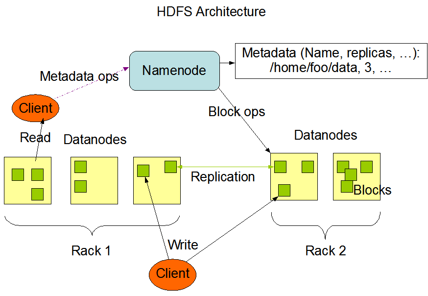

Hadoop学习笔记第一篇。
<!--more--->

# Hadoop介绍

Apache Hadoop 软件库是一个框架，允许在**集群服务器**上使用简单的**编程模型**，**对大数据集进行分布式处理**。

Hadoop 可扩展性强，能从单台服务器扩展到数以千计的服务器；Hadoop 高可用，其代码库自身就能在应用层侦测并处理硬件故障。

Hadoop 的生态系统不仅包含 Hadoop，而且还包含 HDFS、HBase等基本组件。


**HDFS (Hadoop Distributed File System)**

HDFS是分布式文件系统的一种。HDFS是Hadoop生态系统的基本组成，它将数据保存在计算机集群上。HDFS是HBase等工具的基础。

**MapReduce**

MapReduce是一种分布式计算框架，也是一个分布式、并行处理的编程模型。MapReduce把任务分为`map`阶段和`reduce`阶段，`map`阶段将任务分解成子任务后映射到集群上，`reduce`将结果化简并整合。

正是利用了MapReduce的工作特性，Hadoop因此能以并行的方式访问数据，从而实现分布式计算。

关于MapReduce的论文讲解，请看TODO。

**HBase**

HBase 是一个建立在 HDFS 之上，面向列的 NoSQL 数据库，用于快速读 / 写大量数据。HBase 使用 Zookeeper 进行管理。

**ZooKeeper**

ZooKeeper 为大型分布式计算提供开源的分布式配置服务、同步服务和命名注册。

Hadoop 的许多组件依赖于 Zookeeper，它运行在计算机集群中，用于管理 Hadoop 集群。

**Pig**

Pig是一个基于Hadoop的大规模数据分析平台，它为 MapReduce 编程模型提供了一个简单的操作和编程接口。它提供的SQL-LIKE语言叫Pig Latin，该语言的编译器会把类SQL的数据分析请求转换为一系列经过优化处理的MapReduce运算。

**Hive**
Apache Hive是一个建立在Hadoop架构之上的数据仓库。它能够提供数据的精炼，查询和分析。像 Pig 一样，Hive 作为一个抽象层工具，吸引了很多熟悉 SQL 而不是 Java 编程的数据分析师。

与Pig的区别在于，Pig是一中编程语言，使用命令式操作加载数据、表达转换数据以及存储最终结果。Pig中没有表的概念。而Hive更像是SQL，使用类似于SQL语法进行数据查询。

**Sqoop**

用于在关系数据库、数据仓库和 Hadoop 之间转移数据。

**Flume**

是一个分布式、可靠、高可用的海量日志采集、聚合和传输的系统，用于有效地收集、聚合和将大量日志数据从许多不同的源移动到一个集中的数据存储（如文本、HDFS、Hbase等）。

**Yarn**

是从Hadoop 2.0版本开始沿用的任务调度和集群资源管理的框架。

**Spark**

一个快速通用的 Hadoop 数据计算引擎，具有简单和富有表达力的编程模型，支持数据 ETL（提取、转换和加载）、机器学习、流处理和图形计算等方面的应用。

Spark 这一分布式内存计算框架就是脱胎于 Hadoop 体系的，它对 HDFS 、YARN 等组件有了良好的继承，同时也改进了 Hadoop 现存的一些不足。

下图是Hadoop集群的基本架构。



# Hadoop 可以做什么

据Hadoop Wiki记载，阿里巴巴使用15个节点组成的Hadoop集群，每个节点拥有8核心、16GB内存和1.4TB存储。阿里巴巴使用这些节点来处理商业数据的排序和组合，应用于交易网站的垂直搜索。

Ebay拥有32个节点组成的集群，使用Java编写的MapReduce应用，来优化搜索引擎。

FaceBook使用Hadoop来存储内部日志和结构化数据源副本，并且将其作为数据报告、数据分析和机器学习的数据源。

# Hadoop 不同版本

**关于发行方：**

目前Hadoop发行版非常多，有Intel发行版，华为发行版、Cloudera发行版（CDH）、Hortonworks版本等，所有这些发行版均是基于Apache Hadoop衍生出来的，之所以有这么多的版本，是由于Apache Hadoop的开源协议决定的：任何人可以对其进行修改，并作为开源或商业产品发布/销售。

**关于版本：**

现在最新的Hadoop已经达到3.X了，然而大部分公司使用Hadoop 2.X。又由于Hadoop 2.X与1.X相比有较大变化，因此直接使用2.X是比较合理的选择。

Hadoop2.0新增了HDFS HA机制，HA增加了standbynamenode进行热备份，解决了1.0的单点故障问题。

Hadoop2.0新增了HDFS federation，解决了HDFS水平可扩展能力。 

2.0相比于1.0 新增了YARN框架，Mapreduce的运行环境发生了变化


# Hadoop 安装

Hadoop有三种安装方式

- 单机模式：安装简单，几乎不用做任何配置，但仅限于调试用途。
- 伪分布模式：在单节点上同时启动 NameNode、DataNode、JobTracker、TaskTracker、Secondary Namenode 等 5 个进程，模拟分布式运行的各个节点。
- 完全分布式模式：正常的 Hadoop 集群，由多个各司其职的节点构成。

本文介绍 Hadoop 伪分布式模式部署方法，Hadoop 版本为 2.6.1。

## 1. 设置用户和组

```
sudo adduser hadoop
sudo usermod -G sudo hadoop
```

## 2. 安装JDK

不同版本的 Hadoop 对 Java 的版本需求有细微的差别，可以在[这个网站](https://cwiki.apache.org/confluence/display/HADOOP2/HadoopJavaVersions)查询 Hadoop 版本与 Java 版本的关系。

测试jdk是否部署成功：

```sh
java -version
```

## 3. 配置SSH免密码登录

安装和配置 SSH 的目的是为了让 Hadoop 能够方便地运行远程管理守护进程的相关脚本。这些脚本需要用到 sshd 服务。

```sh
su hadoop
cd /home/hadoop
ssh-keygen -t rsa
# 将生成的公钥添加到主机认证记录中。
cat .ssh/id_rsa.pub >> .ssh/authorized_keys
# 为 authorized_keys 文件赋予写权限
chmod 600 .ssh/authorized_keys
# 尝试登录到本机
ssh localhost
```

## 4. 下载 Hadoop

```sh
wget https://archive.apache.org/dist/hadoop/common/hadoop-2.6.1/hadoop-2.6.1.tar.gz
tar zxvf hadoop-2.6.1.tar.gz
sudo mv hadoop-2.6.1 /opt/hadoop-2.6.1
sudo chown -R hadoop:hadoop /opt/hadoop-2.6.1
vim /home/hadoop/.bashrc
```

在 /home/hadoop/.bashrc 文件的末尾添加以下内容：

```sh
export HADOOP_HOME=/opt/hadoop-2.6.1
export JAVA_HOME=/usr/lib/jvm/java-8-oracle
export PATH=$PATH:$JAVA_HOME/bin:$HADOOP_HOME/bin:$HADOOP_HOME/sbin
```

在终端中输入 source 命令来激活新添加的环境变量。

```sh
source /home/hadoop/.bashrc
```

## 5. 伪分布式模式配置

Hadoop 还可以以伪分布式模式运行在单个节点上，通过多个独立的 Java 进程来模拟多节点的情况。在初始学习阶段，暂时没有必要耗费大量的资源来创建不同的节点。

5.1 **打开 core-site.xml 文件:**

```sh
vim /opt/hadoop-2.6.1/etc/hadoop/core-site.xml
```

将 configuration 标签的值修改为以下内容：

```xml
<configuration>
    <property>
        <name>fs.defaultFS</name>
        <value>hdfs://localhost:9000</value>
    </property>
    <property>
        <name>hadoop.tmp.dir</name>
        <value>/home/hadoop/tmp</value>
    </property>
</configuration>
```

fs.defaultFS 配置项用于指示集群默认使用的文件系统的位置。

5.2 **打开另一个配置文件 hdfs-site.xml**

```sh
vim /opt/hadoop-2.6.1/etc/hadoop/hdfs-site.xml
```

将 configuration 标签的值修改为以下内容：

```xml
<configuration>
    <property>
        <name>dfs.replication</name>
        <value>1</value>
    </property>
</configuration>
```

该配置项用于指示 HDFS 中文件副本的数量，默认情况下是 3 份，由于我们在单台节点上以伪分布式的方式部署，所以将其修改为 1 。

5.3 **编辑 hadoop-env.sh 文件：**

```sh
vim /opt/hadoop-2.6.1/etc/hadoop/hadoop-env.sh
```

将其中 `export JAVA_HOME` 的值修改为 JDK 的实际位置，即 `/usr/lib/jvm/java-8-oracle` 。

5.4 **编辑 yarn-site.xml 文件：**

```sh
vim /opt/hadoop-2.6.1/etc/hadoop/yarn-site.xml
```

在 configuration 标签内添加以下内容：

```xml
<configuration>
    <property>
        <name>yarn.nodemanager.aux-services</name>
        <value>mapreduce_shuffle</value>
    </property>
</configuration>
```

5.5 **编辑 mapred-site.xml 文件。首先需要从模板复制过来：**

```sh
cp /opt/hadoop-2.6.1/etc/hadoop/mapred-site.xml.template /opt/hadoop-2.6.1/etc/hadoop/mapred-site.xml
vim /opt/hadoop-2.6.1/etc/hadoop/mapred-site.xml
```

在 configuration 标签内添加以下内容：

```xml
<configuration>
    <property>
        <name>mapreduce.framework.name</name>
        <value>yarn</value>
    </property>
</configuration>
```

## 6. Hadoop 启动测试

```sh
su -l hadoop
vim /home/hadoop/.bashrc
```

向`.bashrc`添加 Java 的环境变量：

```sh
export JAVA_HOME=/usr/lib/jvm/java-8-oracle
export PATH=$PATH:$JAVA_HOME/bin
```

# HDFS 的基本使用

## 1. 初始化HDFS

```sh
hdfs namenode -format
```

格式化的操作只需要进行一次即可，不需要多次格式化。每一次格式化 namenode 都会清除 HDFS 分布式文件系统中的所有数据文件。同时，多次格式化容易出现 namenode 和 datanode 不同步的问题。

## 2. 启动HDFS

HDFS 初始化完成之后，就可以启动 NameNode 和 DataNode 的守护进程。启动之后，Hadoop 的应用（如 MapReduce 任务）就可以从 HDFS 中读写文件。

在终端中输入以下命令来启动守护进程：

```sh
start-dfs.sh
```

为了确认伪分布式模式下的 Hadoop 已经成功运行，可以利用 Java 的进程查看工具 `jps` 来查看是否有相应的进程。

如果执行 jps 发现没有 NameNode 服务进程，可以先检查一下是否执行了 namenode 的初始化操作。如果没有初始化 namenode ，先执行 stop-dfs.sh ,然后执行 hdfs namenode -format ,最后执行 start-dfs.sh 命令，通常来说这样就能够保证这三个服务进程成功启动

## 3. 查看日志和WebUI

作为大数据领域的学习者，掌握分析日志的能力与学习相关计算框架的能力同样重要。

Hadoop 的守护进程日志默认输出在安装目录的 log 文件夹中，在终端中输入以下命令进入到日志目录：

```sh
cd /opt/hadoop-2.6.1/logs
ls
```

HDFS 在启动完成之后，还会由内部的 Web 服务提供一个查看集群状态的网页：

http://localhost:50070/

打开网页后，可以在其中查看到集群的概览、DataNode 的状态等信息。

## 4. HDFS文件上传测试

HDFS 运行起来之后，可将其视作一个文件系统。此处进行文件上传的测试，首先需要按照目录层级逐个创建目录，并尝试将 Linux 系统中的一些文件上传到 HDFS 中。

```sh
cd ~
hdfs dfs -mkdir /user
hdfs dfs -mkdir /user/hadoop
```

如果需要查看创建好的文件夹，可以使用如下命令：

```sh
hdfs dfs -ls /user
```

目录创建成功之后，使用 `hdfs dfs -put` 命令将本地磁盘上的文件（此处是随意选取的 Hadoop 配置文件）上传到 HDFS 之中。

```sh
hdfs dfs -put /opt/hadoop-2.6.1/etc/hadoop /user/hadoop/input
```

如果要查看上传的文件，可以执行如下命令：

```sh
hdfs dfs -ls /user/hadoop/input
```

# WordCount

WordCount 是 Hadoop 的 “HelloWorld” 程序。

绝大多数部署在实际生产环境并且解决实际问题的 Hadoop 应用程序都是基于 WordCount 所代表的 MapReduce 编程模型变化而来。

在终端中首先启动 YARN 计算服务：

```sh
start-yarn.sh
```

然后输入以下命令以启动任务

```sh
hadoop jar /opt/hadoop-2.6.1/share/hadoop/mapreduce/hadoop-mapreduce-examples-2.6.1.jar wordcount /user/hadoop/input/ output
```

上述参数中，关于路径的参数有三个，分别是 jar 包的位置、输入文件的位置和输出结果的存放位置。在填写路径时，应当养成填写绝对路径的习惯。这样做将有利于定位问题和传递工作。

等待计算完成，然后将 HDFS 上的文件导出到本地目录查看：

```sh
rm -rf /home/hadoop/output
hdfs dfs -get /user/hadoop/output output
cat output/*
```

计算完毕后，如无其他软件需要使用 HDFS 上的文件，则应及时关闭 HDFS 守护进程。

作为分布式集群和相关计算框架的使用者，应当养成良好的习惯，在每次涉及到集群开启和关闭、软硬件安装和更新的时候，都主动检查相关软硬件的状态。

```sh
stop-yarn.sh
stop-dfs.sh
```