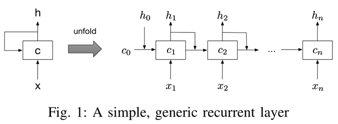
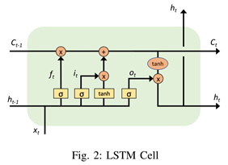
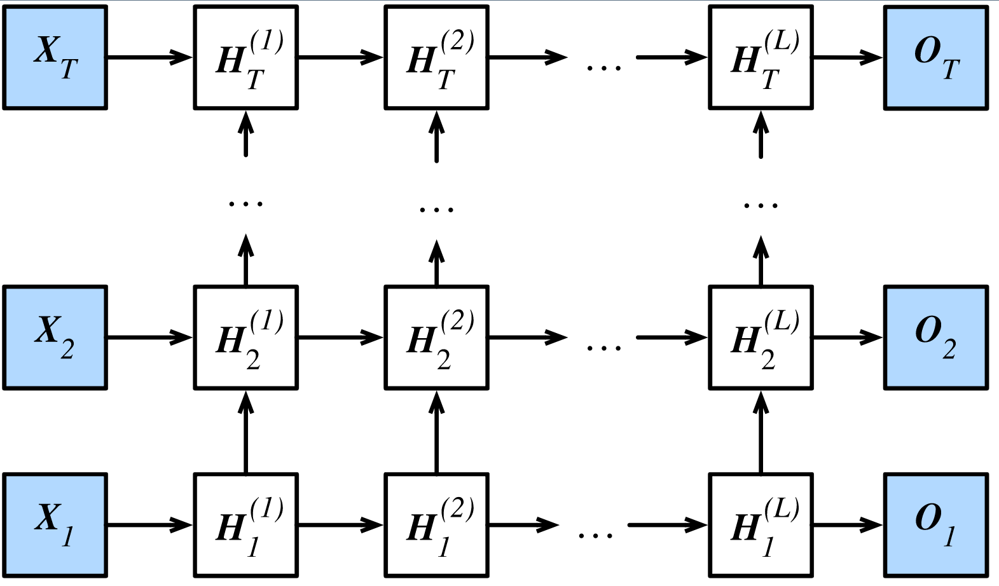

从理论和代码两个层面介绍了LSTM网络。
<!--more--->

## 一、理论来一波

循环神经网络（Recurrent Neural Network，RNN）是一类有短期记忆能力的神经网络。在循环神经网络中，神经元不但可以接受其他神经元的信息，也可以接受自身的信息，形成具有环路的网络结构。



长短期记忆网络（Long Short-Term Memory Network，LSTM）[Gers et al.,2000; Hochreiter et al., 1997] 是循环神经网络的一个变体，可以有效地解决简单循环神经网络的梯度爆炸或消失问题。



LSTM 网络引入一个新的内部状态（internal state） $\boldsymbol{c}_{t}\in \mathbb{R}^{\boldsymbol{D}}$ 专门进行线性的循环信息传递，同时（非线性地）输出信息给隐藏层的外部状态 $\boldsymbol{h}_{t}\in \mathbb{R}^{\boldsymbol{D}}$ 。这两个状态通过下式计算：

$$\begin{array}{l}
\boldsymbol{c}_{t}=\boldsymbol{f}_{t} \odot \boldsymbol{c}_{t-1}+\boldsymbol{i}_{t} \odot \tilde{\boldsymbol{c}}_{t} \\
\boldsymbol{h}_{t}=\boldsymbol{o}_{t} \odot \tanh \left(\boldsymbol{c}_{t}\right)
\end{array}$$

其中，$\odot$为向量逐元素乘积（代表左右两边向量维度相同）；$\boldsymbol{c}_{t-1}$为上一时刻的记忆单元；$\tilde{\boldsymbol{c}}\in \mathbb{R}^{\boldsymbol{D}}$是通过非线性函数得到的候选状态：

$$\tilde{\boldsymbol{c}}_{t}=\tanh \left(\boldsymbol{W}_{c} \boldsymbol{x}_{t}+\boldsymbol{U}_{c} \boldsymbol{h}_{t-1}+\boldsymbol{b}_{c}\right)$$

在每个时刻 $t$，LSTM 网络的内部状态 $\boldsymbol{c}_{t}$ 记录了到当前时刻为止的历史信息。

LSTM内部多了三个gate，分别是forget、input、output。$\boldsymbol{f}_{t}\in [0,1]^{\boldsymbol{D}}$、$\boldsymbol{i}_{t}\in [0,1]^{\boldsymbol{D}}$、$\boldsymbol{o}_{t}\in [0,1]^{\boldsymbol{D}}$。这三个门与输入、隐状态和输出的维度应该相同，都是维度为输入序列维度n的向量（其实应该为n+1）$=D$。

与此同时，三个门的值依赖于$t$时刻的输入$x_t$、$t-1$时刻的隐变量$h_{t-1}$以及不同的权重矩阵($W_i$/$W_f$/$W_o$/$U_i$/$U_f$/$U_o$)。

门控机制（Gating Mechanism）是用来控制信息传递的路径的手段。

* 遗忘门 $\boldsymbol{f}_{t}$ 控制上一个时刻的内部状态$\boldsymbol{c}_{t-1}$ 需要遗忘多少信息。
* 输入门 $\boldsymbol{i}_{t}$ 控制当前时刻的候选状态 ̃$\tilde{\boldsymbol{c}}_{t}$ 有多少信息需要保存。
* 输出门 $\boldsymbol{o}_{t}$ 控制当前时刻的内部状态 $\boldsymbol{c}_{t}$ 有多少信息需要输出给外部状态 $\boldsymbol{h}_{t}$。

举个例子，当$\boldsymbol{f}_{t}=\mathbf{0}, \boldsymbol{i}_{t}=\mathbf{1}$时，记忆单元将历史信息清空，并将候选状态向量$\tilde{\boldsymbol{c}}_{t}$写入。但此时记忆单元 $\boldsymbol{c}_{t}$ 依然和上一时刻的历史信息相关。当$\boldsymbol{f}_{t}=\mathbf{1}, \boldsymbol{i}_{t}=\mathbf{0}$时，记忆单元将复制上一时刻的内容，不写入新的信息。

LSTM 网络中的“门”是一种“软”门，取值在 (0, 1) 之间，表示以一定的比例允许信息通过．三个门的计算方式为：

$$\begin{aligned}
\boldsymbol{i}_{t} &=\sigma\left(\boldsymbol{W}_{i} \boldsymbol{x}_{t}+\boldsymbol{U}_{i} \boldsymbol{h}_{t-1}+\boldsymbol{b}_{i}\right) \\
\boldsymbol{f}_{t} &=\sigma\left(\boldsymbol{W}_{f} \boldsymbol{x}_{t}+\boldsymbol{U}_{f} \boldsymbol{h}_{t-1}+\boldsymbol{b}_{f}\right) \\
\boldsymbol{o}_{t} &=\sigma\left(\boldsymbol{W}_{o} \boldsymbol{x}_{t}+\boldsymbol{U}_{o} \boldsymbol{h}_{t-1}+\boldsymbol{b}_{o}\right)
\end{aligned}$$

其中$\sigma(\cdot)$ 为 Logistic 函数，其输出区间为 (0, 1)；$\boldsymbol{x}_{t}$为当前时刻的输入。

## 二、还是得看代码

下面是我定义的一个专用于IMDb影评情感分析的二分类模型，包装在一个函数中。输入训练集、测试集及其标签，设定好参数就可以运行、训练。可以选择是否保存模型到本地。最后函数返回训练好的模型。

这个二分类模型中，输入是长度为80的整数列表（maxlen=80），代表着80个不同的单词构成的一句话。

如果有影评不够80个词，就在影评前面加足够的0，直到这条影评达到80个词为止。如果影评单词量大于80个，便截取前面的80个词。

每个整数都代表一个单词表中的单词。当然单词表的大小是固定的（num_words=10000个单词），如果出现不在单词表中的单词，固定将其编码成2，表示UNKNOWN（这条设置不在下面的代码中，属于数据预处理）。

第一层是Embedding层，负责将一句话中的每个单词映射成固定维度的词向量；

注意，每个单词（在这里是每个整数）都会变成固定维度（embedding_dim=128）的向量，因此每条影评从Embedding层输出后，都会变成80*128的矩阵。

第二层是LSTM层。如果你看了理论部分的叙述，就知道LSTM层中无论是隐状态$\boldsymbol{c}$、$\boldsymbol{h}$还是三个门$\boldsymbol{f}$、$\boldsymbol{i}$、$\boldsymbol{o}$，他们的维度都是$\boldsymbol{D}$。这个$\boldsymbol{D}$的大小就需要我们用参数`lstm_dim=32`来定义。这个参数越大，代表LSTM层的参数越多、泛化能力越强，也更难训练、更容易过拟合。

第三层是单个神经元的sigmoid层，在这里就直接转换成概率并分类了。

```python
def train_lstm(x_train, y_train, x_test, y_test, 
               num_words=10000, 
               maxlen=80, 
               embedding_dim=128, 
               lstm_dim=32, 
               batch_size=32, 
               epochs=10):
    # 接收一个含有 100 个整数的序列，每个整数在 1 到 20000 之间
    inputs = Input(shape=(maxlen,), dtype='int32', name='main_input')
    # Embedding 层将输入序列编码为一个稠密向量的序列，
    # 每个向量维度为 512。
    x = Embedding(input_dim=num_words, 
                  input_length=maxlen, 
                  output_dim=embedding_dim, 
                  name='embedding')(inputs)
    # LSTM 层把向量序列转换成单个向量，
    # 它包含整个序列的上下文信息
    lstm_output = LSTM(lstm_dim, name='lstm')(x)
    # 插入辅助损失，
    #使得即使在模型主损失很高的情况下，LSTM 层和 Embedding 层都能被平稳地训练
    outputs = Dense(1, activation='sigmoid', name='output')(lstm_output)


    model = Model(inputs=inputs, outputs=outputs)
    model.compile(optimizer='adam',
            loss='binary_crossentropy',
            metrics=['accuracy'])

    model.fit(x_train, y_train,
        batch_size=batch_size,
        epochs=epochs,
        validation_data=(x_test, y_test,))
    score, acc = model.evaluate(x_test, y_test, batch_size=batch_size)
    print('Test score:', score)
    print('Test accuracy:', acc)

    # model.save("lstm_imdb.h5")
    return model
```

## 三、LSTM返回所有时间步的hidden state向量


数据经过LSTM层，输出的是最后一个时间步得到的output向量（即$\boldsymbol{h}_{finally}$），维度为$\boldsymbol{D}$。

其实LSTM能够在每个时间步都输出output（即$\boldsymbol{h}_{t}$），只不过我们把这些没到时间的半成品output选择性忽略了。

如果你想要堆叠LSTM层，也就是LSTM层下面还有LSTM，或者你**需要所有时间步的**$\boldsymbol{h}_{t}$，那么你可以在训练的时候把`return_sequences=True`写进LSTM参数之中。



下面让我们来比较一下`return_sequences`参数开启之后输出值的变化。

### return_sequences=False

首先固定随机数种子。
```python
np.random.seed(0)
tf.random.set_seed(0)
```

然后构建输入Input向量和LSTM层，此时LSTM层使用默认参数`return_sequences=False`。

```python
input1 = Input(shape=(3,1)) # 输入是三维向量
lstm1 = LSTM(1)(input1) # 内部hidden和cell的维度为1
model = Model(inputs=input1, outputs=lstm1)
```

构造一批输入，包括6个句子，每个句子三个单词，然后输入LSTM，查看LSTM层的输出。

```python
data = np.array([[0.1, 0.2, 0.3],
                    [0.3, 0.2, 0.1],
                    [0.2, 0.6, 0.3],
                    [0.8, 0.2, 0.3],
                    [0.3, 0.5, 0.1],
                    [0.2, 0.6, 0.2]])
print(model.predict(data))
```
此时输出为：
```python
[[0.00844267]
 [0.00617958]
 [0.01279002]
 [0.01231858]
 [0.009055  ]
 [0.01108878]]

Process finished with exit code 0
```

### return_sequences=True

然后打开`return_sequences`的开关

```python
lstm1 = LSTM(1, return_sequences=True)(input1)
```

此时的输出为：
```
[[[0.00190693]
  [0.00490441]
  [0.00844267]] # 

 [[0.0055262 ]
  [0.00704476]
  [0.00617958]] #

 [[0.00374958]
  [0.01259477]
  [0.01279002]] #

 [[0.01337298]
  [0.01142679]
  [0.01231858]] #

 [[0.0055262 ]
  [0.01206062]
  [0.009055  ]] #

 [[0.00374958]
  [0.01259477]
  [0.01108878]]] #

Process finished with exit code 0

```

此为输出所有时间步的hidden state。鉴于一共6个测试输入，每个输入有3个feature，所以时间步也就三步。LSTM的输出结果从6个hidden state变成了6*3个hidden state。

### return_state=True

我们再来看另一个参数，这个参数能够控制LSTM输出cell state。

```python
lstm1 = LSTM(1, return_state=True)(input1)
```

```
[array([[0.00844267],
       [0.00617958],
       [0.01279002],
       [0.01231858],
       [0.009055  ],
       [0.01108878]], dtype=float32), 
array([[0.00844267],
       [0.00617958],
       [0.01279002],
       [0.01231858],
       [0.009055  ],
       [0.01108878]], dtype=float32), 
array([[0.01655067],
       [0.01227413],
       [0.02506882],
       [0.02414548],
       [0.01798305],
       [0.02187706]], dtype=float32)]

Process finished with exit code 0

```
开启`return_state=True`之后，LSTM返回3个array，第一个array和第二个array一样，都是hidden state，和默认返回的一样。第三个array就是最后一个时间步的cell state。

### return_state=True, return_sequences=True
如果两个开关都打开，则结果变成
```python
lstm1 = LSTM(1, return_state=True, return_sequences=True)(input1)
```
```
[array([[[0.00190693],
        [0.00490441],
        [0.00844267]],

       [[0.0055262 ],
        [0.00704476],
        [0.00617958]],

       [[0.00374958],
        [0.01259477],
        [0.01279002]],

       [[0.01337298],
        [0.01142679],
        [0.01231858]],

       [[0.0055262 ],
        [0.01206062],
        [0.009055  ]],

       [[0.00374958],
        [0.01259477],
        [0.01108878]]], dtype=float32), 
array([[0.00844267],
       [0.00617958],
       [0.01279002],
       [0.01231858],
       [0.009055  ],
       [0.01108878]], dtype=float32), 
array([[0.01655067],
       [0.01227413],
       [0.02506882],
       [0.02414548],
       [0.01798305],
       [0.02187706]], dtype=float32)]

Process finished with exit code 0

```

还是返回三个array，第一个是所有时间步的hidden state，这是开启`return_sequences=True`的效果；第二个则是原本LSTM的输出hidden state；第三个是开启`return_state=True`的效果，返回最后一个时间步的cell state