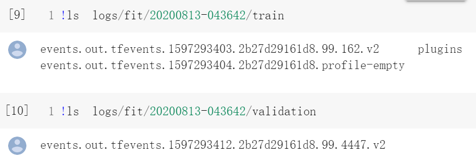

简单介绍了TensorBoard的用途和使用方法。
<!--more--->

## TensorBoard简介

TensorBoard是Google开发的模型内部参数跟踪和可视化的调试工具。在Tensorflow中，用TensorBoard可以监控模型的各种指标的变化（如acc、loss的动态变化），可以将模型结构可视化，可以可视化词嵌入空间，可以分析模型性能，可以分析数据集的公平性等等，是一个非常强大且非常简单的工具。

TensorBoard核心就是回调函数和可视化操作面板。通过编写回调函数获取模型信息，通过命令行启动TensorBoard图形化界面。

TensorBoard的回调函数API为：

```python
tf.keras.callbacks.TensorBoard(
    log_dir='logs', histogram_freq=0, write_graph=True, write_images=False,
    update_freq='epoch', profile_batch=2, embeddings_freq=0,
    embeddings_metadata=None, **kwargs
)

```
| 参数 | 含义 |
| --- | --- |
| log_dir | 模型的信息保存目录 |
| histogram_freq | 模型激活和参数信息记录的频率，每隔几个epochs记录一次 |
| write_graph | 是否保存模型图文件 |
| write_images | 是否保存模型参数可视化图 |
| update_freq | 模型loss和其他metrics的记录频率，每隔几个batch更新一次 |
| profile_batch | 指定性能分析时使用的批次 |
| embeddings_freq | embedding 层更新的频率 |

在Colab中使用TensorBoard需输入：

```bash
%load_ext tensorboard
```

为了跟踪模型训练过程，需要在模型的`fit`过程中添加回调函数

```python
tensorboard_callback = tf.keras.callbacks.TensorBoard(log_dir=log_dir, histogram_freq=1)
```

其中`log_dir`为你想储存log的目录，在教程中，`log_dir="logs/fit/" + datetime.datetime.now().strftime("%Y%m%d-%H%M%S")`。

```python
model.fit(x=x_train, 
          y=y_train, 
          epochs=5, 
          validation_data=(x_test, y_test), 
          callbacks=[tensorboard_callback])
```

在`log_dir`中生成了一系列的日志文件：



这些日志文件可以通过TensorBoard解析：

```shell
%tensorboard --logdir logs/fit
```

在命令行中， 运行不带“％”的相同命令。结果如下：


在TensorBoard面板上，有四个选项卡：

* **Scalars** 显示损失和指标在每个时期如何变化
* **Graphs** 可帮助您可视化模型
* **Distributions** 和 **Histograms** 显示张量随时间的分布

如果使用tensorflow原生API训练模型，也可以利用`tf.summary`记录log，然后利用TensorBoard可视化。具体流程如下：

1. 使用 `tf.summary.create_file_writer()` 创建文件编写器；
2. 使用 `tf.summary.scalar()` 记录感兴趣的指标
3. 将 `LearningRateScheduler` 回调传递给 `Model.fit()`
4. 使用命令行`tensorboard --logdir logs/fit`打开可视化界面