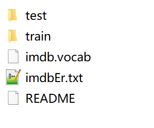

使用LSTM训练最简单的IMDB影评分类任务，总结文本分类任务常见流程。
<!--more--->

## 1. 查看数据集

### 1.1 官网上的数据集压缩包

从IMDB官网上下载的数据集，是一个压缩包`aclImdb_v1.tar.gz`。解压后的目录如下：


- `test`
- `train`
- `imdb.vocab`
- `imdbEr.txt`
- `README`

其内部不仅有完整的影评文件，还包含该影评的链接等信息。

### 1.2 keras自带的数据集

keras里的IMDB影评数据集，内部结构分为两个部分：影评部分和情感标签部分，也就是数据集的X和y部分。

X部分的每条影评都被编码为一个整数列表。另外，每个单词的在单词表中的编码越小，代表在影评中出现频率越高。这使得我们能在取数据时指定只使用某一出现频率内范围的单词（其他单词由于出现频率太低，可以直接标记为未知）。

“0”在数据集中代表“未知”单词。

我们采用内置的`load_data`函数来取出数据。

```python
tf.keras.datasets.imdb.load_data(
    path='imdb.npz', num_words=None, skip_top=0, maxlen=None, seed=113,
    start_char=1, oov_char=2, index_from=3, **kwargs
)
```

num_words: 即设定取出现频率在前num_words的单词。如果不填，所有单词表中的单词都会标记。
skip_top: 设定前skip_top频率出现的单词不予标记。这可能是由于高频出现的单词信息量太低（如the、a等）。
maxlen: 设定最大影评长度，超过该长度的影评都会被截断。
x_train, x_test: 返回影评列表，长度为影评个数（25000个训练，25000个测试），每个影评是整数数组。
y_train, y_test: 返回整数数组，长度为影评个数，代表影评的情感倾向（0或1）。

```python
from tensorflow.keras.datasets import imdb
max_features = 50000 # 取前50000个最常见的单词，组建词典
(x_train, y_train), (x_test, y_test) = imdb.load_data(num_words=max_features)
```

需要注意的是这个`max_features`与数据集的数目没有关系，不要搞混了。

## 2. 数据预处理

```python
from tensorflow.keras.preprocessing import sequence
print('Pad sequences (samples x time)')
x_train = sequence.pad_sequences(x_train, maxlen=maxlen)
x_test = sequence.pad_sequences(x_test, maxlen=maxlen)
X_train
array([[    0,     0,     0, ...,    19,   178,    32],
       [    0,     0,     0, ...,    16,   145,    95],
       [    0,     0,     0, ...,     7,   129,   113],
       ...,
       [    0,     0,     0, ...,     4,  3586, 22459],
       [    0,     0,     0, ...,    12,     9,    23],
       [    0,     0,     0, ...,   204,   131,     9]], dtype=int32)
```
经过这个函数处理，每条影评被规整成了长度为500的整形元素列表，长度不够500个单词的影评，在最前面加0；长度不够的则在最后截断。

## 3. 模型构建

**Embedding层**

在最开始我们加入了Embedding层，max_features是字典长度，也可以说是one-hot向量长度。
input_length=500为每个序列为500个单词构成。
input_shape=(max_features,)表明one-hot的维度，这两个都可以不填，直接通过fit的时候推断出来

**LSTM层**

LSTM层的参数是output_dim，这个参数可以自定义，因为它不受之前影响，只表明输出的维度。

同时也是是门结构（forget门、update门、output门）的维度。之所以理解成维度，是因为LSTM中隐藏单元个数这个概念不好理解。其实该参数名称为`units`，官方说法就是“隐藏单元个数”。

LSTM层的输入是形如（samples，timesteps，input_dim）的3D张量；输出是形如（samples，timesteps，output_dim）的3D张量，或者返回形如（samples，output_dim）的2D张量。二者区别在于，若LSTM层中参数`return_sequences=True`，就返回带时间步的张量。

若我们有很多LSTM层，我们可以把很多LSTM层串在一起，为了方便LSTM层与层之间的信息传递，可以设置`return_sequences=True`。但是最后一个LSTM层return_sequences通常为false，此时输出的就是每个样本的结果张量。

假如我们输入有25000个句子，每个句子都由500个单词组成，而每个单词用64维的词向量表示。那么样本数目samples=25000，时间步timesteps=500（可以简单地理解timesteps就是输入序列的长度input_length），前一层Embedding词向量输出维度input_dim=128。

也就是说通过LSTM，把词的维度由128转变成了100。

在LSTM层中还可以设置Dropout，这一点在之后会详细说明。

**全连接层**

汇总至一个神经元的全连接层，即sigmoid层，判断0或1即可。

```python
from tensorflow.keras.models import Sequential
from tensorflow.keras.layers import Dense, Embedding, LSTM
model = Sequential() 
model.add(Embedding(max_features, 128, input_length=500, input_shape=(max_features,))) 
model.add(LSTM(100, dropout=0.2, recurrent_dropout=0.2))
model.add(Dense(1, activation='sigmoid')) 
model.compile(loss='binary_crossentropy',optimizer='adam', metrics=['accuracy']) 
print(model.summary()) 
```


## 4. 模型训练和保存

```python
model.fit(X_train, y_train, validation_data=(X_test, y_test), epoch=10, batch_size=64) 
scores = model.evaluate(X_test, y_test, verbose=0)
print("Accuracy: %.2f%%" % (scores[1]*100))
model.save('models/sentiment-lstm.h5')
```
