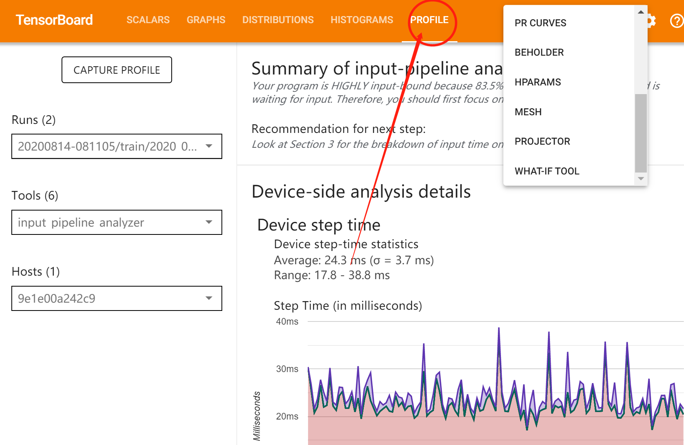
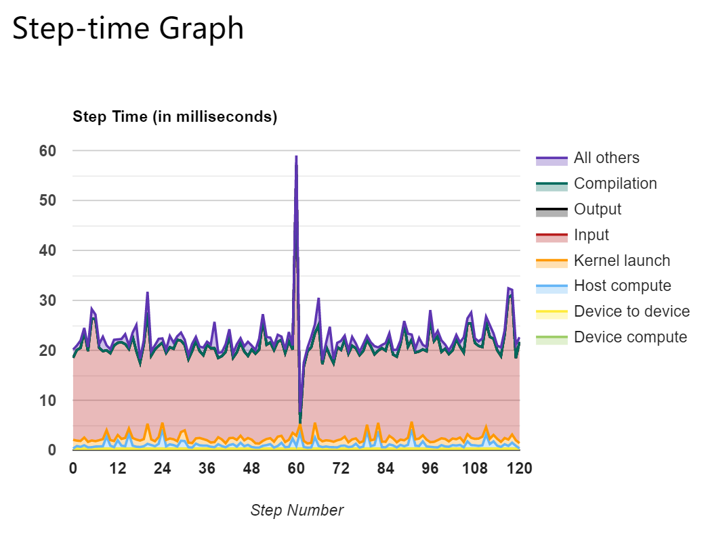
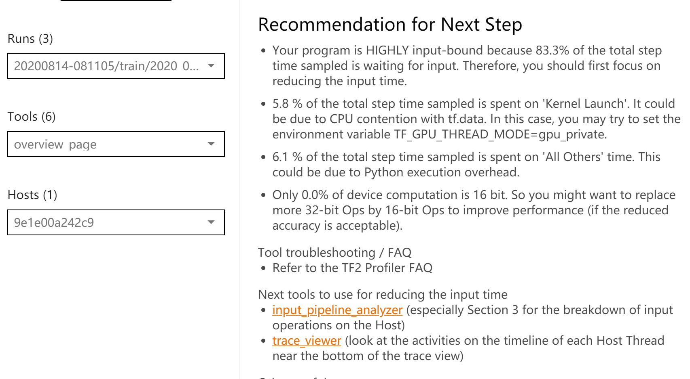
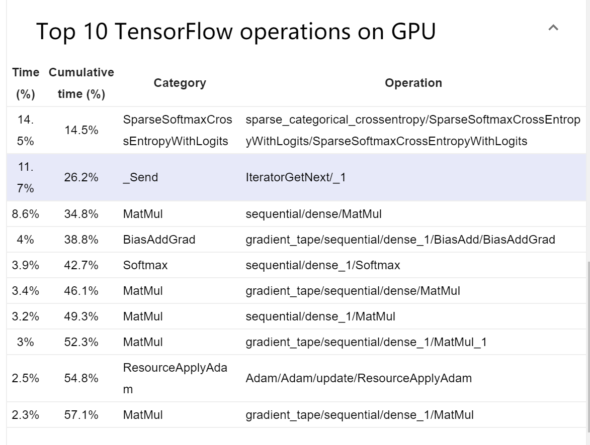

这是TensorBoard笔记的第六篇，讲述的是如何使用TensorBoard分析模型的性能，优化模型的资源消耗。
<!--more--->

TensorBoard可以监控模型的各个组分运行过程中的时间消耗和资源消耗，并根据这些数据对模型下一步优化提出建议。

首先我们安装性能分析的插件

```bash
!pip install -U tensorboard_plugin_profile
```

定义TensorBoard的回调函数（数据预处理和模型定义略去不表），注意这里新的参数`profile_batch`只监控第500到520之间的20个Batch，避免监控过多导致模型运行效率过低。

```python
# Create a TensorBoard callback
logs = "logs/" + datetime.now().strftime("%Y%m%d-%H%M%S")

tboard_callback = tf.keras.callbacks.TensorBoard(log_dir=logs,
                        histogram_freq=1,
                        profile_batch='500,520')

model.fit(ds_train,
    epochs=2,
    validation_data=ds_test,
    callbacks=[tboard_callback])
```

打开TensorBoard：

```bash
# Load the TensorBoard notebook extension.
%load_ext tensorboard
# Launch TensorBoard and navigate to the Profile tab to view performance profile
%tensorboard --logdir=logs
```



有非常多有用的信息，比如每个batch消耗的时间都花在哪里了：



还有针对耗时的改进意见：



有耗时最长的10大操作：



有性能监控选项，查看CPU活动和GPU活动。根据一般经验，始终保持设备（GPU / TPU）处于活动状态是我们的优化目标。


查看事件跟踪，可以看到`tf_data_iterator_get_next` 操作在CPU上运行时GPU不活动。该操作负责处理输入数据并将其发送到GPU进行训练。因此我们的优化方法可以是使用tf.data API优化输入管道，缓存训练数据集并预取数据，以确保始终有可供GPU处理的数据。

```python
 (ds_train, ds_test), ds_info = tfds.load(
    'mnist',
    split=['train', 'test'],
    shuffle_files=True,
    as_supervised=True,
    with_info=True,
)
 
ds_train = ds_train.map(normalize_img)
ds_train = ds_train.batch(128)
ds_train = ds_train.cache()
ds_train = ds_train.prefetch(tf.data.experimental.AUTOTUNE)

ds_test = ds_test.map(normalize_img)
ds_test = ds_test.batch(128)
ds_test = ds_test.cache()
ds_test = ds_test.prefetch(tf.data.experimental.AUTOTUNE)

model.fit(ds_train,
        epochs=2,
        validation_data=ds_test,
        callbacks = [tboard_callback])

%tensorboard --logdir=logs
```

跟踪查看器显示`tf_data_iterator_get_next`操作执行得更快。因此，GPU获得了稳定的数据流以进行训练，并通过模型训练获得了更好的利用率。