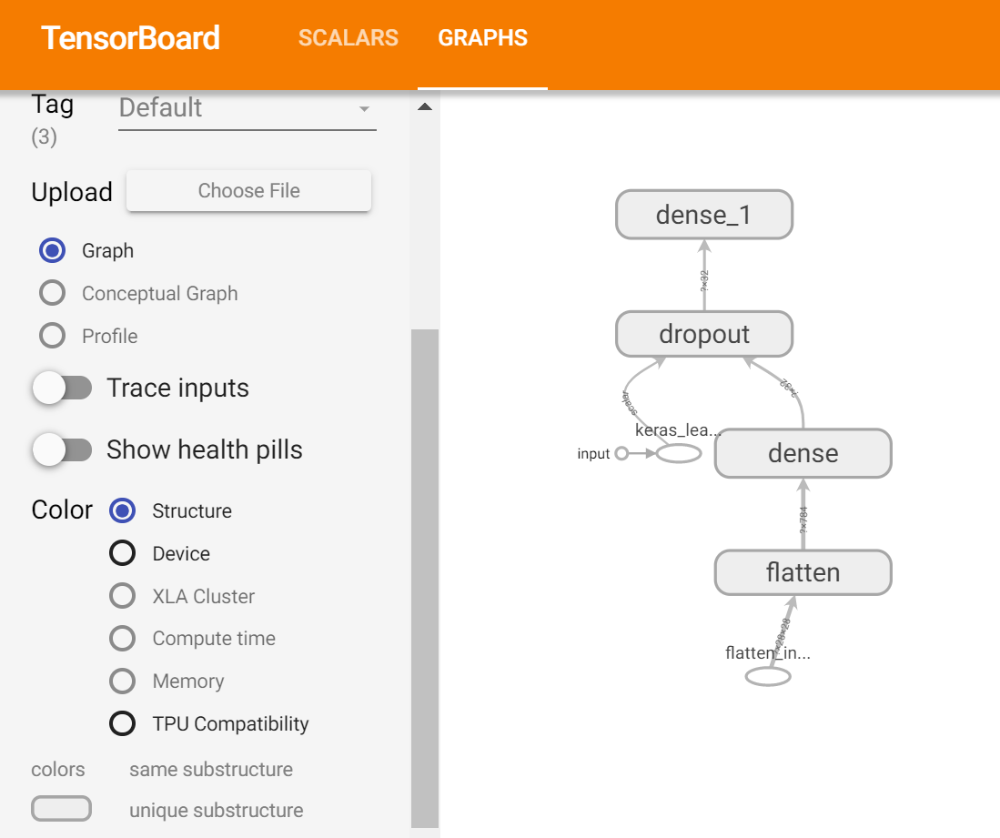
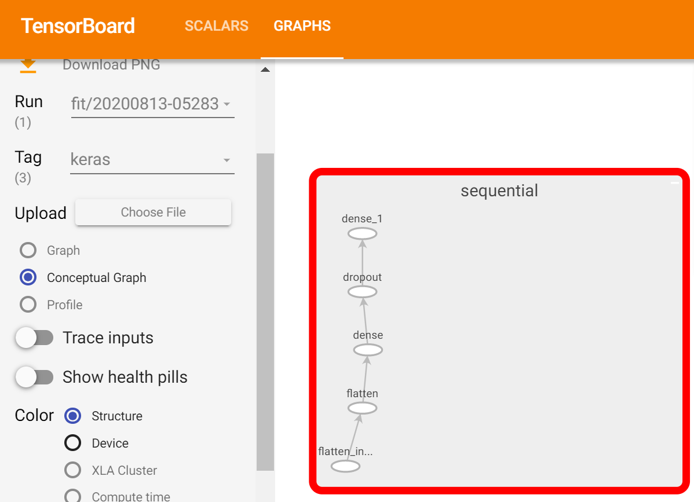

这是TensorBoard笔记的第三篇，讲述的是如何令TensorBoard生成模型架构图。
<!--more--->

TensorBoard不但可以展示存在的图片和张量，还可以生成图片，诸如模型图等。通过TensorBoard的GRAPHS选项卡，可以快速查看模型结构的预览图，并确保其符合设计预期。

比如我们定义模型如下：

```python
model = keras.models.Sequential([
    keras.layers.Flatten(input_shape=(28, 28)),
    keras.layers.Dense(32, activation='relu'),
    keras.layers.Dropout(0.2),
    keras.layers.Dense(10, activation='softmax')
])

model.compile(
    optimizer='adam',
    loss='sparse_categorical_crossentropy',
    metrics=['accuracy'])
```



通过TensorBoard中的GRAPHS选项卡，我们看到执行图。图是倒置的，数据从下到上流动，因此与代码相比是上下颠倒的。

可以更改Tag，选择Keras，选择左边的Conceptual Graph查看概念图，双击Sequential，得到概念图。概念图更像是代码。



有的时候我们希望得到计算图，研究数据经过了何种计算。比如下面这个函数：

```python
# Sample data for your function.
x = tf.random.uniform((3, 3))
y = tf.random.uniform((3, 3))

# The function to be traced.
@tf.function
def my_func(x, y):
  # A simple hand-rolled layer.
  return tf.nn.relu(tf.matmul(x, y))
# z = my_func(x, y)
```

我们希望得到它的计算图。首先需要使用`@tf.function`修饰被监控的函数，然后使用`tf.summary.trace_on()`在`z = my_func(x, y)`函数运行之前开始记录。


```python
tf.summary.trace_on(graph=True, profiler=True)
z = my_func(x, y)
```

定义日志目录名称和文件写入句柄，这些都是刻在DNA里的操作：

```python
# Set up logging.
stamp = datetime.now().strftime("%Y%m%d-%H%M%S")
logdir = 'logs/func/%s' % stamp
writer = tf.summary.create_file_writer(logdir)
```

最后执行记录：

```python
# Call only one tf.function when tracing.
with writer.as_default():
  tf.summary.trace_export(
      name="my_func_trace",
      step=0,
      profiler_outdir=logdir)
```

```bash
%tensorboard --logdir logs/func
```


