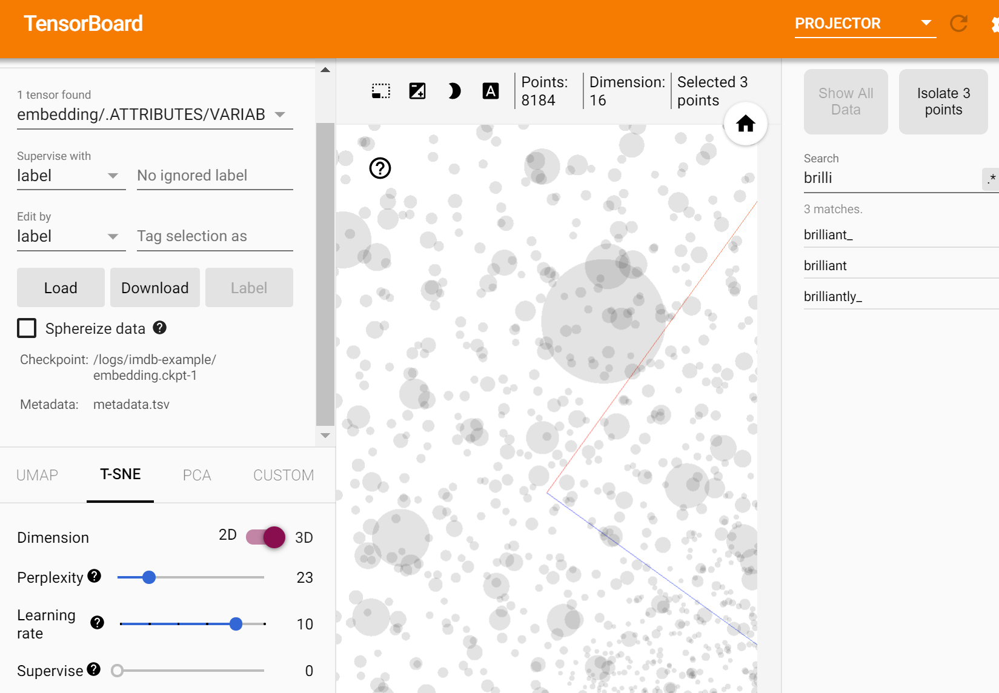

这是TensorBoard笔记的第五篇，讲述的是如何使用TensorBoard对词嵌入空间可视化。
<!--more--->

TensorBoard可以将词嵌入空间二维化，方便我们理解词嵌入空间的含义。

```python
from tensorboard.plugins import projector
```

引入IMDb数据集。tensorflow_datasets是tensorflow的官方数据集库。

```python
import tensorflow_datasets as tfds

(train_data, test_data), info = tfds.load(
    "imdb_reviews/subwords8k",
    split=(tfds.Split.TRAIN, tfds.Split.TEST),
    with_info=True,
    as_supervised=True,
)
encoder = info.features["text"].encoder

# shuffle and pad the data.
train_batches = train_data.shuffle(1000).padded_batch(
    10, padded_shapes=((None,), ())
)
test_batches = test_data.shuffle(1000).padded_batch(
    10, padded_shapes=((None,), ())
)
train_batch, train_labels = next(iter(train_batches))
```

训练词嵌入模型

```python
# Create an embedding layer
embedding_dim = 16
embedding = tf.keras.layers.Embedding(encoder.vocab_size, embedding_dim)
# Train this embedding as part of a keras model
model = tf.keras.Sequential(
    [
        embedding, # The embedding layer should be the first layer in a model.
        tf.keras.layers.GlobalAveragePooling1D(),
        tf.keras.layers.Dense(16, activation="relu"),
        tf.keras.layers.Dense(1),
    ]
)

# Compile model
model.compile(
    optimizer="adam",
    loss=tf.keras.losses.BinaryCrossentropy(from_logits=True),
    metrics=["accuracy"],
)

# Train model
history = model.fit(
    train_batches, epochs=1, validation_data=test_batches, validation_steps=20
)
```

将数据保存成方便TensorBoard读取的形式

```python
# Set up a logs directory, so Tensorboard knows where to look for files
log_dir='/logs/imdb-example/'
if not os.path.exists(log_dir):
    os.makedirs(log_dir)

# Save Labels separately on a line-by-line manner.
with open(os.path.join(log_dir, 'metadata.tsv'), "w") as f:
  for subwords in encoder.subwords:
    f.write("{}\n".format(subwords))
  # Fill in the rest of the labels with "unknown"
  for unknown in range(1, encoder.vocab_size - len(encoder.subwords)):
    f.write("unknown #{}\n".format(unknown))


# Save the weights we want to analyse as a variable. Note that the first
# value represents any unknown word, which is not in the metadata, so
# we will remove that value.
weights = tf.Variable(model.layers[0].get_weights()[0][1:])
# Create a checkpoint from embedding, the filename and key are
# name of the tensor.
checkpoint = tf.train.Checkpoint(embedding=weights)
checkpoint.save(os.path.join(log_dir, "embedding.ckpt"))

# Set up config
config = projector.ProjectorConfig()
embedding = config.embeddings.add()
# The name of the tensor will be suffixed by `/.ATTRIBUTES/VARIABLE_VALUE`
embedding.tensor_name = "embedding/.ATTRIBUTES/VARIABLE_VALUE"
embedding.metadata_path = 'metadata.tsv'
projector.visualize_embeddings(log_dir, config)
```

```python
%tensorboard --logdir /logs/imdb-example/
```

你可以看到2维、3维空间中的Embedding，搜索某个单词在词嵌入空间中的位置，甚至可以采取不同的可视化方法：


打开该工具的时候我的电脑很卡。。。希望大家注意。
