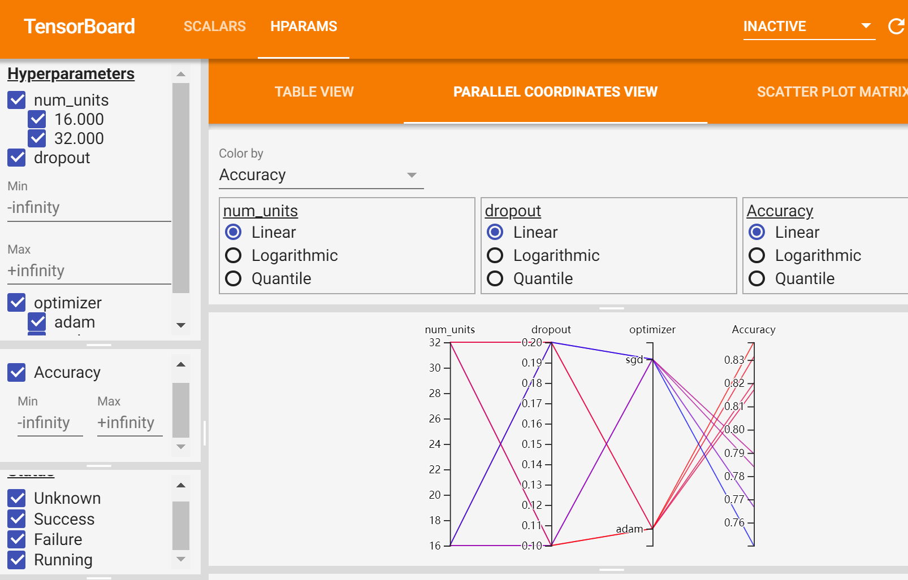

这是TensorBoard笔记的第四篇，讲述的是如何借助TensorBoard调整模型的超参数。
<!--more--->

TensorBoard中的HParams仪表板是比较新颖的工具包，提供了多种调节超参数的工具，并且该工具还在不断更新中。

```python
from tensorboard.plugins.hparams import api as hp
```

用过sklearn进行机器学习模型调参的同学应该体验过交叉验证调参的方法。通过提供许多不同的超参数选项，`GridSearchCV`将训练多个模型，并取性能最优的模型超参数。

```python
from sklearn.model_selection import GridSearchCV
from sklearn.pipeline import make_pipeline

X_train, X_test, y_train, y_test = train_test_split(df_train['text'][:10000], df_train['label'][:10000], random_state=0)
pipe_logis = make_pipeline(TfidfVectorizer(min_df=5, ngram_range=(1,3)), LogisticRegression())
param_grid = {'logisticregression__C': [0.001, 0.01, 0.1, 1, 10]}
grid = GridSearchCV(pipe_logis, param_grid, cv=5)
grid.fit(X_train, y_train)
print("Best params:\n{}\n".format(grid.best_params_))
print("Best cross-validation score: {:.2f}".format(grid.best_score_))
print("Test-set score: {:.2f}".format(grid.score(X_test, y_test)))
```

在上面的程序中，grid中包含一个需要调节的超参数，即逻辑回归的C值。候选C值有5个，因此grid在fit过程中会训练五个模型，每个模型执行5次交叉验证（因为fit中cv参数为5）。

HParams也是采用类似的方法找超参数。首先我们定义候选超参数的变化范围。我们选择三个参数进行网格搜索，分别是Dense层的Unit数目、dropout的比例和优化器，每个超参数都有两种选择，因此一共需要训练八个模型。

最终模型的评价标准以Accuracy为准。具体代码如下所示：

```python
HP_NUM_UNITS = hp.HParam('num_units', hp.Discrete([16, 32]))
HP_DROPOUT = hp.HParam('dropout', hp.RealInterval(0.1, 0.2))
HP_OPTIMIZER = hp.HParam('optimizer', hp.Discrete(['adam', 'sgd']))

METRIC_ACCURACY = 'accuracy'
```

设置write句柄，这已经是传统艺能了。

```python
with tf.summary.create_file_writer('logs/hparam_tuning').as_default():
  hp.hparams_config(
    hparams=[HP_NUM_UNITS, HP_DROPOUT, HP_OPTIMIZER],
    metrics=[hp.Metric(METRIC_ACCURACY, display_name='Accuracy')],
  )
```

接下来我们定义待训练模型。模型本身非常简单，而且只训练一个epoch，这是考虑到要消耗平时八倍的时间而采取的tradeoff。

```python
def train_test_model(hparams):
  model = tf.keras.models.Sequential([
    tf.keras.layers.Flatten(),
    tf.keras.layers.Dense(hparams[HP_NUM_UNITS], activation=tf.nn.relu),
    tf.keras.layers.Dropout(hparams[HP_DROPOUT]),
    tf.keras.layers.Dense(10, activation=tf.nn.softmax),
  ])
  model.compile(
      optimizer=hparams[HP_OPTIMIZER],
      loss='sparse_categorical_crossentropy',
      metrics=['accuracy'],
  )

  model.fit(x_train, y_train, epochs=1) # Run with 1 epoch to speed things up for demo purposes
  _, accuracy = model.evaluate(x_test, y_test)
  return accuracy
```

进行训练并记录模型输出；

```python
def run(run_dir, hparams):
  with tf.summary.create_file_writer(run_dir).as_default():
    hp.hparams(hparams)  # record the values used in this trial
    accuracy = train_test_model(hparams)
    tf.summary.scalar(METRIC_ACCURACY, accuracy, step=1)
```

之后我们进行网格搜索（其实就是遍历每种可能。搜索方法完全是自己定义的，你也可以使用随机搜索方法）：

```python
session_num = 0

for num_units in HP_NUM_UNITS.domain.values:
  for dropout_rate in (HP_DROPOUT.domain.min_value, HP_DROPOUT.domain.max_value):
    for optimizer in HP_OPTIMIZER.domain.values:
      hparams = {
          HP_NUM_UNITS: num_units,
          HP_DROPOUT: dropout_rate,
          HP_OPTIMIZER: optimizer,
      }
      run_name = "run-%d" % session_num
      print('--- Starting trial: %s' % run_name)
      print({h.name: hparams[h] for h in hparams})
      run('logs/hparam_tuning/' + run_name, hparams)
      session_num += 1
```

最后使用TensorBoard进行可视化：

```bash
%tensorboard --logdir logs/hparam_tuning
```


我们可以通过TensorBoard发现很多有趣的现象：比如在本模型中，adam优化器比sgd要好等等。

