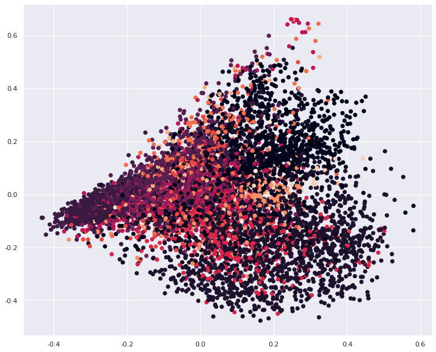
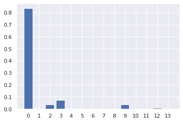
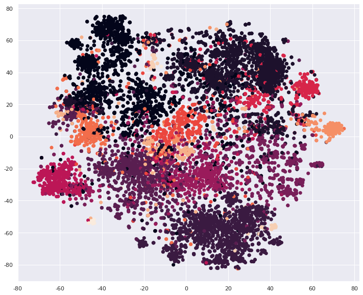

今我睹子之难穷也，吾非至于子之门则殆矣。
<!--more--->

# 文本表示方法实践
自然语言总需要转换成数值等表示才能被线性模型等处理。下面利用task1&2提到的编码方式进行实践。
## Label
这种编码方式是把自然语言首先分词成基本语素单元，然后把不同的单元赋予唯一的整数编码。比如本次比赛提供的数据集就是该编码方式。每条数据都是整数序列，最大整数为7549，最小整数为0。

这样做的好处是相对节约内存，且实现简单；坏处是破坏了自然语言中部分语义，无法进一步进行诸如删除停用词、词根提取等操作。另外，编码的大小可能会让算法误以为词和词之间有大小关系。

因为原来的数据集就是此编码方法，故不再赘述。

## Bag of Words: CountVectorizer
用于机器学习的文本表示有一种最简单的方法，也是最有效且最常用的方法，就是使用词袋（bag-of-words）表示。使用这种表示方式时，我们舍弃了输入文本中的大部分结构，如章节、段落、句子和格式，**只计算语料库中每个单词在每个文本中的出现频次**。舍弃结构并仅计算单词出现次数，这会让脑海中出现将文本表示为“袋”的画面。

```python
from sklearn.feature_extraction.text import CountVectorizer
bagvect = CountVectorizer(max_df=.15)
bagvect.fit(corpus)
feature_names = bagvect.get_feature_names()
print("Number of features: {}".format(len(feature_names)))
print("First 20 features:\n{}".format(feature_names[:20]))
Number of features: 4740
First 20 features:
['10', '100', '1000', '1001', '1002', '1004', '1005', '1006', '1007', '1008', '1009', '101', '1010', '1012', '1013', '1014', '102', '1020', '1022', '1023']


bag_of_words = bagvect.transform(corpus)
print("bag_of_words: {}".format(repr(bag_of_words)))
print(bag_of_words[0].toarray())
bag_of_words: <10000x4740 sparse matrix of type '<class 'numpy.int64'>'
	with 813365 stored elements in Compressed Sparse Row format>
[[0 0 0 ... 0 0 0]]
```

词袋表示保存在一个 SciPy 稀疏矩阵中，这种数据格式只保存非零元素

矩阵的形状为 10000x4740，每行对应于两个数据点之一，每个特征对应于词表中的一个单词。当然，我们在这里选了10000个样本，如果把所有数据集都给转化成词袋向量，那么矩阵形状将会是 200000×6859。

## Hash编码实践
https://chenk.tech/posts/eb79fc5f.html

```python
from sklearn.feature_extraction.text import HashingVectorizer
hvec = HashingVectorizer(n_features=10000)
hvec.fit(corpus)
h_words = hvec.transform(corpus)
print("h_words: {}".format(repr(h_words)))

h_words: <10000x10000 sparse matrix of type '<class 'numpy.float64'>'
	with 2739957 stored elements in Compressed Sparse Row format>
```
我选取了10000个样本，将其映射到10000个特征的Hash向量中。
```python
print(h_words[0])
 (0, 0)	-0.009886463280261834
  (0, 6)	-0.04943231640130917
  (0, 9)	0.03954585312104734
  (0, 26)	-0.04943231640130917
  (0, 42)	0.01977292656052367
  (0, 70)	0.01977292656052367
  (0, 74)	-0.12852402264340385
  (0, 94)	0.009886463280261834
  (0, 99)	0.01977292656052367
  (0, 109)	-0.009886463280261834
  :	:
  (0, 9642)	-0.009886463280261834
  (0, 9650)	0.01977292656052367
  (0, 9653)	0.009886463280261834
  (0, 9659)	-0.04943231640130917
  (0, 9715)	-0.009886463280261834
  (0, 9721)	0.009886463280261834
  (0, 9729)	-0.009886463280261834
  (0, 9741)	0.009886463280261834
  (0, 9765)	-0.01977292656052367
  (0, 9781)	0.01977292656052367
  (0, 9821)	-0.009886463280261834
  (0, 9862)	0.009886463280261834
  (0, 9887)	-0.009886463280261834
  (0, 9932)	0.009886463280261834
  ```
输出的含义，前面的元组代表了该特征在词袋中的位置，后面的数值代表了对应的Hash值。
## TF-IDF
TF-IDF（Term Frequency-inverse Document Frequency）是一种针对关键词的统计分析方法，用于评估一个词对一个文件集或者一个语料库的重要程度。

```python
from sklearn.feature_extraction.text import TfidfVectorizer
tvec = TfidfVectorizer()
tvec.fit(corpus)
feature_names = tvec.get_feature_names()
print("Number of features: {}".format(len(feature_names)))
print("First 20 features:\n{}".format(feature_names[:20]))

Number of features: 5333
First 20 features:
['10', '100', '1000', '1001', '1002', '1004', '1005', '1006', '1007', '1008', '1009', '101', '1010', '1012', '1013', '1014', '1018', '102', '1020', '1022']

t_words = tvec.transform(corpus)
print("t_words: {}".format(repr(t_words)))
print(t_words[0].toarray())

t_words: <10000x5333 sparse matrix of type '<class 'numpy.float64'>'
	with 2797304 stored elements in Compressed Sparse Row format>
[[0. 0. 0. ... 0. 0. 0.]]

# 找到数据集中每个特征的最大值
max_value = t_words.max(axis=0).toarray().ravel()
sorted_by_tfidf = max_value.argsort()
# 获取特征名称
feature_names = np.array(tvec.get_feature_names())
print("Features with lowest tfidf:\n{}".format(feature_names[sorted_by_tfidf[:20]]))
print("Features with highest tfidf: \n{}".format(feature_names[sorted_by_tfidf[-20:]]))
sorted_by_idf = np.argsort(tvec.idf_)
print("Features with lowest idf:\n{}".format(feature_names[sorted_by_idf[:100]]))

Features with lowest tfidf:
['6844' '6806' '7201' '5609' '5585' '5485' '3453' '7390' '2322' '2083'
 '1222' '2360' '319' '2520' '6268' '3105' '6049' '4888' '2390' '2849']
Features with highest tfidf: 
['3198' '2346' '5480' '4375' '6296' '1710' '682' '354' '4381' '482' '5990'
 '2798' '5907' '3992' '418' '513' '4759' '6250' '6220' '1633']
Features with lowest idf:
['3750' '900' '648' '6122' '7399' '2465' '4811' '4464' '1699' '299' '2400'
 '3659' '3370' '2109' '4939' '669' '5598' '5445' '4853' '5948' '2376'
 '7495' '4893' '5410' '340' '619' '4659' '1460' '6065' '1903' '5560'
 '6017' '2252' '4516' '1519' '2073' '5998' '5491' '2662' '5977' '6093'
 '1324' '5780' '3915' '3800' '5393' '2210' '5915' '3223' '4490' '2490'
 '1375' '803' '1635' '7539' '4411' '4128' '7543' '5602' '1866' '5176'
 '2799' '4646' '3700' '5858' '307' '913' '25' '6045' '1702' '4822' '3099'
 '5330' '1920' '1567' '2614' '4190' '1080' '5510' '4149' '3166' '3530'
 '192' '5659' '3618' '4525' '3686' '6038' '1767' '5589' '5736' '6831'
 '7377' '4969' '1394' '6104' '7010' '6407' '5430' '23']
```
## 多个单词的词袋：N-gram《》
使用词袋表示的主要缺点之一是完全舍弃了单词顺序。因此，“it’s bad, not good at all”（电影很差，一点也不好）和“it’s good, not bad at all”（电影很好，还不错）这两个字符串的词袋表示完全相同，尽管它们的含义相反。将“not”（不）放在单词前面，这只是上下文很重要的一个例子（可能是一个极端的例子）。幸运的是，使用词袋表示时有一种获取上下文的方法，就是不仅考虑单一词例的计数，而且还考虑相邻的两个或三个词例的计数。两个词例被称为二元分词（bigram），三个词例被称为三元分词（trigram），更一般的词例序列被称为 n 元分词（n-gram）。我们可以通过改变 CountVectorizer 或 TfidfVectorizer 的 ngram_range 参数来改变作为特征的词例范围。ngram_range 参数是一个元组，包含要考虑的词例序列的最小长度和最大长度。

在大多数情况下，添加二元分词会有所帮助。添加更长的序列（一直到五元分词）也可能有所帮助，但这会导致特征数量的大大增加，也可能会导致过拟合，因为其中包含许多非常具体的特征。原则上来说，二元分词的数量是一元分词数量的平方，三元分词的数量是一元分词数量的三次方，从而导致非常大的特征空间。在实践中，更高的 n 元分词在数据中的出现次数实际上更少，原因在于（英语）语言的结构，不过这个数字仍然很大。

```python
from sklearn.feature_extraction.text import TfidfVectorizer
tvec = TfidfVectorizer(ngram_range=(1,3), min_df=5)
tvec.fit(corpus)
# 找到数据集中每个特征的最大值
max_value = t_words.max(axis=0).toarray().ravel()
sorted_by_tfidf = max_value.argsort()
# 获取特征名称
feature_names = np.array(tvec.get_feature_names())
print("Features with lowest tfidf:\n{}".format(feature_names[sorted_by_tfidf[:20]]))
print("Features with highest tfidf: \n{}".format(feature_names[sorted_by_tfidf[-20:]]))
sorted_by_idf = np.argsort(tvec.idf_)
print("Features with lowest idf:\n{}".format(feature_names[sorted_by_idf[:100]]))


Features with lowest tfidf:
['1008 5612' '100 5560' '1018 4089 5491' '101 648 900' '1006 3750 826'
 '1018 1066 3231' '101 5560 3568' '100 5589' '1018 2119 281'
 '101 5560 3659' '1018 1066 3166' '100 5598 1465' '1000 5011'
 '101 2662 4939' '100 5602' '101 873 648' '1006 2265 648' '1008 5640'
 '1008 5689' '101 856 531']
Features with highest tfidf: 
['101 2087' '1018 1066 281' '101 648 3440' '1006 5640 3641' '101 760 4233'
 '1006 6017' '1018 1066 6983' '1014 3750 3659' '100 5430 2147'
 '100 5510 2471' '1018 1141' '1006 1866 5977' '1018 2119 3560'
 '1018 2662 3068' '101 1844 4486' '101 2304 3659' '1006 3750 5330'
 '101 5589' '1008 900 3618' '100 6122 2489']
Features with lowest idf:
['3750' '900' '648' '2465' '6122' '7399' '4811' '4464' '1699' '3659'
 '2400' '299' '3370' '2109' '4939' '5598' '669' '5445' '4853' '2376'
 '5948' '7495' '4893' '5410' '340' '619' '4659' '1460' '6065' '4516'
 '1903' '5560' '6017' '2252' '2073' '1519' '5491' '5998' '2662' '5977'
 '1324' '5780' '6093' '3915' '5393' '2210' '3800' '3223' '5915' '4490'
 '2490' '803' '1635' '4128' '1375' '7539' '4411' '7543' '5602' '2799'
 '1866' '5176' '5858' '4646' '3700' '307' '6045' '1702' '25' '913' '5330'
 '4822' '2614' '3099' '1920' '1567' '4190' '4149' '5510' '1080' '3166'
 '3659 3370' '3530' '192' '3618' '4525' '5659' '3686' '6038' '1767' '5736'
 '7377' '5589' '6831' '3370 3370' '1394' '4969' '5430' '7010' '6104']
```

# 无监督探索
## PCA可视化

```python
from sklearn.decomposition import PCA
pca = PCA(n_components=2)
pca_vec = pca.fit_transform(t_words.toarray())
pca_vec.shape, pca.explained_variance_ratio_
((10000, 2), array([0.03817303, 0.02684457]))
```

我们成功将tfidf转化后的词向量压缩成2维向量，这样就能够在二维平面可视化了。

后面的`explained_variance_ratio_`代表着经过PCA算法压缩后，保留的信息量。这个数值还是偏低，因此这种PCA压缩方法仅适用于实验。

```python
plt.figure(figsize=(12,10))
plt.scatter(pca_vec[:,0], pca_vec[:,1], c=labels)
```


## 主题建模
常用于文本数据的一种特殊技术是主题建模（topic modeling），这是描述将每个文档分配给一个或多个主题的任务（通常是无监督的）的概括性术语。这方面一个很好的例子是新闻数据，它们可以被分为“政治”“体育”“金融”等主题。如果为每个文档分配一个主题，那么这是一个文档聚类任务。我们学到的每个成分对应于一个主题，文档表示中的成分系数告诉我们这个文档与该主题的相关性强弱。通常来说，人们在谈论主题建模时，他们指的是一种叫作隐含狄利克雷分布（Latent Dirichlet Allocation，LDA）的特定分解方法。

我们将 LDA 应用于新闻数据集，来看一下它在实践中的效果。对于无监督的文本文档模型，通常最好删除非常常见的单词，否则它们可能会支配分析过程。我们将删除至少在15% 的文档中出现过的单词，并在删除前 15% 之后，将词袋模型限定为最常见的 10 000 个单词：

```python
vect = CountVectorizer(max_features=10000, max_df=.15)
X = vect.fit_transform(corpus)
from sklearn.decomposition import LatentDirichletAllocation
lda = LatentDirichletAllocation(n_components=14, learning_method="batch", max_iter=25, random_state=0)
# 我们在一个步骤中构建模型并变换数据
# 计算变换需要花点时间，二者同时进行可以节省时间
document_topics = lda.fit_transform(bag_of_words)
# 对于每个主题（components_的一行），将特征排序（升序）
# 用[:, ::-1]将行反转，使排序变为降序
sorting = np.argsort(lda.components_, axis=1)[:, ::-1]
# 从向量器中获取特征名称
feature_names = np.array(bagvect.get_feature_names())
plt.figure()
plt.bar(x=range(14), height=document_topics[0])
plt.xticks(list(range(14)))
```


由LDA确定的主题词如下：

```python
topic 0       topic 1       topic 2       topic 3       topic 4       
--------      --------      --------      --------      --------      
6654          1970          7349          3464          4412          
4173          2716          7354          7436          7363          
1219          4553          1684          5562          6689          
6861          7042          5744          3289          4986          
5006          5822          6569          5105          2506          
7400          5099          1999          5810          3056          
3508          3654          1351          3134          6220          
6223          3021          56            3648          5117          
6227          4967          4036          6308          6319          
7257          3396          4223          1706          2695          


topic 5       topic 6       topic 7       topic 8       topic 9       
--------      --------      --------      --------      --------      
4967          1334          1934          4114          7328          
7528          5166          1146          3198          5547          
3644          6143          532           517           4768          
1899          2695          4802          812           3231          
6678          1616          419           3090          5492          
5744          7532          4089          4163          4080          
6047          368           3725          5305          4120          
1252          2918          2851          177           2331          
5814          2968          6227          7251          3019          
1170          3032          6639          2835          6613          


topic 10      topic 11      topic 12      topic 13      
--------      --------      --------      --------      
3523          4902          5178          5122          
3342          1258          6014          6920          
6722          343           5920          5519          
6352          4089          4603          7154          
3186          5226          3648          4381          
5179          810           4042          4760          
4369          6284          1724          4412          
3501          3477          4450          4595          
2334          7127          657           3377          
2722          7077          5803          7006 
```
## t-SNE可视化

t-SNE是当前最流行的数据可视化方法。将TF-IDF转化后的向量可视化如下：

```python
from sklearn.manifold import TSNE
words_emb = TSNE(n_components=2).fit_transform(t_words)
plt.figure(figsize=(12,10))
plt.scatter(words_emb[:,0], words_emb[:,1], c=labels)
```


将HashingVectorizer转化后的向量经过t-SNE算法可视化结果分享如下：
```python
hash_words_emb = TSNE(n_components=2).fit_transform(h_words)
plt.figure(figsize=(12,10))
plt.scatter(hash_words_emb[:,0], hash_words_emb[:,1], c=labels)
```


# 机器学习

首先导入相关库
```python
from sklearn.feature_extraction.text import CountVectorizer, TfidfVectorizer
from sklearn.pipeline import make_pipeline
from sklearn.linear_model import LogisticRegression, RidgeClassifier
from sklearn.model_selection import GridSearchCV, train_test_split, cross_val_score
from sklearn.multiclass import OneVsRestClassifier
from sklearn.svm import SVC
from sklearn.metrics import f1_score
```

https://scikit-learn.org/stable/modules/classes.html#module-sklearn.linear_model
## RidgeClassifier+CountVectorizer

首先我们使用教程中的范例

```python
X, y = df_train['text'][:10000], df_train['label'][:10000]
vectorizer = CountVectorizer(max_features=3000)
X = vectorizer.fit_transform(X)

clf = RidgeClassifier()
clf.fit(X[:5000], y[:5000]) # 使用前5000个样本进行训练

val_pred = clf.predict(X[5000:]) # 使用后5000个样本进行预测
print(f1_score(y[5000:], val_pred, average='macro'))

0.6322204326986258
```

我们把10000个样本中，前5000个用于训练，后5000个用于测试，最终结果以F1指标展示，结果为0.63，不太令人满意。

## LogisticRegression+TFIDF

最常见的线性分类算法是 Logistic 回归。虽然 LogisticRegression 的名字中含有回归（regression），但它是一种分类算法，并不是回归算法，不应与 LinearRegression 混淆。
我们可以将 LogisticRegression 和 LinearSVC 模型应用到经过tfidf处理的新闻文本数据集上。

我们使用了sklearn中的划分数据集的方法`train_test_split`，将数据集划分成训练集和测试集两部分。但是这样一来，数据集中的测试集部分将不能被训练，未免有点可惜。

我们在训练时，采用了pipeline方式，Pipeline 类可以将多个处理步骤合并（glue）为单个 scikit-learn 估计器。Pipeline 类本身具有 fit、predict 和 score 方法，其行为与 scikit-learn 中的其 他模型相同。Pipeline 类最常见的用例是将预处理步骤（比如数据缩放）与一个监督模型 （比如分类器）链接在一起。

```python
%%time
X_train, X_test, y_train, y_test = train_test_split(df_train['text'][:10000], df_train['label'][:10000], random_state=0)
pipe_logis = make_pipeline(TfidfVectorizer(min_df=5, ngram_range=(1,3)), LogisticRegression())
param_grid = {'logisticregression__C': [0.001, 0.01, 0.1, 1, 10]}
grid = GridSearchCV(pipe_logis, param_grid, cv=5)
grid.fit(X_train, y_train)
print("Best params:\n{}\n".format(grid.best_params_))
print("Best cross-validation score: {:.2f}".format(grid.best_score_))
print("Test-set score: {:.2f}".format(grid.score(X_test, y_test)))

Best params:
{'logisticregression__C': 10}
Best cross-validation score: 0.91
Test-set score: 0.92
```

## SVC+tfidf
这次我们使用非线性模型中大名鼎鼎的SVM模型，并采用交叉验证的方法划分数据集，不浪费任何一部分数据。

```python
X_train, y_train = df_train['text'][:10000], df_train['label'][:10000]
pipe_svc = make_pipeline(TfidfVectorizer(min_df=5), SVC()) # decision_function_shape='ovr'
scores = cross_val_score(pipe_svc, X_train, y_train, cv=5, n_jobs=-1)
print(scores.mean())

0.8924
```

# 模型评价
TR，FN，precision，recall等的进一步解释，请参考以下链接：
https://www.zhihu.com/question/30643044

# 进一步优化

使用机器学习模型+巧妙的特征工程，我们可以达到90%以上的精度，这在14分类问题中已经很惊人了。然而我们的工作并没有结束，还有许许多多的问题等着我们去探索。比如
- 删除停用词、罕见词、其他常见词和不能反映特征的词
- 类别不平衡问题

周志华《机器学习》中介绍到，分类学习方法都有一个共同的基本假设，即不同类别的训练样例数目相当。如果不同类别的训练样例数目稍有差别，对学习结果的影响通常也不大，但若样本类别数目差别很大，属于极端不均衡，则会对学习过程（模型训练）造成困扰。这些学习算法的设计背后隐含的优化目标是数据集上的分类准确度，而这会导致学习算法在不平衡数据上更偏向于含更多样本的多数类。多数不平衡学习（imbalance learning）算法就是为了解决这种“对多数类的偏好”而提出的。如果正负类样本类别不平衡比例超过4:1，那么其分类器会大大地因为数据不平衡性而无法满足分类要求

关于如何解决类别不平衡的问题，可以参考以下链接：
https://zhuanlan.zhihu.com/p/84322912
https://zhuanlan.zhihu.com/p/36381828
