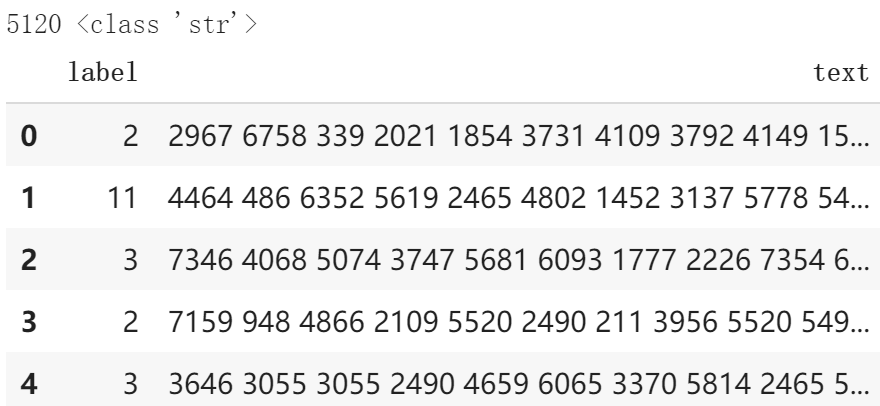
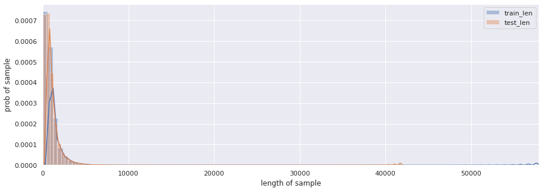
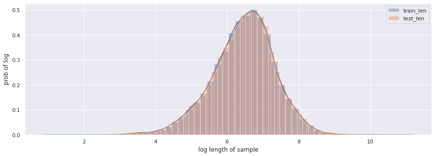
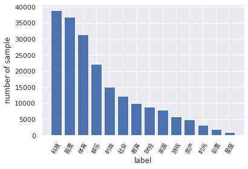
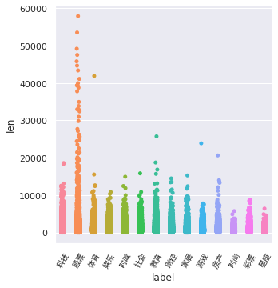
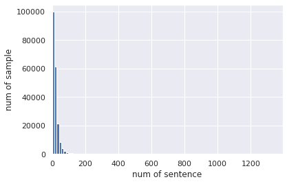

不要对我有任何期待哦！
<!--more--->

# 实验环境

Colab

```python
import numpy as np
import pandas as pd
import matplotlib.pyplot as plt
from sklearn.model_selection import train_test_split
import seaborn as sns
import scipy
from collections import Counter
```

# 准备数据

```python
df_train = pd.read_csv(train_path, sep='\t')
df_test = pd.read_csv(test_path, sep='\t')
```
# 数据探索

## 简单查看数据

```python
df_train.head(), len(df_train)
(   label                                               text
 0      2  2967 6758 339 2021 1854 3731 4109 3792 4149 15...
 1     11  4464 486 6352 5619 2465 4802 1452 3137 5778 54...
 2      3  7346 4068 5074 3747 5681 6093 1777 2226 7354 6...
 3      2  7159 948 4866 2109 5520 2490 211 3956 5520 549...
 4      3  3646 3055 3055 2490 4659 6065 3370 5814 2465 5..., 200000)
```

发现text域的数据是字符串。我们想要得到整数序列。可以用字符串分割`split()`。
```python
print(len(df_train['text'][0]), type(df_train['text'][0]))
df_train.head()
```

## 长度分布

### describe

这里与教程中的方法有所不同。vectorize是numpy中很方便的函数，作用和pandas中`apply`差不多。用法：

`np.vectorize(function)(array)`

输入待处理的array，以及逐元素处理函数function，返回经过处理后的ndarray。原来的array则不受影响。

当前我使用的函数`split_df`负责将一行数据按空格切分成整数列表，然后计算该列表的长度。

```python
def split_df(df_row):
    return len(str(df_row).split())
len_dist = np.vectorize(split_df)(df_train['text'])
len_test_dist = np.vectorize(split_df)(df_test['text'])
```
使用describe函数查看训练集和测试集中的数据长度分布

```python
print(pd.Series(len_dist).describe())
print(pd.Series(len_test_dist).describe())
count    200000.000000
mean        907.207110
std         996.029036
min           2.000000
25%         374.000000
50%         676.000000
75%        1131.000000
max       57921.000000

dtype: float64
count    50000.000000
mean       909.844960
std       1032.313375
min         14.000000
25%        370.000000
50%        676.000000
75%       1133.000000
max      41861.000000
dtype: float64
```
通过数据描述可以看到

训练集共200,000条新闻，每条新闻平均907个字符，最短的句子长度为2，最长的句子长度为57921，其中75%以下的数据长度在1131以下。

测试集共50,000条新闻，每条新闻平均909个字符，最短句子长度为14，最长句子41861,75%以下的数据长度在1133以下。

训练集和测试集就长度来说似乎是同一分布。

### 直方图
绘制直方图查看训练集和测试集中的数据长度分布

```python
fig, ax = plt.subplots(1,1,figsize=(12,6))

ax = plt.hist(x=len_dist, bins=100)
ax = plt.hist(x=len_test_dist, bins=100)

plt.xlim([0, max(max(len_dist), max(len_test_dist))])
plt.xlabel("length of sample")
plt.ylabel("number of sample")
plt.legend(['train_len','test_len'])

plt.show()
```


使用seaborn绘制更好的图

seaborn计算的纵坐标是频率，而不是出现次数。由于训练集和测试集的数据量不一样，因此用频率更加科学、更能看出是否符合同一分布。

```python
plt.figure(figsize=(15,5))
ax = sns.distplot(len_dist, bins=100)
ax = sns.distplot(len_test_dist, bins=100)
plt.xlim([0, max(max(len_dist), max(len_test_dist))])
plt.xlabel("length of sample")
plt.ylabel("prob of sample")
plt.legend(['train_len','test_len'])
```


通过直方图，我们能直观感受到训练集和测试集的长度分布都属于右偏分布。按理说分析到这份儿上就该停了。

### 同分布验证

```python
import scipy
scipy.stats.ks_2samp(len_dist, len_test_dist)
Ks_2sampResult(statistic=0.004049999999999998, pvalue=0.5279614323123156)
```

P值为0.52，比指定的显著水平（假设为5%）大，我们认为二者同分布。

### 截断位置

在输入模型进行训练之前，我们要把所有的数据长度统一化，数据肯定要截断。但是在什么位置截断合适呢？

考虑到数据长度分布是长尾分布，log一下看看是不是正态分布，如果是正态分布，使用3sigma法则作为截断的参考。如果不是，则就只能瞎猜了

测量拟合分布的均值和方差sigma原则

$1\sigma$原则：数值分布在$(\mu-\sigma,\mu+\sigma)$中的概率为0.6526；

$2\sigma$原则：数值分布在$(\mu-2\sigma,\mu+2\sigma)$中的概率为0.9544；

$3\sigma$原则：数值分布在$(\mu-3\sigma,\mu+3\sigma)$中的概率为0.9974；

由于“小概率事件”和假设检验的基本思想 “小概率事件”通常指发生的概率小于5%的事件，认为在一次试验中该事件是几乎不可能发生的。由此可见X落在$(\mu-3\sigma,\mu+3\sigma)$以外的概率小于千分之三，在实际问题中常认为相应的事件是不会发生的，基本上可以把区间$(\mu-3\sigma,\mu+3\sigma)$看作是随机变量X实际可能的取值区间，这称之为正态分布的“$3\sigma$”原则。
```python
log_len_dist = np.log(1+len_dist)
log_len_test_dist = np.log(1+len_test_dist)
plt.figure(figsize=(15,5))
ax = sns.distplot(log_len_dist)
ax = sns.distplot(log_len_test_dist)
plt.xlabel("log length of sample")
plt.ylabel("prob of log")
plt.legend(['train_len','test_len'])
```


从log图上也能看出二者（很像）同分布。

下面我想验证一下我的猜想：该分布为正态分布，且训练集和测试集为同分布。

先验证训练集分布为正态分布：

```python
_, lognormal_ks_pvalue = scipy.stats.kstest(rvs=log_len_dist, cdf='norm')
print('P value is ', lognormal_ks_pvalue)

P value is  0.0
```
？0？？？拟合优度检验，p值为0，意思就是说这不是一个正态分布。
关于分布检验，参考[这篇文章](https://blog.csdn.net/QimaoRyan/article/details/72861387)

之前我们把数据log了一下，但是这里有更科学的变换方式。log只是box-cox变换的特殊形式。我们使用box-cox变换再次做一下验证，是否为正态分布：
```python
trans_data, lam = scipy.stats.boxcox(len_dist+1)
scipy.stats.normaltest(trans_data)
NormaltestResult(statistic=1347.793358118494, pvalue=2.1398873511704724e-293)
```
e后面跟了那么多负数，我佛了。

但总归是要猜一个截断值的。看log图上8.5的位置比较靠谱。np.exp(8.5)=4914约等于5000，因此我初步决定把截断长度定为5000。

## 类别分布

之前的讨论是从数据集总体验证同分布的，我们还需要验证训练集的类别足够均匀。

在数据集中标签的对应的关系如下
```python
label_2_index_dict = {'科技': 0, '股票': 1, '体育': 2, '娱乐': 3, '时政': 4, '社会': 5, '教育': 6, '财经': 7, '家居': 8, '游戏': 9, '房产': 10, '时尚': 11, '彩票': 12, '星座': 13}
index_2_label_dict = {v:k for k,v in label_2_index_dict.items()}

plt.figure()
plt.bar(x=range(14), height=np.bincount(df_train['label']))
plt.xlabel("label")
plt.ylabel("number of sample")
plt.xticks(range(14), list(index_2_label_dict.values()), fontproperties=zhfont, rotation=60)
plt.show()
```


从统计结果可以看出

赛题的数据集类别分布存在较为不均匀的情况。在训练集中科技类新闻最多，其次是股票类新闻，最少的新闻是星座新闻。

科技类新闻最多，星座类新闻最少。这个国家的人大部分是唯物主义者哈，神秘学受众比较少（啊这，我在分析什么？）。

由于类别不均衡，会严重影响模型的精度。但是我们也是有办法应对的。由于篇幅受限，我就不在这里写了

> 关于此，我确信已发现了一种美妙的证法 ，可惜这里空白的地方太小，写不下。——费马  
> Cuius rei demonstrationem mirabilem sane detexi. Hanc marginis exiguitas non caperet.

## 类别长度
```python
df_train['len'] = df_train['text'].apply(lambda x: len(x.split()))
plt.figure()
ax = sns.catplot(x='label', y='len', data=df_train, kind='strip')
plt.xticks(range(14), list(index_2_label_dict.values()), fontproperties=zhfont, rotation=60)
```


在散点图中，股票类新闻的长度都飘到天上去了，可以看出股票分析类文章真的很容易写得又臭又长啊！

## 字符分布

训练集中总共包括6869个字，最大数字为7549，最小数字为0，其中编号3750的字出现的次数最多，编号3133的字出现的次数最少，仅出现一次。
```python
# 内存警告！！！没有8G内存不要运行该代码
all_lines = ' '.join(list(df_train['text']))
word_count = Counter(all_lines.split(" "))
word_count = sorted(word_count.items(), key=lambda d:d[1], reverse=True)

print(len(word_count))
# 6869

print(word_count[0])
# ('3750', 7482224)

print(word_count[-1])
# ('3133', 1)
```
下面代码统计了不同字符在多少个句子中出现过，其中字符3750、字符900和字符648在20w新闻的覆盖率接近99%，很有可能是标点符号。
```python
%%time
df_train['text_unique'] = df_train['text'].apply(lambda x: ' '.join(list(set(x.split(' ')))))
all_lines = ' '.join(list(df_train['text_unique']))
word_count = Counter(all_lines.split(" "))
word_count = sorted(word_count.items(), key=lambda d:int(d[1]), reverse=True)
# 打印整个训练集中覆盖率前5的词
for i in range(5):
    print("{} occurs {} times, {}%".format(word_count[i][0], word_count[i][1], (word_count[i][1]/200000)*100))
```
3750 occurs 197997 times, 98.9985%
900 occurs 197653 times, 98.8265%
648 occurs 191975 times, 95.9875%
2465 occurs 177310 times, 88.655%
6122 occurs 176543 times, 88.2715%

## 习题

**假设字符3750，字符900和字符648是句子的标点符号，请分析赛题每篇新闻平均由多少个句子构成？**

如果这是英文文章，那么3750应该是空格吧？如果3750是逗号怎么办？先要判断哪个是句号。

思路：该新闻的句子数为该个数。每条新闻最后的字符往往是句号，先看看每条新闻最后一个字符是什么：

```python
last_char = np.vectorize(lambda x:int(x.split()[-1]))(df_train['text'])
last_char_count = Counter(last_char)
last_char_count = sorted(last_char_count.items(), key=lambda d:d[1], reverse=True)
# 打印出现次数最多的前十个
for i in range(10):
    print("{}在新闻末尾出现了{}次".format(last_char_count[i][0], last_char_count[i][1]))
900在新闻末尾出现了85040次
2662在新闻末尾出现了39273次
885在新闻末尾出现了14473次
1635在新闻末尾出现了7379次
2465在新闻末尾出现了7076次
57在新闻末尾出现了3284次
3231在新闻末尾出现了2758次
1633在新闻末尾出现了2706次
3568在新闻末尾出现了1504次
2265在新闻末尾出现了1389次
```

因此我们有理由认为900是句号。值域3750应该是逗号吧？猜的，我也不知道，因为3750不太容易在新闻末尾出现。但是除了句号之外，感叹号和问号照样能划分句子，我们试着将2662当作感叹号，将885当作问号。

下面开始计算每篇新闻所含标点符号（900、2662、885）的个数，

```python
def sum_of_sep(row):
    counter = Counter(row.split())
    return counter.get('900', 0)+counter.get('2662', 0)+counter.get('885', 0)
sum_sep = np.vectorize(sum_of_sep)(df_train['text'])
print("平均每条新闻的句子个数约为：", np.round(np.mean(sum_sep)))
pd.Series(sum_sep).describe()

平均每条新闻的句子个数约为： 19.0
count    200000.000000
mean         19.070155
std          21.463798
min           0.000000
25%           7.000000
50%          14.000000
75%          24.000000
max        1392.000000
dtype: float64
```
平均长度为19，其实这是把那些股票文章也算上了，拉高了平均值。75%的新闻长度都在24个句子以下。

看看分布：

```python
plt.figure()
plt.hist(sum_sep, bins=100)
plt.xlim([0,max(sum_sep)])
plt.xlabel("num of sentence")
plt.ylabel("num of sample")
plt.show()
```


**每类新闻中出现次数最多的字符**
```python
word_count_dict = {}
for name, df in df_train.groupby('label'):
    # print(name, type(df))
    all_text = ' '.join(list(df['text'].apply(lambda x: ' '.join(list(x.split(' '))))))
    word_count_single_class = Counter(all_text.split(" "))
    word_count_single_class = sorted(word_count_single_class.items(), key=lambda d:int(d[1]), reverse = True)
    word_count_dict[name] = word_count_single_class

# 查看每个类别出现最多的词汇
for label in range(14):
    print(index_2_label_dict[label], word_count_dict[label][0])
```
科技 ('3750', 1267331)
股票 ('3750', 1200686)
体育 ('3750', 1458331)
娱乐 ('3750', 774668)
时政 ('3750', 360839)
社会 ('3750', 715740)
教育 ('3750', 469540)
财经 ('3750', 428638)
家居 ('3750', 242367)
游戏 ('3750', 178783)
房产 ('3750', 180259)
时尚 ('3750', 83834)
彩票 ('3750', 87412)
星座 ('3750', 33796)

**每类新闻中出现次数前10**
```python
for label in range(14):
    print(index_2_label_dict[label], [x for x,_ in word_count_dict[label][:10]])
```
科技 ['3750', '648', '900', '3370', '4464', '2465', '6122', '3659', '7399', '4939']
股票 ['3750', '648', '3370', '900', '4464', '3659', '5036', '6250', '1633', '6065']
体育 ['3750', '648', '900', '7399', '6122', '4939', '4704', '1667', '5598', '669']
娱乐 ['3750', '648', '900', '6122', '4939', '4893', '7399', '669', '803', '1635']
时政 ['3750', '648', '900', '4411', '7399', '4893', '6122', '4464', '2400', '4853']
社会 ['3750', '648', '900', '6122', '5598', '4893', '7399', '4939', '3370', '669']
教育 ['3750', '648', '900', '6248', '2555', '5620', '2465', '6122', '5560', '3370']
财经 ['3750', '648', '900', '3370', '5296', '4464', '6835', '3659', '6122', '7399']
家居 ['3750', '648', '900', '6122', '4939', '913', '5560', '7399', '3961', '4811']
游戏 ['3750', '648', '900', '7328', '6122', '7399', '5547', '4939', '3370', '2465']
房产 ['3750', '648', '900', '3370', '2465', '5560', '3686', '4464', '3523', '6122']
时尚 ['3750', '648', '900', '4939', '6122', '5560', '669', '4811', '7539', '4893']
彩票 ['3750', '4464', '3370', '648', '2465', '900', '3659', '6065', '1667', '2614']
星座 ['3750', '648', '900', '4939', '669', '6122', '4893', '3864', '4811', '1465']

# 分析结果

数据分析肯定要有结论，没有结论的数据分析是不完整的。

1. 训练集共200,000条新闻，每条新闻平均907个字符，最短的句子长度为2，最长的句子长度为57921，其中75%以下的数据长度在1131以下。测试集共50,000条新闻，每条新闻平均909个字符，最短句子长度为14，最长句子41861,75%以下的数据长度在1133以下。

2. 训练集和测试集就长度来说似乎是同一分布，但是不属于正态分布。

3. 把截断长度定为5000？

4. 赛题的数据集类别分布存在较为不均匀的情况。在训练集中科技类新闻最多，其次是股票类新闻，最少的新闻是星座新闻。需要用采样方法解决。文章最长的是股票类新闻。

5. 训练集中总共包括6869个字，最大数字为7549，最小数字为0，其中编号3750的字出现的次数最多，编号3133的字出现的次数最少，仅出现一次，其中字符3750、字符900和字符648在20w新闻的覆盖率接近99%，很有可能是标点符号。

6. 900很有可能是句号，2662和885则很有可能为感叹号和问号，3750出现频率很高但是基本不在新闻最后出现，因此初步判断为逗号。按照这种划分，训练集中每条新闻平均句子个数约为19。