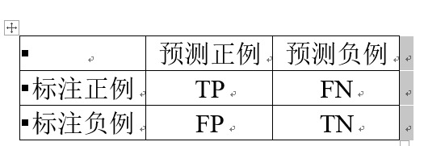

这项任务不好做呀，稍不小心就占用了task2的内容。
<!--more--->

# 零基础入门NLP之新闻文本分类之赛题理解

## 一、现在公开的情报

### 1. 比赛内容

本次比赛的任务为文本的分类任务。虽然简单，但是想要取得高分还是不容易。

待分类文本为新闻文本。新闻文本根据来源，分为财经、彩票、房产、股票、家居、教育、科技、社会、时尚、时政、体育、星座、游戏、娱乐，共14类。

### 2. 数据内容

训练集和测试集在[官网](https://tianchi.aliyun.com/competition/entrance/531810/introduction)下载。

其中训练集是带正确标签的，测试集不带标签，是真正的题目。我们的任务是训练模型，正确分类测试集中每一条新闻的标签。

训练集由20万条新闻构成，测试集五万条数据。

每条新闻都被编码为整数序列。每个单词对应一个整数。

数据集中标签的对应的关系如下：

`{'科技': 0, '股票': 1, '体育': 2, '娱乐': 3, '时政': 4, '社会': 5, '教育': 6, '财经': 7, '家居': 8, '游戏': 9, '房产': 10, '时尚': 11, '彩票': 12, '星座': 13}`

### 3. 赛制

- 第一阶段（7月15日-9月7日），每天两次提交自己答案的机会，系统根据成绩自动排名，排行榜每小时更新。该排行与最终成绩无关。
- 第二阶段（9月7日～9月8日）清空排行榜，7日11：00放出新测试数据。同样每天只能提交两次，每小时更新榜单，9月8日晚上20点的排行即为最终成绩。
- 排行前13名选手在9月11日12:00前提交代码，获得奖励。

### 4. 结果提交

将测试集的label保存成csv格式，上传到[这里](https://tianchi.aliyun.com/competition/entrance/531810/submission/)。

注意第一行是标题label，从第二行开始写入标签。

### 5. 评分标准

F1评价指标

### 6. 其他

可以充分发挥自己的特长来完成各种特征工程，不限制使用任何外部数据和模型。

## 二、赛题理解

### 1. 数据编码

赛题使用的数据为新闻，但是数据已经编码成了整数序列。分词我们不必操心了，但是这种编码方式我们有必要熟悉一下。

文本数据的编码方式通常有：

#### 1.1 根据单词表编码

本题就是根据单词表编码的，每个单词被编码为在单词表中的位置。比如整数40就是单词表中第40个单词。

本题中最大的数据就是7549，因此推测单词表大小为7550。剩下的特征工程留给下次打卡，要不没得写了XD

当然你可以基于单词表编码的方法，使用大名鼎鼎的**One-Hot编码**方法，把每个单词对应的整数映射成一个7550维的向量$\mathbf{x}$，该向量的第$i$维$\mathbf{x}_i=1$，其他维度为0。

One-Hot编码方法的坏处显而易见，那就是数据太过稀疏。好处则是，实践证明，深度学习模型是可以从这种稀疏表示的特征中高效地学习到知识的。

#### 1.2 词袋模型

文本数据通常被表示为由字符组成的字符串。我们需要先处理数据，然后才能对其应用机器学习算法。

在文本分析的语境中，数据集通常被称为语料库（corpus），每个由单个文本表示的数据点被称为文档（document）。

最简单的处理方法，是**只计算语料库中每个单词在每个文本中的出现频次**。这种文本处理模型称之为**词袋模型**。

不考虑词语出现的顺序，每个出现过的词汇单独作为一列特征，这些不重复的特征词汇集合为词表。

每一个文本都可以在很长的词表上统计出一个很多列的特征向量。如果每个文本都出现的词汇，一般被标记为**停用词**不计入特征向量。

为了搞清楚词袋模型，也就是`CountVectorizer`到底做了什么，我们执行以下代码：

```python
bards_words =["The fool doth think he is wise,",
    "but the wise man knows himself to be a fool"]
```

我们导入 CountVectorizer 并将其实例化，然后对 bards_words 进行拟合，如下所示：

```python
from sklearn.feature_extraction.text import CountVectorizer
vect = CountVectorizer()
vect.fit(bards_words)
```

拟合 CountVectorizer 包括训练数据的分词与词表的构建，我们可以通过 vocabulary_ 属性来访问词表：

```python
print("Vocabulary size: {}".format(len(vect.vocabulary_)))
print("Vocabulary content:\n {}".format(vect.vocabulary_))
#------------------#
Vocabulary size: 13
Vocabulary content:
{'the': 9, 'himself': 5, 'wise': 12, 'he': 4, 'doth': 2,
 'to': 11, 'knows': 7,'man': 8, 'fool': 3, 'is': 6, 'be': 0, 
 'think': 10, 'but': 1}
```

词表共包含 13 个词，从 "be" 到 "wise"。
我们可以调用 transform 方法来创建训练数据的词袋表示：

```python
bag_of_words = vect.transform(bards_words)
print("bag_of_words: {}".format(repr(bag_of_words)))
#--------------------#
bag_of_words: <2x13 sparse matrix of type '<class 'numpy.int64'>'
with 16 stored elements in Compressed Sparse Row format>
```

词袋表示保存在一个 SciPy 稀疏矩阵中，这种数据格式只保存非零元素。这个矩阵的形状为 2×13，每行对应于两个数据点之一，每个特征对应于词表中的一个单词。要想查看稀疏矩阵的实际内容，可以使用 toarray 方法将其转换为“密集的”NumPy 数组（保存所有 0 元素）：

```python
print("Dense representation of bag_of_words:\n{}".format(
    bag_of_words.toarray()))
#---------------------#
Dense representation of bag_of_words:
[[0 0 1 1 1 0 1 0 0 1 1 0 1]
[1 1 0 1 0 1 0 1 1 1 0 1 1]]
```

删除没有信息量的单词，除了使用`min_df`参数设定词例至少需要在多少个文档中出现过之外，还可以通过添加停用词的方法。

#### 1.3 用tf-idf编码数据

词频 - 逆向文档频率（term frequency–inverse document frequency，tf-idf）方法，对在某个特定文档中经常出现的术语给予很高的权重，但对在语料库的许多文档中都经常出现的术语给予的权重却不高。

scikit-learn 在两个类中实现了 tf-idf 方法：TfidfTransformer 和 TfidfVectorizer，前者接受 CountVectorizer 生成的稀疏矩阵并将其变换，后者接受文本数据并完成词袋特征提取与 tf-idf 变换。

单词w在文档d中的tf-idf分数为：

$$\operatorname{tfidf}(w, d)=\operatorname{tf} \log \left(\frac{N+1}{N_{w}+1}\right)+1$$

式中，tf为词频，Term Frequency, 表示一个词在一个文档中的出现频率。该频率最后要除以该文档的长度，用以归一化。

式中，$N$为总文档数，$N_w$为带有单词$w$的文档数。由于分子比分母大，所以该 $\log$ 值必不可能小于零。

```python
from sklearn.feature_extraction.text import TfidfVectorizer
corpus=["I come to China to travel",
"This is a car polupar in China",
"I love tea and Apple ",
"The work is to write some papers in science"]
tfidf = TfidfVectorizer()
vector = tfidf.fit_transform(corpus)
print(vector)

#---------------#
(0, 16)	0.4424621378947393
(0, 3)	0.348842231691988
(0, 15)	0.697684463383976
(0, 4)	0.4424621378947393
(1, 5)	0.3574550433419527
(1, 9)	0.45338639737285463
(1, 2)	0.45338639737285463
(1, 6)	0.3574550433419527
(1, 14)	0.45338639737285463
(1, 3)	0.3574550433419527
(2, 1)	0.5
(2, 0)	0.5
(2, 12)	0.5
(2, 7)	0.5
(3, 10)	0.3565798233381452
(3, 8)	0.3565798233381452
(3, 11)	0.3565798233381452
(3, 18)	0.3565798233381452
(3, 17)	0.3565798233381452
(3, 13)	0.3565798233381452
(3, 5)	0.2811316284405006
(3, 6)	0.2811316284405006
(3, 15)	0.2811316284405006
```
返回值什么意思呢？(0, 16)代表第0个文档，第一个单词在单词表（词袋）中的位置是第16个，该单词的tf-idf值为0.44246213；第二个单词在词袋中第3个位置……

显然这是个经过压缩的系数矩阵，每一行的元组表明该元素在稀疏矩阵中的位置，其值为右边的tf-idf值，代表一个单词。可以通过`.toarray()`方法令其恢复到系数矩阵状态。

```python
print(vector.toarray().shape)
print(len(vector.toarray()))
print(type(vector.toarray()))
print(vector.toarray())
#-----------------------------#
(4, 19)
4
<class 'numpy.ndarray'>
[[0. 0. 0. 0.34884223 0.44246214 0.
  0. 0. 0. 0. 0. 0.
  0. 0. 0. 0.69768446 0.44246214 0.
  0. ]
  
 [0. 0. 0.4533864  0.35745504 0. 0.35745504
  0.35745504 0. 0. 0.4533864  0. 0.
  0. 0. 0.4533864  0. 0. 0.
  0. ]
  
 [0.5 0.5 0. 0. 0. 0.
  0. 0.5 0. 0. 0. 0.
  0.5 0. 0. 0. 0. 0.
  0. ]
  
 [0. 0. 0. 0. 0. 0.28113163
  0.28113163 0. 0.35657982 0. 0.35657982 0.35657982
  0. 0.35657982 0. 0.28113163 0. 0.35657982
  0.35657982]]
```

#### 1.4 Hash编码

无论采用什么编码，只要令每个特征能够独一无二地表示即可。可采用Hash思想。

对于类别数量很多的分类变量，利用哈希函数将一个数据点转换成一个向量。相比较One-Hot模型，哈希编码维度下降了很多。

若采用哈希函数
```
h(the) mod 5 = 0
h(quick) mod 5 = 1
h(brown) mod 5 = 1
h(fox) mod 5 = 3
```
则对于某句话：
`the quick brown fox`
来说，其使用哈希特转换的向量就是：
`(1,2,0,1,0)`
对比one-hot编码向量（在单词表里就这四个单词的情况下）：
`(0001,0010,0100,1000)`

在实践中，哈希编码通过调用sklearn的HashingVectorizer实现。

关于数据的编码及其他特征工程，请看[这里](https://superlova.github.io/2020/07/20/%E3%80%90%E5%AD%A6%E4%B9%A0%E7%AC%94%E8%AE%B0%E3%80%91%E7%89%B9%E5%BE%81%E5%B7%A5%E7%A8%8B/#%E4%B8%80%E3%80%81%E7%B1%BB%E5%88%AB%E7%89%B9%E5%BE%81)。

### 2. 评分标准

分类模型的评分标准非常丰富，通用评价指标有精度和错误率

$$\operatorname{accuracy}=\frac{T P+T N}{N}, \text { Error Rate }=\frac{F P+F N}{N}$$

其中N是样本总数，TP、FP、TN、FN的含义如下表



除此之外，准确率、召回率、F1值也是常用的评价指标。


P-R曲线即召回率R为横轴、精确率P为纵轴画的曲线。分类器的P-R曲线下面积越大，表明分类性能越好。

ROC曲线分析的是二元分类模型，也就是输出结果只有两种类别的模型。ROC以伪阳性率（FPR）为 X 轴，以真阳性率（TPR）为 Y 轴绘制曲线。AUC（Area Under Curve）被定义为ROC曲线下与坐标轴围成的面积，完美分类器的AUC=1。


### 3. 实验环境

你还不知道Colab吗？我不允许有人不知道这么好的东西！Colab是一款在线Python编程工具。使用Colab，让你再也不用下载和安装Anaconda，再也不用纠结显卡驱动！有了它就可以白嫖Google的GPU服务器啦！(https://colab.research.google.com/)

Colab深度学习乞丐炼丹师的最爱！但是想说爱你不容易，各种掉线、内存不足，心酸……有钱还是买带显卡的服务器吧！

关于如何使用Colab，可以参考知乎的[这篇文章](https://zhuanlan.zhihu.com/p/35063343)。

（其实使用Colab最大的障碍是，你得有个稳定的VPN……）

### 4. 解题思路

文本分类问题嘛，相比大家都用LSTM分类过IMDb影评，相当于Hello World之于程序员了。用LSTM分类IMDb影评的笔记我都写好了：[这里](https://superlova.github.io/2020/06/03/%E3%80%90%E5%AD%A6%E4%B9%A0%E7%AC%94%E8%AE%B0%E3%80%91%E4%BD%BF%E7%94%A8LSTM%E8%AE%AD%E7%BB%83imdb%E6%83%85%E6%84%9F%E5%88%86%E7%B1%BB%E6%A8%A1%E5%9E%8B/)。[Tensorflow的官方教程](https://www.tensorflow.org/tutorials/text/text_classification_rnn?hl=zh-cn)也有用LSTM分类IMDb影评的Notebook。

因此使用LSTM的方法可以作为Baseline。

### 5. 小试牛刀

