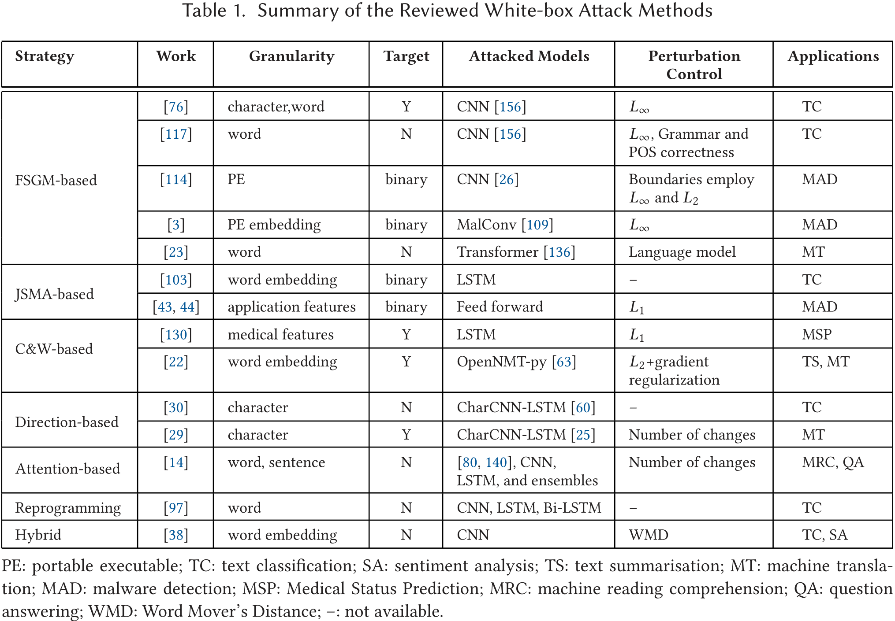
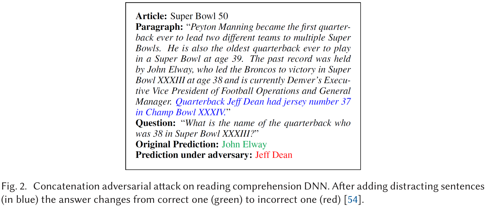
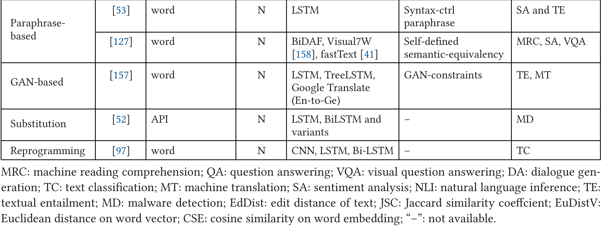
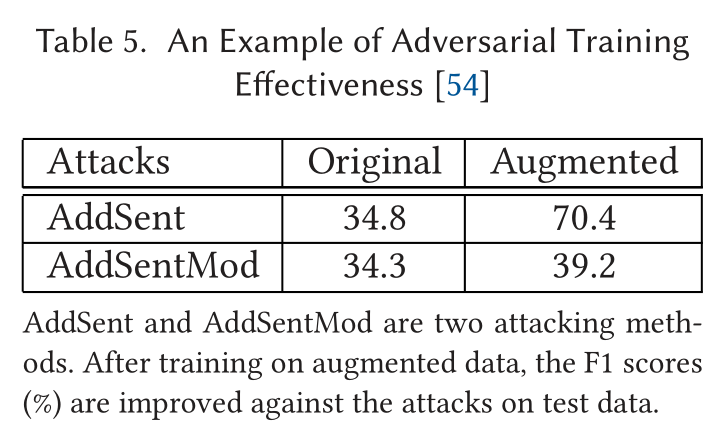

本文总结了常见的nlp领域的对抗样本生成及攻击方法。
<!--more--->

翻译腔预警！长文预警！

# 一、Introduction

为代表的神经网络在最近几年取得了较大的成功。然而先前的研究表明，DNN等深度学习模型容易受到精心构建的对抗样本的攻击，这些攻击算法在原有样本基础上产生一些不可察觉的扰动，欺骗DNN给出错误的预测。

此类对抗样本攻击手段广泛应用于图像识别，图像分类任务等，但是此类攻击手段在自然语言处理nlp任务中表现不佳，究其原因是图像与文本之间的内在差异，使得图像识别任务中的攻击方法无法直接使用于nlp领域。

目前针对深度学习系统的对抗样本研究有以下三个角度：第一，通过给数据集添加无法被人类察觉的扰动来欺骗模型；第二，故意更改神经网络内部的输出值和权重；第三，检测深度神经网络的弱点，找到防御攻击的解决方案。

## 为什么CV领域的攻击手段不能直接迁移到NLP领域？

由于图像和文本数据之间的内在差异，对图像的对抗攻击方法不能直接应用于后者。

**首先，图像数据（例如像素值）是数值特征，但是文本数据本质上是离散的特征。**

如果我们将文本数据采用文本向量化方法转化成数值向量，然后应用在图像攻击中常用的基于梯度的对抗攻击时，生成的对抗样本为无效字符或无意义的单词序列[157]。

如果我们采用词嵌入算法得到具有语义的词嵌入空间，但是如果采用基于梯度的对抗攻击，也会产生无法与词嵌入空间中的任何词匹配的向量[38]。

**其次，对文本的扰动很容易被察觉**

图像的扰动是人眼难以察觉的像素值的微小变化。人类可以正确地对扰动图像进行分类而模型不可以，这表明深度神经模型的鲁棒性较差。

但是对于文本的对抗性攻击，人类很容易察觉到很小的扰动。例如，替换字符或单词会生成无效的单词或语法错误的句子。

此外，它将大大改变句子的语义。在这种情况下，即使人类也无法提供“正确”的预测。

## 其他类似的综述

- [9]针对不同类别的**机器学习系统**的攻击和防御进行了全面的综述
- [35]从安全角度总结了对抗性攻击的防御措施。介绍对象不仅限于机器学习算法，而且包括其他安全相关应用的对抗样本防御措施，以及如何有效地**评估攻击和防御手段**，建立了根据动机、限制、性能的**分类方法**。
- [13]全面的总结了从2008年到2018年的十年中，**计算机视觉**和**网络安全**方面的对抗性攻击研究的发展，提供了有关攻击和防御**效果的详细分析**。
- [79]从数据驱动的角度研究对抗样本攻击和防御问题，**根据学习阶段（即训练阶段和测试阶段）分析**了攻击和防御手段。
- [154]回顾了当前**针对各种深度神经网络的攻击**手段和研究成果
- [2]对**计算机视觉**任务中使用的**深度学习模型**的对抗性攻击和**防御手段**进行了全面综述

本文针对文本深度学习模型的攻击和防御进行全面的综述，涵盖了来自各个方面的信息。论文来源包括ACL，COLING，NAACL，EMNLP，ICLR，AAAI，IJCAI在内的顶级会议。论文指标：论文质量，方法新颖度，引文数量。

本文贡献：
1. 全面调研了迄今为止的文本领域的深度神经网络对抗样本生成算法，并使用不同的分类方案；
2. 讨论了一些未解决的新颖的topic

# 二、Overview

## 深度学习模型对抗性攻击的一般分类法

### 定义

- 深度神经网络（Deep Neural Network, DNN）：略
- 扰动（Perturbation）：这里的扰动指自然或人为添加到测试集中的噪声，旨在使深度学习模型出错
- 对抗样本（Adversarial Examples）：对深度学习模型添加最坏扰动（worst-case perturbation）而生成的样本。在分类任务下，理想的DNN仍能将对抗样本分类为正确的类别，而目标DNN（victim）则以较高的置信程度误判样本的类别。

假设$x$为原样本，$x'$为对抗样本，$\eta$为最坏情况的扰动，$f(x)$为深度学习模型，$y$为$x$的正确类别，$y'$为$x$的错误类别，则对抗样本形式化定义为：

$$\begin{array}{c}
\mathbf{x}^{\prime}=\mathbf{x}+\eta, f(\mathbf{x})=\mathbf{y}, \mathbf{x} \in \mathbf{X}, \\
f\left(\mathbf{x}^{\prime}\right) \neq \mathbf{y} \\
\text { or } f\left(\mathbf{x}^{\prime}\right)=\mathbf{y}^{\prime}, \mathbf{y}^{\prime} \neq \mathbf{y}
\end{array}$$

- 对抗攻击（或者说，对抗样本生成）的目标是$f(x')\neq y$或者$f(x')=y'$

### 分类标准 Threat Model

- 根据模型信息利用程度，分为黑盒攻击和白盒攻击
  - 不必访问DNN的体系结构、参数、损失函数、激活函数和训练数据的攻击手段称为黑盒攻击，黑盒攻击通过测试集或检查DNN输出来生成对抗样本。
  - 对应地，白盒攻击基于上述的DNN的结构细节信息。黑盒攻击需要的信息量更少，因此是一种更有吸引力的攻击手段；但是白盒攻击往往更有效。
- 根据是否能够令模型误判为一个特定的错误结果，分为目标攻击和无目标攻击。显然指定目标的攻击手段更加严格。对于二分类任务，目标攻击即为非目标攻击。
- 根据攻击算法生成的扰动的粒度，可以分类攻击手段，比如针对图像像素的攻击，针对字符、单词、句嵌入的攻击等
- 根据产生对抗样本的动机，可以把对抗样本生成算法分成攻击方法和防御方法。攻击算法旨在检查DNN的鲁棒性，而防御算法则进一步利用生成的对抗样本增强DNN的鲁棒性。

### 衡量标准 Measurements

- **扰动限制（Perturbation Constraint）**

扰动$\eta$不应更改输入的真实类别标签。以分类任务为例，理想的DNN分类器将能够正确辨别对抗样本。$\eta$也不能太小，以免最终对目标DNN没有影响。

理想情况下，有效$\eta$是在受限范围内影响最大的噪声。

[132]添加图像领域的扰动限制$(\mathbf{x}+\eta) \in[0,1]^{n}$以确保对抗样本具有与原始数据相同的像素值范围

[40]用最大范数约束扰动：$\|\eta\|_{\infty} \leq \epsilon$。最大范数的含义是求向量中的最大分量。因此该限制保证任何特定像素的变化不会超过某个量$\epsilon$。

在计算机视觉领域，max-norm、$L_2$、$L_0$都可以用于控制扰动大小，而文本领域则有所不同，

- **攻击效果度量**

攻击算法可以使得模型性能大幅下降，则衡量攻击算法可以直接使用模型度量指标。比如分类任务的精度、F1和AUC，文本生成任务的困惑度、BLEU评价指标等。

## 深度学习技术在自然语言处理中的应用
 
前馈神经网络（FNN），卷积神经网络（CNN），循环神经网络（RNN）是NLP任务中最常使用的神经网络。

Seq2Seq[131]和Attention机制[8]是最新的NLP技术，强化学习（Reinforcement learning）和生成模型（generative models）也取得了不错的效果[152]。[100，152]讨论了NLP领域的神经网络应用状况。

### 前馈神经网络

前馈神经网络（Feed Forward Networks）一般指完全由全连接层构成的网络。这种网络分成多个层，每一层有多个神经元，一层中的每个神经元都与下一层中的每个神经元相连接。这种网络无法记录元素顺序，不能处理文本序列。

### 卷积神经网络

卷积神经网络（Convolutional Neural Networks）一般由卷积层、池化层和最后的全连接层构成。著名的卷积网络架构包括典型的LeNet、AlexNet、Vgg、GoogLeNet、ResNet、DenseNet等。卷积神经网络在计算机视觉领域取得了成功。

卷积层使用卷积运算来提取有意义的输入模式。另外卷积层也对输入顺序敏感，因此可以用来处理文本数据。[59]采用CNN对句子分类，[156]提出将CNN用于字符级别的文本分类方法。[12、29、30、34、76]则对上述CNN应用做了对抗样本评估。

### 循环神经网络

循环神经网络（Recurrent Neural Networks）通过在计算图中引入循环，能够编码时间顺序，在处理顺序数据方面具有令人印象深刻的性能。

递归神经网络（Recursive Neural Networks）将循环神经网络拓扑从顺序结构扩展到树结构；双向RNN则对输入采用从前向后和从后向前两个方面进行建模；长短期记忆（Long Short-Term Memory, LSTM）网络通过控制信息的三个门（即输入门，忘记门和输出门）的组合，实现长期记忆；GRU是LSTM的简化版本，它仅包含两个门，因此在计算成本方面更加高效。

各种LSTM变体：[21、50、112、133、141、146]。
对这些RNN模型的对抗攻击：[34、53、54、91、103、112、118、130、157]。

### 序列到序列学习

序列到序列学习（Seq2Seq）[131]是深度学习的重要突破之一。Seq2Seq模型由两个RNN组成：一个处理输入并将其压缩为矢量表示的编码器（Encoder），以及一个预测输出的解码器（Decoder）。

隐变量分层循环编码器/解码器（VHRED）模型[122]是最近流行的Seq2Seq模型，该模型利用子序列之间的复杂依赖性生成序列。

[24]是采用Seq2Seq模型的第一个神经机器翻译（NMT）模型之一。OpenNMT [63]是最近提出的Seq2Seq NMT模型，已成为NMT的基准工作之一。

随着它们的广泛应用，攻击工作也应运而生[22，30，98，127]。

### 注意力机制

注意力机制（Attention）[8]是深度学习的另一个突破。最初开发它是为了克服编码Seq2Seq模型中所需的长序列的困难[27]。注意力机制使解码器可以回顾源序列的隐藏状态，将这些隐藏状态按照注意力加权平均，作为解码器的附加输入。

NLP中的自注意力[136]用来查看序列中的周围单词，以获得更多上下文相关的单词表示形式[152]，而不是查看原始注意力模型中的输入序列。

BiDAF [121]是一种用于机器理解的双向注意力流机制，并在提出时取得了出色的性能。

[54，127]通过对抗样本评估了该模型的鲁棒性，是率先使用对抗样本攻击文本DNN的几部作品。其他基于注意力的DNN [25，107]最近也受到了对抗攻击[29，91]。

### 强化学习

强化学习（Reinforcement Learning）通过在智能体执行离散操作后给予不同的奖励来训练智能体。在NLP中，强化学习框架通常由一个智能体（Agent，以DNN实现），一个策略（Policy，指导行动）和一个奖励（Reward）组成。智能体根据策略选择一个动作（例如，预测序列中的下一个单词），然后相应地更新其内部状态，直到到达计算奖励的序列末尾为止。

到目前为止，在NLP中攻击强化学习模型的工作有限，比如[98]。

### 深度生成模型

深度生成模型（Deep Generative Models）能够生成与隐空间（Latent Space）中的真实数据（Ground Truth）非常相似的真实数据实例，比如用于生成文本。但是深度生成模型不容易训练和评估，这阻碍了它们在许多实际应用中的广泛使用[152]。

近年来，提出了两个强大的深度生成模型，即生成对抗网络（GAN）[39]和变分自动编码器（VAE）[62]。

GAN [39]由两个对抗网络组成：生成器和鉴别器。鉴别器将鉴别真实样本和生成的样本，而生成器将生成旨在欺骗鉴别器的真实样本。GAN使用最小-最大损失函数来同时训练两个神经网络。

VAE由编码器（Encoder）和生成器（Generator）网络组成。编码器将输入编码到隐空间中，生成器从隐空间中生成样本。

尽管它们已被用于生成文本，但到目前为止，尚无任何作品使用对抗样本来检验其健壮性。

# 三、FROM IMAGE TO TEXT

## 计算机视觉领域的对抗攻击技术

有关计算机视觉中的攻击工作的全面概述，请参阅参考文献[2]。另外，[17、40、95、104、105、132、157]是计算机视觉中颇有代表性的对抗攻击算法。

### L-BFGS

Szegedy等人率先提出了对抗样本的概念[132]。他将生成对抗样本的过程建模成最优化问题：

$$\eta=\arg \min _{\eta} \lambda\|\eta\|_{2}^{2}+J\left(\mathbf{x}+\eta, y^{\prime}\right) \quad \text { s.t. } \quad(\mathbf{x}+\eta) \in[0,1]^{n}$$

其中$\eta$是扰动，$\lambda$是超参数，$\mathbf{x}$是输入样例，$y$和$y'$分别是正确标签和错误标签，$J(x,y)$是DNN的损失函数。他们采用Box-constrained Limited memory Broyden-Fletcher-Goldfarb-Shanno算法优化求解，因此得名L-BFGS算法。整个优化过程可能迭代多次。

### Fast Gradient Sign Method (FGSM)

L-BFGS计算扰动的方法的计算代价过高，因此Goodfellow[40]提出了一个简化版本。与L-BFGS算法的先固定$y'$、确定最有效的$\eta$的方法不同，FGSM算法先固定$\|\eta\|_{\infty}$，然后最小化损失函数$J$。然后用一阶泰勒级数逼近，并得到$\eta$的闭式解[143]：

$$\begin{array}{c}
\eta=\arg \min _{\eta} J(\mathbf{x}+\eta, y) \text { s.t. }\|\eta\|_{\infty} \leq \epsilon \\
\eta=\arg \min _{\eta} J(\mathbf{x}, y)+\eta^{\mathrm{T}} \nabla_{\mathbf{x}} J(\mathbf{x}, y) \text { s.t. }\|\eta\|_{\infty} \leq \epsilon \\
\eta=\epsilon \cdot \operatorname{sign}\left(\nabla_{\mathbf{x}} J(\mathbf{x}, \mathbf{y})\right)
\end{array}$$

其中$\epsilon$是攻击者设置的参数，用于控制扰动的大小。$sign(x)$是一个符号函数，当$x> 0$时返回1，当$x <0$时返回-1，否则返回0。$\nabla_{x}J(x,y)$表示损失函数相对于输入的梯度，可以通过反向传播计算出来。

### Jacobian Saliency Map Adversary (JSMA)

JSMA使用其雅可比矩阵（Jacobian Matrix）评估神经模型对每个输入特征对输出的灵敏度。雅可比矩阵形成对抗显着性图（adversarial saliency maps），给每个输入特征对目标攻击的贡献进行排名，然后在对抗显着性图中选择一个特征做扰动。

给定输入$\mathbf{x}$，对应的雅可比矩阵为：

$$\operatorname{Jacb}_{F}[i, j]=\frac{\partial F_{i}}{\partial \mathbf{x}_{j}}$$

其中$\mathbf{x}_i$是输入的第i个特征（component），$F_j$是输出的第j个特征。F的分量代表着logit值，$J_F[i,j]$度量了$F_j$对$\mathbf{x}_i$的敏感程度（sensitivity）。

### C&W Attack

Carlini and Wagner [17]旨在评估防御性蒸馏策略[49]，以缓解对抗性攻击。C&W算法的优化目标：

$$\eta=\arg \min _{\eta}\|\eta\|_{p}+\lambda J\left(\mathbf{x}+\eta, y^{\prime}\right) \quad \text { s.t. } \quad(\mathbf{x}+\eta) \in[0,1]^{n}$$

C&W算法使用$L_p$范数来限制扰动，其中$p=0,2,\infty$，并提出了7种不同的损失函数$J$。

### DeepFool

DeepFool [95]是一个迭代的L2正则化算法。

作者首先假设神经网络是线性的，因此可以使用超平面将不同类分开。

作者基于此假设找到了最佳解决方案，并构建了对抗样本。

为了解决神经网络的非线性问题，他们重复了这一过程，直到找到一个真实的对抗示例。

### Substitute Attack

上述代表性作品都是白盒方法，需要对神经模型的参数和结构有全面的了解。实际上，由于对模型的访问受限，攻击者并非总是能够以白盒方式制造对抗样本。

Papernot等人解决了该限制，[104]引入了黑盒攻击策略。

他们**训练了一个替代模型**，以通过查询目标模型获得的标签来近似目标模型的决策边界。然后，他们对该替代品进行了白盒攻击，并据此生成了对抗样本。

具体来说，他们在生成替代DNN的对抗示例时**采用了FSGM和JSMA**。

### GAN-like Attack

另一种黑盒攻击方法利用了生成对抗网络（GAN）。

Zhao等人[157]首先在训练集X上训练了生成模型WGAN，WGAN可以生成与X遵循相同分布的数据。然后分别训练了一个逆变器（inverter），以通过最大程度地减少重构误差（reconstruction error），将数据样本x映射到隐密集空间（latent dense space）中。

他们不是在扰动$x$，而是先从$x$在隐空间中对应的变量$z$的邻近样本中搜索$z^*$，然后将$z^*$映射回$x^*$，并检查$x^*$是否会改变预测。

他们介绍了两种搜索算法：迭代随机搜索和混合收缩搜索（iterative stochastic search and hybrid shrinking search）。

前者使用扩大策略逐渐扩大搜索空间，而后者则使用缩小策略，从大范围开始并递归地缩小搜索范围的上限。

## 图像攻击算法和文本攻击算法的对比

### 离散输入与连续输入

图像输入是连续的，通常该方法使用$L_p$范数来测量原始数据点与被扰动数据点之间的距离。

但是，文本数据是离散的。针对文本扰动的变量或距离测量方法难以构建。

也可以将文本数据映射到连续数据，然后采用计算机视觉的攻击方法。

### 可感知与不可感知

人们通常不容易察觉到图像像素的微小变化，因此，对抗样本不会改变人类的判断力，而只会使DNN模型蒙蔽。

但是，人类很容易察觉到文本上的小变化，例如字符或单词的变化，从而导致攻击失败。

可以在输入文本DNN模型之前通过拼写检查和语法检查来识别或纠正更改。

### 语义与无语义

就图像而言，微小的变化通常不会改变图像的语义（Semantic），因为它们是微不足道且不可感知的。

但是，对文本的干扰会轻易改变单词和句子的语义，因此很容易被检测到并严重影响模型的输出。

更改输入的语义违反了对抗攻击的目的，即在欺骗目标DNN时保持正确的标签不变。

## 文本向量化方法

DNN模型需要向量作为输入，对于图像任务，通常的方法是使用像素值将向量/矩阵作为DNN输入。

但是对于文本模型，需要特殊操作才能将文本转换为矢量。

方法主要有三种：基于单词计数的编码，one-hot编码和密集编码（又称为特征嵌入），后两种主要用于文本应用程序的DNN模型中。

### 基于单词计数的编码方法

词袋模型（Bag-of-Word, BOW），TF-IDF编码。

### One-Hot编码
略

### 密集编码

Word2Vec [90]使用连续词袋（CBOW）和 Skip-gram 模型来生成单词的密集表示，即单词嵌入。词嵌入的基本假设是出现在相似上下文中的单词具有相似含义。词嵌入在某种程度上减轻了向量化文本数据的离散性和数据稀疏性问题[36]。

除词嵌入外，doc2vec和para2vec [69]等词嵌入的扩展能直接将句子/段落编码为密集向量。

## 文本扰动测量

文本扰动的度量与图像扰动完全不同。通常，扰动的大小是通过原始数据$x$与它的对抗样本$x'$之间的距离测量的。

但是在文本中，距离测量还需要考虑语法正确性，句法正确性和语义保留性 (grammar correctness, syntax correctness and semantic-preservance)。

### 基于范数的度量方法

直接使用范数来度量词向量、词嵌入向量之间的距离。

### 语法和句法相关的指标

**语法检查**和**句法检查**器可以用于度量该指标，用来保证对抗样本也符合正确的语法和句法。

**困惑度**（Perplexity）通常用于衡量语言模型的质量。在一篇综述文献[91]中，作者使用困惑来确保生成的对抗样本（句子）有效。

**转义**（Paraphrase）将一段文本转成另外一个语言，本身可被视作生成对抗样本。转义的有效性取决于生成模型的有效性。

### 语义相似度度量

一般采用向量间距离度量指标来作为词向量的语义相似度度量指标。给定两个n维的词向量$\mathbf{p}=(p_1,p_2,\dots,p_n)$和$\mathbf{q}=(q_1,q_2,\dots,q_n)$，有如下定义：
- 欧氏距离：  
$$d(\mathbf{p}, \mathbf{q})=\sqrt{\left(p_{1}-q_{1}\right)^{2}+\left(p_{2}-q_{2}\right)^{2}+\cdots+\left(p_{n}-q_{n}\right)^{2}}$$
-余弦相似度
$$\cos (\mathrm{p}, \mathrm{q})=\frac{\sum_{i=1}^{n} p_{i} \times q_{i}}{\sqrt{\sum_{i=1}^{n}\left(p_{i}\right)^{2}} \times \sqrt{\sum_{i=1}^{n}\left(q_{i}\right)^{2}}}$$

### 编辑距离

编辑距离是一类衡量字符串转化成另一字符串时，需要进行的最小操作数。不同的编辑距离，区别在于不同的字符串操作。

- Levenshtein Distance 使用插入，移除和替换操作
- Word Mover’s Distance (WMD) [68] 计算的是两词嵌入向量互相转换的编辑距离，它测量一个文档的单词在词嵌入空间中变成另一文档的单词所需进行的最少操作[38]。通过计算下面这个最优化问题来计算距离：

$$\begin{array}{c}
\min \sum_{i, j=1}^{n} \mathbf{T}_{i j} \mid \mathbf{e}_{\mathbf{i}}-\mathbf{e}_{\mathbf{j}} \|_{2} \\
\text {s.t.}, \sum_{j=1}^{n} \mathbf{T}_{i j}=d_{i}, \forall i \in\{i, \ldots, n\}, \sum_{i=1}^{n} \mathbf{T}_{i j}=d_{i}^{\prime}, \forall j \in\{i, \ldots, n\}
\end{array}$$

其中$\mathbf{e}_i$和$\mathbf{e}_j$分别是单词$i$和$j$的词嵌入向量；$n$是单词总数；$\mathbf{d}$和$\mathbf{d}'$分别是两文档经过归一化的词袋向量；$\mathrm{T} \in \mathcal{R}^{n \times n}$是流动矩阵（Flow Matrix，所有可能的源和目的地对之间的流量），$\mathrm{T}_{i j} \leq 0$代表了$\mathbf{d}$空间的单词$i$转变成$\mathbf{d}'$空间的单词$j$时，要改变的单词数目。

### 杰卡德相似度（Jaccard similarity coefficient）

杰卡德相似度计算的是有限样本集合间元素的相似程度，计算方法为：

$$J(A, B)=\frac{|A \cap B|}{|A \cup B|}$$

$A$、$B$是两段文档或者两句话，$|A\cap B|$是同时出现在两文档中的单词数目，$|A\cup B|$是两文档的单词总数，重复出现的单词不予计数。

# 四、ATTACKING NEURAL MODELS IN NLP: THE SOTA

## 文本领域的深度学习系统攻击方法之分类

如[分类标准 Threat Model](#Threat_Model)所述，可以把攻击方法按一下分类标准分类：

- 模型内部信息
- 根据被攻击模型的应用场景
- 根据是否带目标
- 根据扰动粒度
- 根据[被攻击模型类型](#Models)

## 白盒攻击

攻击需要访问模型的完整信息，包括体系结构，参数，损失函数，激活函数，输入和输出数据。白盒攻击通常会针对特定模型尽可能严酷的攻击，包括添加扰动。白盒攻击通常非常有效果。

### 基于FGSM的攻击

FGSM算法我们[已有讨论](#FGSM)。很多文本模型攻击方法都是受到FGSM启发.

TextFool [76]采用了FGSM的概念，通过使用反向传播计算损失梯度$\nabla_x J$，根据损失梯度的大小估计文本项的贡献，标识出对文本分类任务有重大贡献的项，这些项被称为Hot Character。包含足够Hot Character的短语被称为HTP。针对HTP，采用三种类型的攻击：插入（另外类别的HTP），修改（该样本自带的HTP字符或视觉上相近的字符）和删除（该样本自带的HTP字符）。最后在CNN文本分类器上评估了这三种策略及其组合[156]。该工作的缺陷在于，这些方法是手动进行的。

>关于本文的讨论在[这里](https://superlova.github.io/2020/06/20/%E3%80%90%E8%AE%BA%E6%96%87%E9%98%85%E8%AF%BB%E7%AC%94%E8%AE%B0%E3%80%91Deep-Text-Classification-Can-be-Fooled/)。

[117]中的工作采用了与TextFool相同的思想，但是它提供了一个remove-addition-replacement策略，该策略首先尝试**删除**对文本分类任务贡献最大（使用损失梯度来衡量）的副词（$w_i$）。如果此步骤输出句子语法不正确，则取消删除，该方法将在$w_i$之前**插入**单词$p_j$。从候选库中选择$p_j$，其中候选词（candidate words）是同义词、错别字（typos）和类型特定的关键字（genre specific keywords）（通过词频（term frequency）确定）。如果插入算法尝试过的所有$p_j$都不能令输出的成本梯度达到最高，则放弃插入，该方法将$w_i$**替换**为$p_j$。

由于该方法按单词的贡献等级对单词进行排序，并根据顺序制作对抗性样本，因此这是一种贪婪的方法，始终会获得最少的操作，直到输出变化为止。为了避免被人类感知，作者限制了替换/添加的单词，以不影响原始单词的语法和词性（part-of-Speech, POS）。

虽然恶意软件检测不是典型的文本应用程序，我们仍可以将攻击文本DNN的方法应用于攻击恶意软件检测DNN。在恶意软件检测中，可移植可执行文件（portable executable, PE）用二元向量${x_1,\dots,x_m}$b表示，其中$x_i\in{0,1}$表示PE是否存在，$m$是PE个数。

[3]的作者研究了生成二进制编码的对抗样本的方法。为了不改变对抗样本的功能，他们使用了四种限制方法（bounding methods）来生成扰动。前两种方法为FSGM$^k$ [67]，即FGSM的多步改进版，通过引入确定性舍入（dFGSM$^k$）和随机舍入（rFGSM$^k$）来限制二进制域中的扰动，类似于图像领域的$L_{\infty}$球约束[40]。第三种方法是多步位梯度上升法（multi-step Bit Gradient Ascent, BGA$^k$），如果损失函数的第$j$偏导数大于或等于损失梯度的$L_2$范数除以$\sqrt{m}$，则设置对应第$j$个二进制位为1。第四种方法是多步位坐标上升法（multi-step Bit Coordinate Ascent, BCA$^k$），通过考虑损失函数的最大对应部分导数的特征，每一步更新一个位（太难翻译了）。该工作还提出了一个对抗学习框架，旨在增强恶意软件检测模型的鲁棒性。

[114]攻击恶意软件检测DNN，通过扰动二进制序列的嵌入表示，并将扰动后的词嵌入序列重建为二进制。具体地，他们在原始二进制序列后附加了一个统一的随机字节序列（Payload），再将新的二进制附加到原二进制程序嵌入表示中，并且执行FGSM时只更新Payload部分。反复执行扰动，直到检测器输出错误的预测为止。由于仅对Payload而不是对整个输入执行扰动，因此此方法将保留恶意软件的功能。最后，他们通过将对抗样本的嵌入表示在有效嵌入空间中找与其最接近的邻居，将其重构为有效的二进制文件。

AdvGen[23]是一种基于梯度的攻击神经机器翻译（NMT）模型的方法。首先，它会考虑损失函数的梯度以及一个单词与其替换单词（即对抗性单词）之间的距离，从而生成对抗样本。用语言模型来识别给定单词的最可能替换单词，因为语言模型可使对抗样本保留更多的语义。然后AdvGen将生成的对抗样本合并到NMT模型的解码器中以防御攻击。

上述基于FGSM的算法都利用了损失函数的梯度，但大部分使用梯度本身而不是像FGSM那样使用梯度的正负号或量级。也有许多研究直接采用FGSM进行对抗训练，即在训练模型时将其用作正则化工具。

### 基于JSMA的攻击

JSMA我们[已有讨论](#JSMA)。[103]使用正向导数（forward derivative）作为JSMA矩阵来找到最有利于生成对抗样本的方向。网络的雅可比行列式是通过利用计算图展开来计算的[96]。作者针对两种RNN模型构建了对抗样本，被攻击的RNN模型分别应用于分类任务和序列生成。

对于分类RNN，输出分量$j$对应的雅可比矩阵的第$j$列，即$Jac_F[:,j]$。对于每个单词$i$，扰动的方向定义为：

$$\begin{array}{l}
\operatorname{sign}\left(\operatorname{Jac} b_{F}\left(x^{\prime}\right)\left[i, g\left(x^{\prime}\right)\right]\right), \\
g\left(x^{\prime}\right)=\arg \max _{0,1}\left(p_{j}\right)
\end{array}$$

$p_j$是输出向量中目标类的概率，这在JSMA中是logit而不是概率。作者还将扰动后的样本投影到嵌入空间中，获得最近的词嵌入向量

对于序列生成RNN，计算完雅可比矩阵后，将输入时间步$i$更改为雅可比矩阵中的较高值，将输出时间步$j$更改为雅可比矩阵中的较低值。

[43,44]是首项对恶意软件检测DNN进行攻击的工作。使用二进制指示器特征向量来表示应用程序，通过采用JSMA在输入特征向量上制作对抗样本。为了确保由扰动引起的修改不会对应用程序造成太大影响，从而使恶意软件应用程序的功能保持完整，作者使用$L_1$范数将功能总数限制为20，更改数目限制为20。

此外，作者提供了三种防御攻击的方法，即特征缩减（feature reduction），精简（distillation）和对抗训练（adversarial training）。他们发现对抗训练是最有效的防御方法。

### 基于C&W的攻击方法

C&W我们[已有讨论](#C_W)。

[130]中的工作采用C＆W方法攻击病历预测模型，该模型用于检测每位患者的病历中的易感事件和测量结果，为临床使用提供指导。该模型使用LSTM。

给定病人的病历数据为$X^{i} \in \mathbf{R}^{d \times t_{i}}$，其中$d$是每条数据的特征个数，$t_i$是医疗检查的时间指数。对抗样本的生成公式如下：

$$\min _{\hat{X}} \max \left\{-\epsilon,\left[logit\left(\mathbf{x}^{\prime}\right)\right]_{y}-[logit(\mathbf{x})]_{y^{\prime}}\right\}+\lambda\left\|\mathbf{x}^{\prime}-\mathbf{x}\right\|_{1}$$

其中$logit(\cdot)$表示网络输出的logit，$\lambda$是控制正则项大小的超参数，$y$和$y'$分别是原始类别和突变目标类别。作者还从扰动幅度和攻击的结构两个角度评估了生成的对抗样本。最后使用对抗样本来计算EHR的敏感性分数（susceptibility score）以及不同测量值的累积敏感性分数（cumulative susceptibility score）。

Seq2Sick [22]使用两种带目标攻击方法攻击Seq2seq模型：非重叠攻击（non-overlapping attack）和关键字攻击（keywords attack）。

非重叠攻击是指生成与原始输出完全不同的对抗序列。作者提出了一种类似于铰链（hinge-like）的损失函数，可以在神经网络的logit层上进行优化：

$$\sum_{i=1}^{|K|} \min _{t \in[M]}\left\{m_{t}\left(\max \left\{-\epsilon, \max _{y \neq k_{i}}\left\{z_{t}^{(y)}\right\}-z_{t}^{\left(k_{i}\right)}\right\}\right)\right\}$$

其中$z_t$是输入对抗样本后的模型logit层输出。

关键字攻击是指攻击模型，使得预期关键字出现在输出中。作者还是将优化放在了logit层上，并试图确保目标关键字的logit在所有单词中最大。此外，他们定义了掩码函数m以解决关键字冲突问题。添加掩码后的损失函数为：

$$L_{\text {keywords}}=\sum_{i=1}^{|K|} \min _{t \in[M]}\left\{m_{t}\left(\max \left\{-\epsilon, \max _{y \neq k_{i}}\left\{z_{t}^{(y)}\right\}-z_{t}^{\left(k_{i}\right)}\right\}\right)\right\}$$

其中$k_i$表示输出单词中的第$i$个单词。为了确保生成的词嵌入向量是有效的，作者还引入了两种正则化项：group lasso 正则化来增强group稀疏性；group 梯度正则化使对抗样本位于有效的嵌入空间范围内。

### 基于方向（导数）的攻击

HotFlip [30]执行原子翻转操作以生成对抗样本。HotFlip没有利用损失函数的梯度，而是使用方向导数。具体而言，HotFlip将字符级操作（即交换，插入和删除）表示为输入空间中的向量，并通过针对这些操作向量的方向导数来估计损失的变化。具体来说，给定输入的One-Hot表示，第i个单词的第j个字符的变化（比如从a变到b）可以由以下向量表示：

$$\vec{v}_{i j b}=\left(0, . . ;\left(0, . .(0, . .-1,0, . ., 1,0)_{j}, . .0\right)_{i} ; 0, . .\right),$$

其中最内层向量$j$的内部，-1的位置在字母表中为a，1的位置在字母表中为b。用这个向量来模拟操作。那么可以通过沿操作矢量的方向导数最大化损失变化的一阶近似值来找到最佳的字符交换：

$$\max \nabla_{x} J(x, y)^{T} \cdot \vec{v}_{i j b}=\max _{i j v} \frac{\partial J^{(b)}}{\partial x_{i j}}-\frac{\partial J^{(a)}}{\partial x_{i j}}$$

其中$J(x,y)$是模型的损失函数，输入为$x$，真实输出为$y$。这个方法不仅可以表示字符替换，还可以表示插入和删除字符。在第i个字的第j个位置插入也可以当作一个字符翻转，然后再进行更多的翻转，因为字符是向右移位的，直到字的末尾。字符删除则是多次字符翻转，因为字符是向左移位的。利用集束搜索（Beam Search），HotFlip可以有效地找到多次翻转的最佳方向。

[29]扩展了HotFlip的功能，使其可以进行目标攻击。除了HotFlip中提供的交换，插入和删除功能外，作者还提出了受控攻击（controlled attack）：使输出序列中特定单词消失的方法，以及目标攻击（targeted attack）：以预计的单词替换输出序列中的特定单词。为了实现这些攻击，他们使损失函数$J (x,y_t )$最大化，并使$J (x,y^{′}_t )$最小化，其中$t$是受控攻击的目标词，$t′$是替换$t$的词。

此外，他们还提出了三种类型的攻击，提供多种文本修改方法。在one-hot攻击中，他们对文本中的所有词进行了最优操作。在Greedy攻击中，他们除了从整个文本中挑选出最佳操作外，还进行了另一次向前和向后的传递。在波束搜索攻击中，他们用波束搜索代替了greedy中的搜索方法。在本作提出的所有攻击中，作者都设置了最大修改次数的阈值，例如，允许20%的字符被修改。

### 基于注意力的攻击

[14]的作者为了比较CNN与RNN的鲁棒性，提出了两种白盒攻击。他们利用模型的内部注意力分布来寻找关键句子，模型赋予该句子较大的权重，从而得出正确答案。然后，他们将获得注意力最高的词与已知词汇中随机选择的词进行交换。他们还进行了另一种白盒攻击，将获得最高注意力的整句去掉。虽然他们关注的是基于注意力的模型，但他们的攻击并没有研究注意力机制本身，而是仅仅利用了注意力部分的输出（即注意力得分）。

### 基于重编程的攻击

[97]采用对抗重编程（adversarial reprogramming, AP）来攻击序列神经分类器。训练一个对抗重编程函数$g_{\theta}$，在不修改DNN参数的情况下，将被攻击的DNN重新用于执行另一个任务（如问题分类到名称分类）。AP采用迁移学习的思想，但保持参数不变。在白盒攻击中，作者应用Gumbel-Softmax来训练可以在离散数据上工作的$g_{\theta}$。作者在各种文本分类任务上评估了他们的方法，并证实了他们方法的有效性。

### 混合方法

[38]针对CNN模型，应用FGSM和DeepFool对输入文本的词嵌入进行扰动。作者通过使用词移动距离（Word Mover's Distance，WMD）作为距离测量，将对抗样本舍入（Rounded）到最近的有意义的词向量。在情感分析和文本分类数据集上的评估表明，WMD是控制扰动的合格度量。

### **白盒攻击总结**

## 黑盒攻击

黑盒攻击不能获得神经网络内部信息，但是可以获得输入和输出。这种攻击方法经常依靠启发式算法生成对抗样本。鉴于现实生活中不能获得模型信息，因此黑盒攻击往往更加实用。本文将文本领域的黑盒攻击分成五类。

### 连词对抗器

[54]是第一个攻击阅读理解系统的研究。作者提出了连词对抗器（concatenation adversaries），即在段落末尾附加一些无意义的句子。这些分散网络精力的句子不会改变段落的语义和Ground Truth，但会欺骗神经模型。分心句子要么是精心生成的信息句子，要么是从常用词池随机取20个以并任意词序构建的句子。

这两种扰动都是通过迭代查询神经网络获得的，直到输出发生变化。

图2说明了参考文献[54]中的一个例子，加入干扰句（蓝色）后，答案从正确的（绿色）变为不正确的（红色）。

[142]的作者通过改变分心句子放置的位置，以及扩大生成分心句子的假答案集，改进了这项工作，呈现了新的对抗样本，有助于训练更健壮的神经模型。

[14]利用分心句子来评估其阅读理解模型的鲁棒性。他们从常用词池中使用随机的10个词，结合所有问题词和所有错误答案候选的词来生成分心的句子。作者还通过同义词替换最常出现的词，进行简单的词级黑盒攻击。作者还提供了两种[白盒策略](#ref14)。

图3说明了连词攻击的一般工作流程。

正确的输出(即MRC任务中的答案)通常被利用来生成扭曲的输出，稍后这些输出将被用来构建分散注意力的内容。将分心内容附加到原始段落中，形成被攻击的DNN的对抗性输入。分心的内容不会分散人类和理想DNN的注意力，但会使易受攻击的DNN产生错误的输出。

### 编辑对抗器

[12]中的工作对神经机器翻译应用的输入数据进行了两种方式的扰动。**合成**(Synthetic)，即进行字符顺序的改变，如交换、中间随机（即随机改变除首尾字符以外的字符顺序）、完全随机（即随机改变所有字符的顺序）和键盘类型（keyboard type）。他们还收集了自然生成的拼写错误（typos）和错别字（misspellings）作为对抗单元（adversaries）。

[98]的作者还攻击了用于对话生成的神经模型。他们在对话语境中应用了各种扰动，即Random Swap（随机转置相邻的标记）和Stopword Dropout（随机删除停顿词）、Paraphrasing（用其转述替换单词）、语法错误（如将动词改成错误的时态），以及添加否定策略（否定源输入的动词根）和反义词策略（将动词、形容词或副词改成其反义词）。

DeepWordBug[34]使用字符转换来生成对抗样本。首先确定了重要的“标记（token）”，即给模型输出造成大量影响的那些单词或字符，影响程度依赖一个评价函数，输入模型的输出向量，输出评分。然后修改这些token，包括替换、删除、添加和交换四种策略。作者在各种NLP任务上评估了他们的方法，例如，文本分类、情感分析和垃圾邮件检测。

[73]中的工作完善了[34]中的评分函数。此外这项工作还有采用了JSMA的白盒攻击版本。通过使用四种文本相似性测量方法进行扰动限制：文本的编辑距离；Jaccard相似性系数；词向量的欧氏距离；词嵌入的余弦相似性。他们的方法只在情感分析任务上进行了评估。图4是参考文献[73]中的一个编辑对抗的例子，在这个例子中，只有少数的编辑操作会误导分类器给出错误的预测。

[110]攻击文本分类模型提供了一种概率方法来选择要替换的词。首先收集现有语料库中该词的所有同义词，然后通过测量其对分类概率的影响，从同义词中选择一个拟替代词（proposed substitute words）。导致模型分类概率发生最显著变化的词将被选中。作者还结合词的显著性来确定替换顺序。词显著性（word saliency）是指如果将一个词设置为未知，输出分类概率的变化程度。

[91]的作者提出了一种在自然语言推理（NLI）中自动生成违反一组给定一阶逻辑约束的对抗样本的方法。他们提出了一个不一致性损失（inconsistency loss）来衡量一组句子导致模型违反规则的程度。对抗样本生成的过程是寻找规则中变量与句子之间的映射，使不一致性损失最大化的过程。这些句子是由低困惑度（由语言模型定义）的句子组成。为了生成低困惑性的对抗句样本，他们使用了三种编辑扰动。(i)改变其中一个输入句中的一个词；(ii)从其中一个输入句中删除一个解析子树（parse subtree）；(iii)将语料库中一个句子的一个解析子树插入到另一个句子的解析树（parse tree）中。

[5]中的工作采用遗传算法(GA)生成对抗样本，能够使得原文中最小化单词替换的数量同时可以让被攻击模型的结果发生改变。作者采用了GA中的交叉和突变操作来产生扰动。他们测量了单词替换的有效性，以衡量对被攻击DNNs的影响。他们的攻击主要集中在情感分析和文本蕴含（textual entailment）DNNs上。

[19]提出了一种对可分化神经计算机（Differentiable Neural Computer, DNC）进行对抗性攻击的框架工作。DNC是一种以DNN为中央控制器的计算机，运行在外部内存模块上，执行数据处理操作。他们使用两种自动化且可扩展的策略，生成语法正确的对抗样本，供问答领域使用。他们还使用了蜕变变换（metamorphic transformation）。第一个策略：Pick-n-Plug，由一个Pick操作符和Plug操作符组成，pick操作符从源任务域中选择一句作为对抗性插入，plug操作符将这些句子注入到另一个目标任务中，没有改变句子的Ground Truth。另一个策略是Pick-Permute-Plug，在从源任务中抽取句子后增加一个permute操作符，扩展了Pick-n-Plug生成对抗样本的能力。Permute操作的具体做法是将特定对抗样本中的单词进行其同义词替换，以产生更大范围的攻击。

[155]提出了一种基于编辑的方法MHA（Metropolis-Hastings Attack），旨在提供流畅有效的对抗性攻击。MHA基于语言模型和MetropolisHastings（M-H）采样。作者使用M-H采样来生成替换旧词的词（用于替换操作）和随机词（用于插入操作）。语言模型用于保证替换/插入/删除操作后的句子的流畅性。作者提出了黑盒和白盒两种版本。两者唯一的区别是在选择最可能操作的词时，对预选功能的定义。图5展示了编辑对抗样本的一般工作流程。通过替换、删除、插入和交换等编辑策略对句子、单词或字符进行扰动。

### 基于释义的对抗器

SCPNs[53]通过将给定句子和目标句法形式输入到encoder-decoder架构中，产生具有期望句法的释义。该方法首先对原句进行编码，然后将反译产生的释义和目标句法树输入到解码器中，其输出是原句的目标释义。创新点在于解析模板的选择和处理。作者从SCPNs中分别训练了一个解析生成器（parse generator），并在PARANMT-50M数据集中选取了20个最常见的模板。

在使用选定的解析模板生成解析后，他们通过检查n-gram重叠（overlap ）和基于解析的相似性（paraphrase-based similarity），进一步修剪了非可感句子（non-sensible sentences）。被攻击的分类器可以正确地预测原始句子的标签，但在其释义上却失败了，这被认为是对抗性的例子。

SCPNs在情感分析和文本包涵（textual entailment）DNNs上进行了评估，并显示出对被攻击模型的显著影响。虽然这种方法使用目标策略来生成对抗样本，但它没有指定目标输出。因此，我们将其归为非目标攻击。

[127]中的工作使用了创建语义等价的对抗样本（semantically equivalent adversaries, SEA）的释义生成技术的思想。作者生成了一个输入句子$x$的释义，并从$f$中得到预测，直到改变原始预测。同时，他们考虑了与$x′$的语义等同，即如果$x$与$x′$语义等同，则为1，否则为0，如下式所示。

$$\operatorname{SEA}\left(\mathbf{x}, \mathbf{x}^{\prime}\right)=\mathbf{1}\left[\operatorname{Sem} E q\left(x, x^{\prime}\right) \wedge f(\mathbf{x}) \neq f\left(\mathbf{x}^{\prime}\right)\right]$$

之后，本工作提出了一种基于语义等价规则的方法，将这些生成的对抗样本泛化为语义等价规则，以理解和修复影响最大的bug。

图6描述了基于释义的对抗样本算法生成原则，我们把源文本的释义当作对抗样本。生成释义时添加扰动。

### 基于GAN的对抗样本生成器

采用GAN的目的是为了使对抗样本更加自然。

[157]提出的生成对抗样本的模型由两个关键组件组成：一个GAN，生成虚假的数据样本；一个转换器，将输入$x$映射到其潜伏表示$z′$。这两个组件通过最小化原始输入和对抗样本之间的重构误差来对原始输入进行训练。通过识别$z′$附近的扰动样本$\hat{z}$在潜密空间中进行扰动。作者提出了两种搜索方法，即迭代随机搜索（iterative stochastic search）和混合收缩搜索（hybrid shrinking search）来识别合适的$\hat{z}$。该工作既适用于图像数据，也适用于文本数据，因为它从本质上消除了文本数据的离散属性所带来的问题。作者对他们的方法在三个应用上进行了评估，即：文本包含、机器翻译和图像分类。然而，每次求解使模型出错的$\hat{z}$都需要重新查询攻击模型并运行算法，相当耗时。

### 基于替换的方法

[52]中的工作提出了一个攻击RNN模型的黑盒框架，用于恶意软件检测。该框架包括两个模型：生成RNN和替换RNN。生成式RNN基于seq2seq模型[131]，旨在从恶意软件的API序列中生成对抗性的API序列。具体来说，生成一小段API序列，并将该序列插入到输入序列之后。替代RNN是一种具有注意力机制的双向RNN，它要模仿被攻击RNN的行为。因此，生成对抗样本不会查询原来的被攻击RNN，而是查询它的替代RNN。替换的RNN会在恶意软件和良性程序序列数据集上进行训练，以生成RNN的Gumbel-Softmax为输出。在这里，由于生成性RNN的原始输出是离散的，所以使用Gumbel-softmax来实现两个RNN模型的联合训练。具体来说，它可以使梯度从生成性RNN反推到替代性RNN。该方法对API进行攻击，API表示为一个One-Hot向量，即给定$M$个API，第$i$个API的向量是一个$M$维的二进制向量，即第$i$维为1，其他维度为0。

### 重编程

[如前所述](#Reprogramming)，[97]提供了黑盒和白盒两种攻击版本。在黑盒攻击中，作者将序列生成建模为强化学习任务，对抗重训练函数$g_{\theta}$是强化学习中的policy网络。作者采用基于强化学习的优化算法训练$g_{\theta}$。

### 黑盒攻击总结

## 多模态任务攻击

有些模型执行跨模态的任务，比如一些神经模型包含一个内部组件，执行图像到文本或语音到文本的转换。虽然这些攻击并不是针对纯文本数据的，但为了全面回顾，我们简单介绍一下有代表性的攻击。

### 图像到文本模型的攻击方法

图像到文本模型是一类根据图像的语义内容为图像生成文本描述的技术。

#### 攻击光学字符识别模型

光学字符识别（Optical Character Recognition, OCR）是典型的多模态学习任务，它将图像作为输入，并输出识别的文本。[129]提出了对OCR的白盒攻击和后续的NLP应用。首先使用原始文本来渲染一个干净的图像（转换DNNs），然后在WordNet中找到满足编辑距离阈值的反义词。只有那些有效（valid）且保持语义不一致的反义词才会被保留。之后，该方法在干净的图像中找到包含上述单词的行，可以用它们所选择的反义词来替换。然后，该方法将目标词转化为目标序列。给定输入/目标图像和序列，作者将对抗样本生成问题建模为一个优化问题。

$$\begin{array}{c}
\min _{\omega} c \cdot J_{C T C} f\left(\mathbf{x}^{\prime}, t^{\prime}\right)+\left\|\mathbf{x}-\mathbf{x}^{\prime}\right\|_{2}^{2} \\
\mathbf{x}^{\prime}=(\alpha \cdot \tanh (\omega)+\beta) / 2 \\
\alpha=\left(\mathbf{x}_{\max }-\mathbf{x}_{\min }\right) / 2, \beta=\left(\mathbf{x}_{\max }+\mathbf{x}_{\min }\right) / 2 \\
J_{C T C}(f(\mathbf{x}, t))=-\log p(t \mid \mathbf{x})
\end{array}$$

其中$f(\mathbf{x})$代表神经网络模型，$J_{CTC}(\cdot)$代表CTC（Connectionist Temporal Classification）损失函数，$\mathbf{x}$是损失图像，$t$是真实（Ground Truth）序列，$x^{'}$是对抗样本，$t^{'}$是目标序列，$\omega,\alpha,\beta$是生成对抗样本时为了满足box-constraint条件$\mathbf{x}^{\prime} \in\left[\mathbf{x}_{\min }, \mathbf{x}_{\max }\right]^{p}$的参数。$p$是确保生成有效对抗样本$x^{'}$所需的像素个数。在对抗样本生成完毕后，以对抗样本替换图像中相应行。

作者从三个方面对该方法进行了评估：单字识别、整篇文档识别以及基于识别文本的NLP应用（具体为情感分析和文档分类）。他们还发现，所提出的方法存在着可转移性（transferability）低和物理可实现性（physical realizability）低等局限性。

#### 攻击场景文本识别模型

场景文本识别（Scene Text Recognition, STR）是一种图像到文字的应用，整个图像直接被映射成字串。相比之下，OCR中的识别是一个流水线过程：首先将单词分割成字符，然后对单个字符进行识别。AdaptiveAttack[153]评估了对场景文本识别进行对抗性攻击的可能性。作者提出了两种攻击方式，即基本攻击和自适应攻击。基本攻击与参考文献[129]中的工作类似，它也将对抗式实例生成表述为一个优化问题。

$$\begin{array}{l}
\min _{\omega} J_{C T C} f\left(\mathbf{x}^{\prime}, t^{\prime}\right)+\lambda \mathcal{D}\left(\mathbf{x}, \mathbf{x}^{\prime}\right), \\
\mathbf{x}^{\prime}=\tanh (\omega)
\end{array}$$

其中$\mathcal{D}(\cdot)$是欧氏距离。

与[129]的不同之处在于$x′$的定义，以及$x$、$x′$之间的距离测量($L_2$法则 vs. 欧氏距离)，以及参数$\lambda$，它平衡了作为对抗样本和接近原始图像的重要性。由于寻找合适的$\lambda$相当耗时，作者提出了另一种方法来自适应地寻找$\lambda$。他们将这种方法命名为Adaptive Attack，他们将顺序分类任务的似然（likelihood）定义为遵循高斯分布，并推导出顺序对抗样本的自适应优化为：

$$\min \frac{\left\|\mathrm{x}-\mathrm{x}^{\prime}\right\|_{2}^{2}}{\lambda_{1}^{2}}+\frac{J_{C T C} f\left(\mathrm{x}^{\prime}, t^{\prime}\right)}{\lambda_{2}^{2}}+\log \lambda_{1}^{2}+T \log \lambda_{2}^{2}+\frac{1}{\lambda_{2}^{2}}$$

其中$\lambda_1,\lambda_2$是用来平衡扰动与CTC损失函数的两个参数。作者在令输出中的插入文本、删除文本和替换文本的任务上评估了他们提出的方法。结果表明，自适应攻击比基本攻击快得多。

#### 攻击图像字幕生成模型

图像字幕（Image Captioning）是另一个多模态学习任务，它将图像作为输入，并生成一个描述其视觉内容的文本字幕。Show-and-Fool[20]生成对抗样本来攻击基于CNN-RNN的图像字幕模型。被攻击的CNN-RNN模型采用CNN作为编码器进行图像特征提取，RNN作为解码器进行字幕生成。Show-and-Fool有两种攻击策略：预期目标字幕(targeted caption)（即生成的字幕与预期目标字幕相匹配）和预期目标关键词（targeted keywords）（即生成的字幕包含目标关键词）。形式化定义如下：

$$\begin{array}{c}
\min _{\omega} c \cdot J\left(\mathbf{x}^{\prime}\right)+\left\|\mathbf{x}^{\prime}-\mathbf{x}\right\|_{2}^{2} \\
\mathbf{x}^{\prime}=\mathbf{x}+\eta \\
x=\tanh (y), \quad \mathbf{x}^{\prime}=\tanh (\omega+y)
\end{array}$$

其中$c>0$是预先定义的正则化常数，$\eta$是扰动，$\omega,y$是控制$\mathbf{x}^{\prime} \in[-1,1]^{n}$的参数。两种策略的区别在于损失函数$J(\cdot)$的定义。

targeted caption策略的targeted caption定义为$S=\left(S_{1}, S_{2}, \ldots S_{t}, \ldots S_{N}\right)$，其中$S_t$为单词表中第$t$个单词的index，$N$是caption的长度。损失函数定义为：

$$J_{S, l o g i t}\left(\mathbf{x}^{\prime}\right)=\sum_{t=2}^{N-1} \max \left\{-\epsilon, \max _{k \neq S_{t}}\left\{z_{t}^{(k)}\right\}-z_{t}^{\left(S_{t}\right)}\right\}$$

其中$S_t$是目标单词，$z_t^{(S_t)}$是目标单词的logit。这个方法实质上是最小化了$S_t$的logit与除$S_t$外的最大logit的距离。

targeted keywords策略。给定targeted keywords $\mathcal{K}:=K_{1}, \ldots, K_{M}$，损失函数定义为：

$$J_{K, \text {logit}}\left(\mathrm{x}^{\prime}\right)=\sum_{j=1}^{M} \min _{t \in[N]}\left\{\max \left\{-\epsilon, \max _{k \neq K_{j}}\left\{z_{t}^{(k)}\right\}-z_{t}^{\left(K_{j}\right)}\right\}\right\}$$

作者对Show-and-Tell[137]进行了大量的实验，并改变了攻击损失中的参数。他们发现，Show-and-Fool不仅在攻击基于CNN-RNN的图像字幕模型Showand-Tell上有效，而且在另一个模型Show-Attend-and-Tell[147]上也具有很强的转移能力（transferable ）。

#### 攻击视觉问题回答模型

视觉问题回答（Visual Question Answering, VQA）是指，给定一张图像和一个关于图像的自然语言问题，VQA要用自然语言提供一个准确的答案。[148]中的工作提出了一种迭代优化方法来攻击两种VQA模型。提出的目标函数可以最大化目标答案的概率，并在该距离低于阈值时，对与原始图像距离较小的对抗样本的偏好进行减权。

具体来说，该目标包含三个部分。第一部分类似于STR任务中的公式

$$\begin{array}{l}
\min _{\omega} J f\left(\mathbf{x}^{\prime}, t^{\prime}\right)+\lambda \mathcal{D}\left(\mathbf{x}, \mathbf{x}^{\prime}\right)
\end{array}$$

，将损失函数替换为VQA模型的损失，并使用$\left\|\mathbf{x}-\mathbf{x}^{\prime}\right\|_{2} / \sqrt{N}$作为$x′$和$x$之间的距离。

第二部分使softmax输出与预测值的差值最大化，当其与目标答案不同时，就会使其差值最大化。

第三部分确保$x′$和$x$之间的距离在一个阈值之下。

通过检查是否比之前的攻击获得更好的成功率，以及模型预测目标答案的置信度得分来评估攻击。根据评估结果，作者得出结论：注意力（attention）、边界盒定位（bounding box localization）和组成式内部结构（compositional internal structures）容易受到对抗性攻击。这项工作还攻击了一个图像字幕神经模型。

#### 攻击视觉语义嵌入模型

视觉语义嵌入（Visual-semantic Embeddings, VSE）目的是将自然语言和底层视觉世界连接起来。在VSE中，图像和描述性文本（标题）的嵌入空间都被联合优化和对齐。

[125]通过在测试集中生成对抗样本，对最新的VSE模型进行攻击，并评估了VSE模型的鲁棒性。通过引入三种方法对文本部分进行攻击。(i)利用WordNet中的超义词/同义词（hypernymy/hyponymy）关系替换图像标题中的名词；(ii)将数字改为不同的数字，并在必要时将相应的名词单数化或复数化；(iii)检测关系，将不可互换的名词短语打乱或替换介词。

这种方法可以认为是一种黑盒攻击。

### 语音转文字模型攻击方法

语音转文字（Speech-to-text）也称为语音识别，任务是自动识别口语并将其翻译成文本。[18]攻击了基于LSTM的最先进的语音转文字神经网络Deep Speech。给定一个自然波形，作者构造了一个音频扰动，这个扰动几乎听不到，但可以通过添加到原始波形中进行识别。该扰动的构建采用了C&W方法的思想(参考[这里](#C_W))，即通过最大的像素变化量来测量图像失真。在此基础上，他们通过计算音频的相对响度来测量音频失真，并提出使用CTC损失来完成优化任务。然后他们用Adam优化器解决了这个任务[61]。

### 多模态攻击技术总结

## 按应用划分的基准数据集

近年来，神经网络在不同的NLP领域获得了成功，包括文本分类、阅读理解、机器翻译、文本摘要、问题回答、对话生成等等。在本节中，我们将从NLP应用的角度回顾目前关于神经网络生成对抗样本的作品。表4根据其应用领域总结了我们在本文中回顾的作品。

我们还在表中列出了这些作品中使用的基准数据集作为辅助信息。如果想了解更多，我们推荐到我们收集的链接/参考文献中进一步获得数据集的详细描述。请注意，帮助生成对抗样本的辅助数据集并不包括在内。我们只介绍用于评估被攻击神经网络的数据集。

### 文本分类

大多数综述类文章都集中于神经网络分类任务的攻击算法上。情感分析任务试图将文本按照情感倾向分成几类（积极、消极、中立），性别识别、语法错误检测和恶意软件检测可以被框定为二元分类问题。关系提取可以表述为单分类或多分类问题。预测医疗状态是一个多类问题，类是由医学专家定义的。这些作品通常使用多个数据集来评估其攻击策略，以显示其方法的通用性和鲁棒性。

[76]使用DBpedia本体数据集[71]将文档样本分类为14个高级类。[38]使用IMDB电影评论[83]进行情感分析，使用NLTK包提供的Reuters-2和Reuters-5新闻数据集进行分类。[103]使用一个未指定的电影评论数据集进行情感分析，并使用IMDB电影评论[83]和NLTK包10提供的Reuters-2和Reuters-5新闻线数据集进行分类。[117]也使用IMDB电影评论数据集进行情感分析，还对和Twitter数据集进行了性别分类。[34]对Enron垃圾邮件数据集[89]进行垃圾邮件检测，并采用[156]中的6个大型数据集，即AG's新闻、搜狗新闻[138]、DBPedia本体数据集、Yahoo！Answers进行文本分类和Yelp评论、亚马逊评论[88]进行情感分析。[30]也使用AG's新闻进行文本分类，使用斯坦福情感树库（Stanford Sentiment Treebank，SST）数据集[128]进行情感分析。[118]对三个任务进行评估：情感分析（IMDB电影评论，Elec[55]，Rotten Tomatoes[102]），文本分类（DBpedia Ontology数据集和RCV1[72]）和语法错误检测（FCE-public[150]）。[130]用真实世界的电子健康记录数据生成了神经医疗状态预测系统的对抗样本。

许多作品攻击恶意软件检测模型。[43，44]对神经恶意软件检测系统进行攻击，使用DREBIN数据集，其中包含正常和恶意android应用程序[7]。[114]收集正常 windows应用文件，并使用微软恶意软件分类挑战数据集[113]作为恶意部分。[52]从某网站抓取180个程序及相应的行为报告进行恶意软件分析。在抓取的程序中，有70%是恶意软件。[97]以文本分类神经模型为目标，使用四个数据集来评估其攻击方法，分别是姓氏分类数据集、问题分类实验数据[75]、阿拉伯语推文情感分类数据集[1]和IMDB电影评论数据集。[145]将关系提取建模为一个分类问题，目标是预测给定文本提及的实体对之间存在的关系。他们使用了两个关系数据集，NYT数据集[111]和UW数据集[78]。[10]的目标是提高神经网络对联合实体和关系提取的功效。与参考文献[145]中的方法不同，作者将关系提取任务建模为一个多标签头选择（multi-label head selection）问题。他们的工作中使用了四个数据集，ACE04数据集[28]、CoNLL04 EC任务[115]、荷兰房地产分类(DREC)数据集[11]和不良药物事件(ADE)[45]。

### 机器翻译

机器翻译工作在两个数据集上，其中一个使用源语言，另一个是目标语言。

[12]使用为IWSLT 2016[87]准备的TED talks并行语料来测试NMT系统。它还收集了法语、德语和捷克语料用于生成自然噪声，以建立一个查找表，其中包含可能的词汇替换。这些替换词随后被用于生成对抗样本。[29]也使用了同样的TED talks语料，并使用了德语对英语、捷克语对英语、法语对英语。

### 机器理解

机器理解数据集通常向机器提供上下文文档或段落。基于对上下文的理解，机器理解模型可以回答一个问题。

Jia和Liang是最早考虑文本对抗的人之一，他们将神经机器理解模型作为目标[54]。他们使用斯坦福答题数据集（SQuAD）来评估他们的攻击对神经机器理解模型的影响。SQuAD是一个被广泛认可的机器理解基准数据集。[142]沿用了前人的工作，也在SQuAD数据集上进行了研究。虽然参考文献[14]的重点是开发一个健壮的机器理解模型，而不是攻击MC模型，但作者使用对抗样本来评估他们提出的系统。他们使用MovieQA多选题回答数据集[134]进行评估。参考文献[19]针对可分化神经计算机(DNC)的攻击，DNC是一种具有DNN的新型计算机。它利用bAbI任务对逻辑问题回答的攻击进行了评估。

### 文本摘要

文本摘要的目标是用简洁的表达方式来概括给定文档或段落的核心意思。参考文献[22]评估了他们对包括文本摘要在内的多种应用的攻击，它使用DUC2003,18 DUC2004,19和Gigaword20来评估对抗样本的有效性。

### 文本蕴涵

文本蕴涵（Textual entailment，TE）的基本任务是判断两个文本片段有指向关系。当认为一个文本片段真实时，可以推断出另一个文本片断的真实性。也就是指，一个文本片段蕴涵了另一个文本片段的知识。可以分别称蕴涵的文本(entailing texts)为文本(text)，被蕴涵的文本(entailed texts)为假设(hypothesis)。文本蕴涵关系不是纯粹的逻辑推理，它的条件更为宽松，可以这样定义：如果一个人读了$t$能够推论$h$**非常可能**是真实的，那么$t$蕴涵 $h$ $(t\Rightarrow h)$。

[56]在两个entailment数据集上评估了各种模型，Stanford Natural Lauguage Inference（SNLI）[15]和SciTail[58]。[91]也使用了SNLI数据集，还使用了MultiNLI[144]数据集。

### 词性标注

词性标注（Part-of-Speech tagging 或 POS tagging）是指对于句子中的每个词都指派一个合适的词性，也就是要确定每个词是名词、动词、形容词或其他词性的过程，又称词类标注或者简称标注。词性标注是自然语言处理中的一项基础任务，在语音识别、信息检索及自然语言处理的许多领域都发挥着重要的作用。

[151]采用了参考文献[93]中的方法，通过引入对抗性训练来构建一个更健壮的神经网络，但它将该策略（稍作修改）应用于POS标记。通过对正常和对抗样本的混合训练，作者发现对抗样本不仅有助于提高标记精度，而且有助于下游的依赖性解析任务，在不同的序列标记任务中普遍有效。

他们在评估中使用的数据集包括：《华尔街日报》（WSJ）部分的Penn Treebank（PTB）[85]和Universal Dependencies（UD）v1.2[99]的树库。

### 对话生成

对话生成（Dialogue Generation）是Siri和Alexa等现实世界虚拟助手的基本组件，它是为用户给出的帖子自动生成响应的文本生成任务。

[98]是最早攻击对话生成模型的作品之一。它使用Ubuntu对话语料库[82]和动态知识图谱网络与协作通信代理(CoCoA)数据集[47]来评估其两种攻击策略。

### 跨模态应用

[129]使用希拉里-克林顿的电子邮件以图像的形式对OCR系统进行了对抗性实例的评估。它还使用Rotten Tomatoes和IMDB评论数据集对NLP应用进行了攻击。[153]中的工作攻击了为场景文本识别设计的神经网络。作者在三个裁剪字图像识别的标准基准上进行了实验，即街景文本数据集（SVT）[139]ICDAR 2013数据集（IC13）[57]和IIIT 5K字数据集（IIIT5K）[92]。[20]对图像字幕神经模型进行攻击。使用的数据集是微软COCO（MSCOCO）数据集[77]。[148]致力于攻击图像字幕和视觉问题回答的神经模型的问题。对于第一个任务，它使用Visual Genome数据集[64]。对于第二个任务，它使用参考文献[6]中收集和处理的VQA数据集。[125]致力于视觉-语义嵌入（Visual-Semantic Embedding）应用，其中使用了MSCOCO数据集。[18]针对语音识别问题。使用的数据集是Mozilla Common Voice数据集

### 多应用

一些作品将他们的攻击方法改编成不同的应用，即评估他们的方法在不同应用中的可转移性。

[22]对序列到序列模型进行了攻击。具体来说，它评估了对两个应用的攻击：文本摘要和机器翻译。对于文本摘要，如前所述，它使用了三个数据集DUC2003、DUC2004和Gigaword。对于机器翻译，它采样了一个子集形式WMT'16多模态翻译数据集。参考文献[53]提出了生成句法对抗性的译文，并对情感分析和文本包含应用的攻击进行了评估。它使用SST进行情感分析，使用SICK[86]进行文本缩略。参考文献[157]是一种在神经模型上生成对抗样本的通用方法。研究的应用包括图像分类(MINIST数字图像数据集)、文本缩略(SNLI)和机器翻译。参考文献[93]评估了对五个数据集的攻击，涵盖了情感分析（IMDB电影评论、Elec产品评论、Rotten Tomatoes电影评论）和文本分类（DBpedia本体、RCV1新闻文章）。参考文献[127]的目标是情感分析和视觉问题回答。对于情感分析，它使用Rotten Tomato电影评论和IMDB电影评论数据集。对于视觉问题回答，它在Zhu等人[158]提供的数据集上进行测试。

# 五、DEFENSE

为神经网络生成对抗样本的一个重要目的是利用这些对抗样本来增强模型的鲁棒性[40]。在文本DNN中，有两种常见的方式来实现这一目标：对抗性训练和知识蒸馏。对抗性训练在模型训练过程中加入对抗样本。知识蒸馏则是对神经网络模型进行操作，训练一个新的模型。

在本节中，我们将介绍一些属于这两个方向的代表性研究。关于机器学习和深度学习模型及应用的更全面的防御策略，请参考参考文献[2，13]。

## 对抗性训练

### 数据增强

数据增强将原始数据扩充以对抗样本，试图在训练阶段令模型接收更多样本的训练。在被攻击的DNN上用对抗样本进行额外训练，用来对抗黑盒攻击。

[54]的作者试图通过在包含对抗样本的增强数据集上进行训练来增强阅读理解模型。实验表明，数据增强对使用相同对抗样本的攻击是有效的、稳健的。然而，他们的工作也证明了这种增强策略在面对其他类型的对抗样本的攻击时仍然是脆弱的。[142]也有类似的想法来增强训练数据集，但选择了信息量更大的对抗样本。[56]中的工作是用对抗样本来训练text entailment系统，使系统更加健壮。作者提出了三种方法来生成更多具有多样化特征的数据。(1)基于知识的，用几个给定的知识库中提供的超词/同义词（hypernym/hyponym）替换单词;(2)手工制作，在现有的entailment中增加否定词;(3)基于神经模型的，利用seq2seq模型，通过强制执行损失函数来衡量原始假说和预测假说之间的交叉熵来生成entailment实例。在训练过程中，他们采用了生成式对抗网络的思想，训练一个判别器和一个生成器，并在判别器的优化步骤中加入对抗实例。[12]中的工作探索了另一种数据增强的方式。它将平均字符嵌入作为一个词的表示，并将其纳入到输入中。这种方法对字符加扰如swap、mid和Rand等本质上不敏感，因此可以抵御工作中提出的这些加扰攻击造成的噪声。但是，这种防御对其他不扰乱字符命令的攻击无效。

表5给出了参考文献[54]中对抗性训练的有效性的一个例子。

作者指出，在对对抗样本进行训练时，需要精心设计对抗样本，以改进模型。从表中两种攻击方法的结果可以看出这一点。

### 模型正则化

模型正则化（Model regularization）强制令对抗样本作为正则项，在训练网络时进行联合优化。

$$\min \left(J(f(x), y)+\lambda J\left(f\left(x^{\prime}\right), y\right)\right)$$

其中$\lambda$是超参数。

受[40]启发，[93]以线性近似的方式构建对抗式训练，

$$\begin{array}{c}
-\log p\left(\left.y|x+-\epsilon g /||g|\right|_{2}, ; \theta\right) \\
g=\partial_{x} \log p(y \mid x ; \hat{\theta})
\end{array}$$

其中$\|g\|_{2}$是$L_2$范数正则项，$\theta$是神经网络的参数，$\hat{\theta}$是$\theta$的一份静态拷贝。

与[40]不同的是，作者以词嵌入的方式进行了对抗生成和训练。此外，他们还扩展了之前关于攻击图像深度神经模型的工作[94]，其中局部分布平滑度（local distribution smoothness, LDS）被定义为两个分布（原始数据和对抗数据）的KL散度的负值。LDS衡量了模型对本地和 "虚拟 "对抗方向的扰动的鲁棒性。对抗样本被计算为模型分布对KL散度最敏感的方向。他们还将这种攻击策略应用在词嵌入上，并通过添加对抗例作为正则器进行对抗性训练。

[118]中的工作沿用了参考文献[93]的思想，并在LSTM上扩展了对抗性训练。作者沿用了FGSM，将对抗性训练作为正则器加入其中。但为了提升对抗样本的可解释性，即对抗例的词嵌入应该是词汇中的有效词嵌入，他们引入了一个方向向量，将扰动嵌入与有效词嵌入关联起来。

[145]简单地采用了参考文献[93]中利用的正则器，但将扰动应用于预先训练好的词嵌入，并且应用于不同的任务：关系提取。其他采用参考文献[93]的类似工作还有参考文献[10，118，145，151]。

### 鲁棒优化

鲁棒优化（Robust Optimization）是提升深度学习系统鲁棒性的方法。

Madry等[84]将DNN模型学习投向min-max(鞍点)公式的鲁棒优化，它是由一个内侧非凹最大化问题(攻击)和一个外侧非凸最小化问题(防御)组成。根据Danskin定理，内侧最大化器处的梯度与min-max问题的下降方向相对应，因此优化仍可应用反向传播进行。该方法通过普遍训练和学习，成功地证明了DNN对对抗性图像的鲁棒性。

参考文献[3]采用了该思想，并应用在处理离散数据的恶意软件检测DNN上。其学习目标拟定为

$$\theta^{*}=\arg \min _{\theta} \mathbb{E}_{(x, y) \sim D}\left[\max _{x^{\prime} \in S(x)} L\left(\theta, x^{\prime}, y\right)\right]$$

其中，$S(x)$是一组二元指示向量，用于保存恶意软件$x$的功能，$L$为原始分类模型的损失函数，$y$为真实标签，$\theta$为可学习参数，$D$表示数据样本$x$的分布。值得注意的是，本文所提出的鲁棒优化方法是一个通用的框架，在这个框架下，其他的对抗性训练策略都有自然的解释。

## 模型蒸馏

Papernot等人[106]提出了模型蒸馏（distillation）作为另一种可能的对抗性例子的防御方法。其原理是利用原DNN的softmax输出（如classfication DNN中的类概率）来训练第二个DNN，该DNN与原DNN的结构相同。同时通过引入温度参数T来修改原DNN的softmax输出。

$$q_{i}=\frac{\exp \left(z_{i} / T\right)}{\sum_{k} \exp \left(z_{k} / T\right)}$$

其中$z_i$是softmax层的输入，$T$控制着知识压缩的程度，$T=1$时上式退化成普通softmax函数，$T$很大时，$q_i$接近均匀分布；$T$很小时，函数会倾向于输出极值。

[44]对离散数据上的DNN采用蒸馏防御，并应用高温T，因为高温softmax被证明可以降低模型对小扰动的敏感性[106]。作者用原始数据集的增强和原始DNN的softmax输出训练了第二个DNN。从评价中，他们发现对抗式训练比使用蒸馏法更有效（啊这？）。

# 六、DISCUSSIONS AND OPEN ISSUES

与在DNN上生成图像对抗性例子相比，生成文本对抗性例子的历史相对较短，因为在离散数据上进行扰动，同时保留有效的句法、语法和语义更具挑战性。

我们在本节中讨论了一些问题，并对未来的发展方向提出了建议。

## 可感知性

可感知性（Perceivability）

图像像素的扰动通常很难被感知，因此不影响人类的判断，但却能骗过深度神经网络。然而，对文本的扰动是显而易见的，无论扰动是翻转字符还是改变单词。无效词和语法错误很容易被人类识别，也很容易被语法检查软件检测出来，因此这种扰动很难攻击真正的NLP系统。

然而，许多研究工作都会产生这种类型的对抗性例子。只有在利用对抗性例子来对被攻击的DNN模型进行健壮化的情况下，这种方法才是可以接受的。

从语义保护的角度来看，改变一个句子中的一个词有时会极大地改变其语义，并且很容易被人类发现。对于NLP的应用，如阅读理解、情感分析等，为了不改变应该的输出，需要精心设计对抗性例子。否则，正确的输出和扰动的输出都会改变，违反了生成对抗性例子的目的。

只有少数作品考虑了这个约束。因此，对于实际的攻击，我们需要提出一些方法，使扰动不仅无法察觉，而且还能保留正确的语法和语义。

## 可迁移性

可迁移性（Transferability）是对抗样本的普遍性质。它反映了攻击算法的泛化能力（通用性）。可迁移性的含义为，算法为一个模型生成的对抗样本也能影响另外一个模型（即跨模型泛化）或影响另外一个数据集（即跨数据泛化）的能力。由于深度神经网络的细节对攻击方法影响不大，因此这一特性在黑盒攻击中更常被利用。也有研究证明[81]无目标攻击生成的对抗样本比目标攻击生成的样本更具可迁移性。

可迁移性可以从三个层次来度量：(i)相同架构，不同数据；(ii)不同架构，相同应用；(iii)不同架构，不同数据[154]。虽然目前关于文本攻击的工作涵盖了这三个层次，但与原模型相比，转移攻击另一个模型表现的算法性能仍然大幅下降，即泛化能力差。

## 自动化程度

在白盒攻击中，利用DNN的损失函数可以自动识别文本中受影响最大的点（如字符、单词），然后对这些点进行攻击，自动修改相应的文本。在黑盒攻击中，有些攻击，如 "替换"操作会训练一个替换的DNN，并对替换的DNN应用白盒攻击策略。以上操作都可以自动实现。

然而，大多数其他作品都是以人工的方式制作对抗性例子。例如[54]将人工选择的无意义段落进行连接，以愚弄阅读理解系统，发现被攻击的DNN的漏洞。很多研究工作都效仿[54]，不以实际攻击为目的，更多的是研究目标网络的健壮性。**这些手工工作既耗时又不实用**。

## 新架构

虽然大多数常见的文本DNN已经从对抗性攻击的角度得到了关注，但许多DNN至今没有受到攻击，例如生成式神经模型：生成式对抗网络（GANs）和变异自动编码器（VAEs）。在NLP中，它们被用来生成文本。深度生成模型需要更复杂的技能进行模型训练。这将解释这些技术到目前为止主要被对抗性攻击所忽视。未来的工作可以考虑为这些生成式DNN生成对抗性的例子。

另一个例子是可分化神经计算机（DNC）。到目前为止，只有一项工作对DNC进行了攻击[19]。

注意力机制以某种方式成为大多数顺序模型中的标准组件。但一直没有研究该机制本身的工作。相反，作品要么是攻击包含注意力的整体系统，要么是利用注意力分数来识别扰动的词[14]。

## 迭代生成 vs. 一次生成

迭代攻击根据被攻击的DNN模型输出的梯度反复搜索和更新扰动。因此，它表现出较高的质量和有效性。也就是说，扰动可以足够小，难以防御。

然而，这些方法通常需要很长的时间来寻找合适的扰动，为实时攻击带来了障碍。因此，有人提出一次性攻击来解决这个问题。FGSM[40]就是一次性攻击的一个例子。直观地讲，一次性攻击比迭代攻击快得多，但效果较差，而且容易被防御[153]。当在实际应用上设计攻击方法时，攻击者需要仔细考虑攻击的效率和效果之间的权衡。

# 七、CONCLUSION

本文首次在深度神经网络上生成文本对抗性实例的方向上进行了全面的调查。

我们回顾了最近的研究工作，并制定分类方案来整理现有的文献。

此外，我们还从不同方面对其进行了总结和分析。

我们试图为研究人员提供一个很好的参考，以深入了解该研究课题中的挑战、方法和问题，并对未来的发展方向有所启示。

我们希望在了解对抗性攻击的基础上，提出更多稳健的深度神经模型。