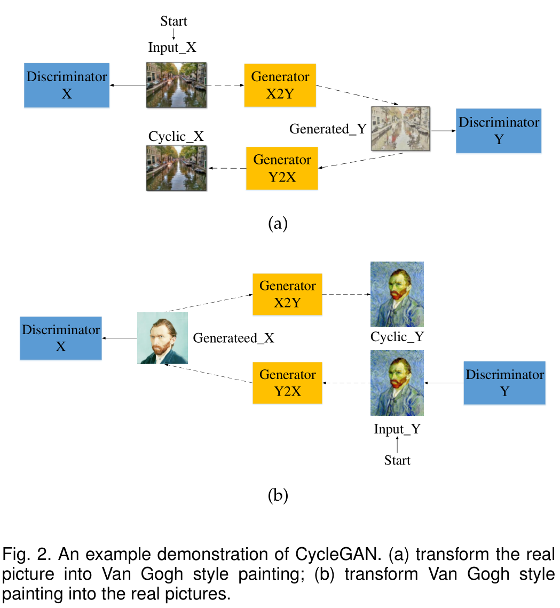
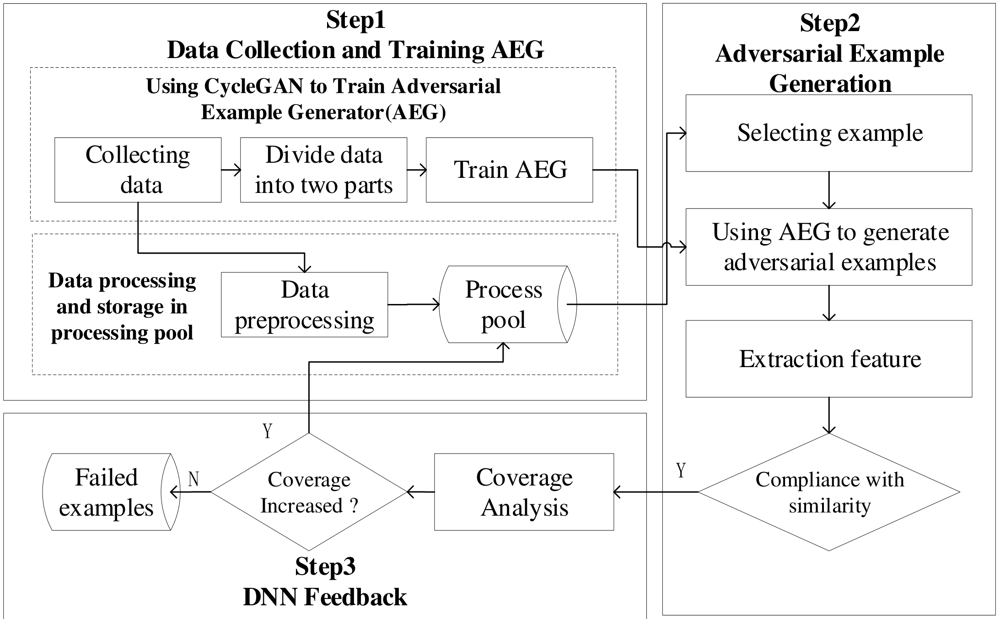
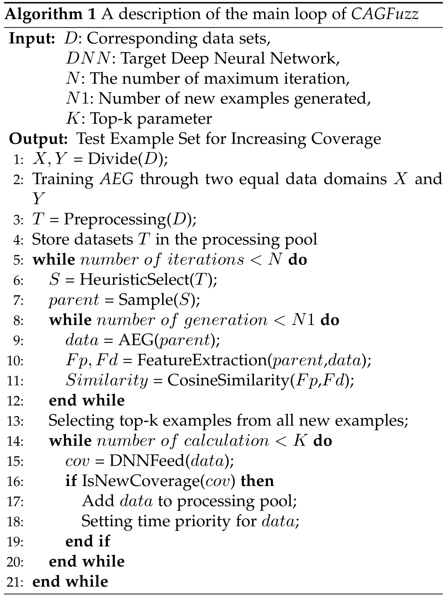

提出了CAGFuzz，这是一种覆盖率指导的灰盒对抗性生成模糊测试方法，可以为目标DNN生成对抗性示例，以发现其潜在缺陷。
<!--more--->

DeepXplore，使用多个DNN来发现并生成位于这些DNN决策边界之间的对抗性示例。

DeepHunter，使用变形突变策略来生成新的测试示例。

DeepGauge，提出了深度神经网络的新覆盖标准。

1. 为了提高泛化能力，仅从数据的角度添加较小的扰动就非常重要。
2. 现有研究完全忽略了包含高级语义信息（例如图像对象类别和场景语义）的深度特征约束。使用L0和L∞来限制对抗性示例的像素级变化，这样的约束只能代表对抗实例和原始实例之间的视觉一致性，而不能保证对抗实例和原始实例的高级语义信息之间的一致性。

具体地，
1. 双重GAN构造对抗样本生成器AEG
CAGFuzz的目标是最大化神经元覆盖范围，并在对目标DNN产生较小扰动的情况下尽可能多地生成对抗性测试示例。同时，生成的示例适用于不同种类的DNN。

CycleGAN [19]的目标是将图像A转换为具有不同样式的图像B。

基于CycleGAN，我们的目标是将图像B转换回图像A，以获得与原始图像A类似的图像A’。

因此，我们将两个具有相反功能的CycleGAN的生成器组合为对抗示例生成器。

基于几个特定的​​数据集对AEG进行训练，并且不需要依赖任何特定的DNN模型。

2. 采用网络信息确保两样本语义一致
我们提取原始示例和对抗示例的深度特征，并通过相似性度量使其尽可能相似。

我们使用VGG-19网络[20]提取原始示例和对抗示例的深度语义信息，并使用余弦相似度测量方法来确保对抗示例的深度语义信息与原始示例一致 越多越好。

3. 结果
AGFuzz可以有效地改善目标DNN模型的神经元覆盖范围。证明了由CAGFuzz生成的对抗示例可以发现目标DNN模型中的隐藏缺陷。通过AEG训练的DNN模型的准确性和鲁棒性已得到显着提高。

# 背景知识

## 覆盖率引导的灰盒模糊测试

最新的CGF方法主要包括三个部分：突变，反馈指导和模糊策略

## CycleGAN

生成对抗性示例的想法是增加人们无法与原始示例区分开的干扰。这与GAN [27]生成示例的想法非常相似。

GAN的生成器G和鉴别器D根据噪声数据交替生成与原始示例非常相似但不完全相同的对抗示例。

考虑到不同目标DL系统（例如某些带有标签数据的DL系统和其他DL系统的数据集）的差异，我们选择CycleGAN [19]作为对抗性示例生成器的训练模型，因为CycleGAN不需要数据匹配集和标签信息。

CycleGAN的目标是学习X和Y之间的映射关系G和F。有两个对抗判别器$D_x$和$D_y$，$D_x$分辨图片$x$和转换后的图片$F(x)$。$D_y$相似。

和其他GAN一样，用损失函数优化映射函数。这里用最小二乘损失。

本示例的目的是将真实图片和梵高风格的绘画相互转化。

## VGG-19

VGG-19网络可以从图像中提取高级语义信息[29]，[30]，可用于识别图像之间的相似性。

本文将最后一个完整连接层的输出作为特征向量进行融合，以比较对抗性示例与原始示例之间的相似性，并作为过滤生成的对抗性示例的阈值。

## 神经网络覆盖率

# 方法

## 概述

第一步是数据收集和训练对抗性示例生成器

将数据集分为两个子集，并作为CycleGAN的输入来训练AEG。

在根据存储时间等设置了优先级之后，将这些示例放入处理池中，作为模糊测试的原始示例集。

第二步是对抗示例生成。

每次从处理池中选择优先的原始示例，并将其用作AEG的输入以生成对抗示例。

VGG-19处理对抗性示例和原始示例，以提取示例的特征矩阵。

计算对抗性示例与原始示例之间的特征矩阵的余弦相似度，以确保对抗性示例的深层语义与原始示例一致。

第三步是使用神经元覆盖率来指导生成过程。

第二步中生成的对抗示例将输入到被测DNN中以进行覆盖率分析。

如果发生新的覆盖，则对抗性示例将作为数据集的一部分放入处理池中。

新的覆盖范围意味着对抗示例的神经元覆盖范围高于原始示例的神经元覆盖范围。

CAGFuzz的输入包括目标数据集D，给定深度神经网络DNN，最大迭代数N，每个原始示例生成的对抗性示例N1以及top-k的参数K。

输出是生成的测试示例，可改善目标DNN的覆盖范围。

在整个模糊测试过程之前，我们需要处理数据集。

一方面，它被分为两个相等的数据字段（第1行），以训练对抗性示例生成器AEG（第2行）。

另一方面，所有示例都经过预处理（第3行），并存储在处理池中（第4行）。

在每个迭代过程中（第5行），根据时间优先级（第6、7行）从处理池中选择原始示例父对象。

然后，每个原始示例父对象都会生成多次（第8行）。

对于每一代，对抗性示例生成器AEG用于变异原始示例性父级，以生成对抗性示例数据（第9行）。

分别提取原始示例父对象和对抗示例数据的深度特征，并计算它们之间的余弦相似度（第10-11行）。

最后，将原始样本产生的所有对抗性示例按照相似性从高到低排序，并选择其中的前k个作为目标示例（第13行）。

排名前k位的对抗性示例是具有覆盖范围的反馈（第15行）。

如果对抗性示例增加了目标DNN的覆盖范围，它们将被存储在处理池中并设置时间优先级（第16-19行）。

## 数据收集

首先对数据集进行排序，将排好序的数据集储存在队列中。然后将队列分成两部分，训练cycleGAN使用。

## 训练对抗样本生成器

如何把握突变程度degree是关键。本文提出了一个新的对抗样本生成方法，能够保证深层次semantic信息的不变性，且扰动对人类是不可察觉的。

这个新的方法就是引用了cyclegan，依赖adversarial loss函数添加对抗扰动，且通过cyclic consistency loss控制扰动在人类不可察觉的范围内。

CycleGAN是怎么做的呢？首先将数据集均匀分成两部分X、Y，模型试图学习两个映射，分别是从X到Y的映射P，以及从Y到X的映射Q。对应地，有两个对抗判别器$D_x$和$D_y$，分别负责判断当前的$x$是来自X的样本还是来自Q生成的样本，以及负责判断当前的$y$是来自Y的样本还是来自P生成的样本。

对于映射函数P和对应的对抗样本判别器$D_y$，对抗损失函数为：
$$\begin{aligned}
\min _{P} \max _{D} Y V\left(P, D_{Y}, X, Y\right)=E_{y \sim P_{\text {data}}(y)}\left[\log D_{Y}(y)\right] &+\\
E_{x \sim P_{\text {data}}(x)}\left[\log \left(1-D_{Y}(P(x))\right)\right] &]
\end{aligned}$$

最小化映射函数P，最大化对抗判别器$D_y$。

P映射的目的是生成对抗样本$y'=P(x)$，让$y'$看起来像是从Y中来的一样。这个过程可以理解成，把大量的来自于Y的特性给添加到来自于X的$x$中。同时训练一个辨别器$D_y$，辨别真正的$y$与P生成出来的$y'$。

