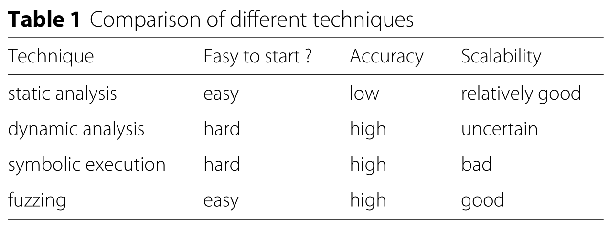
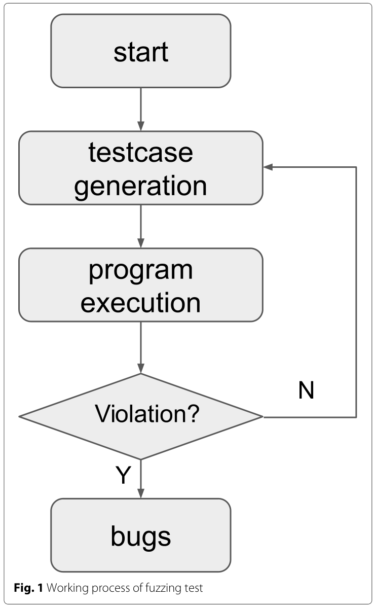
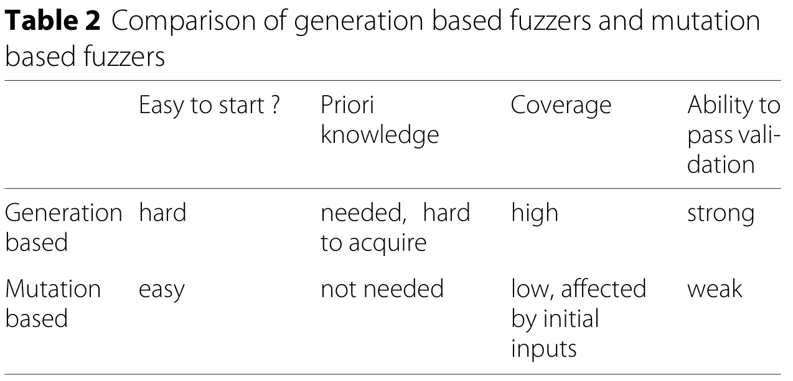
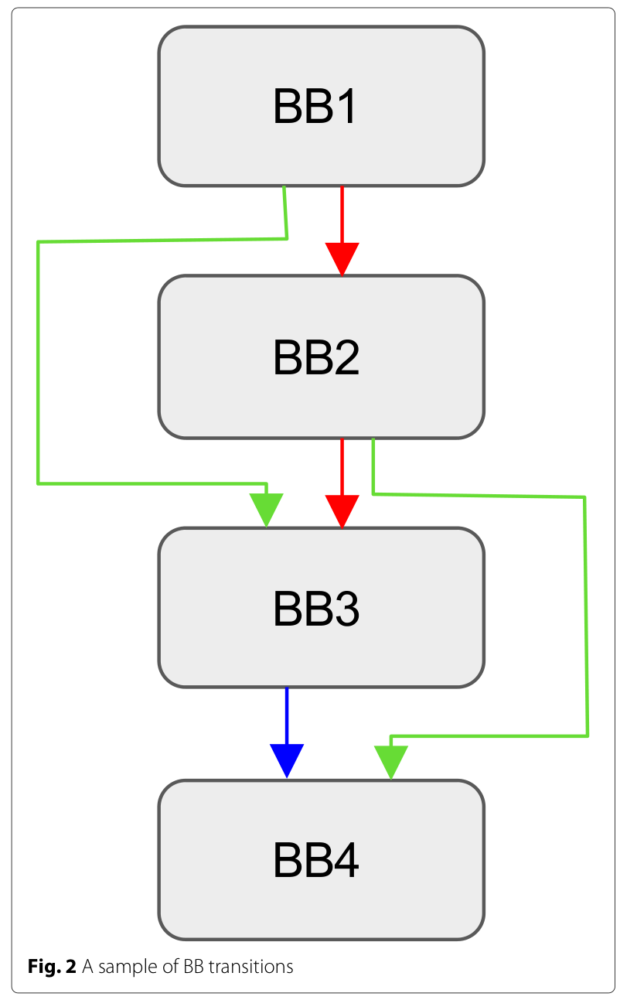
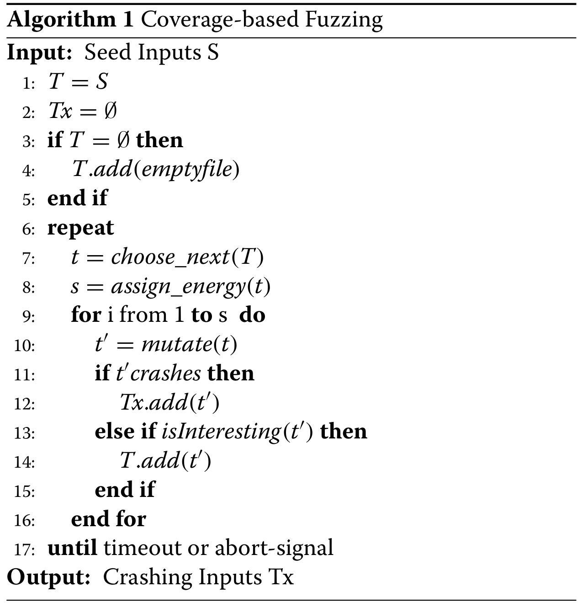
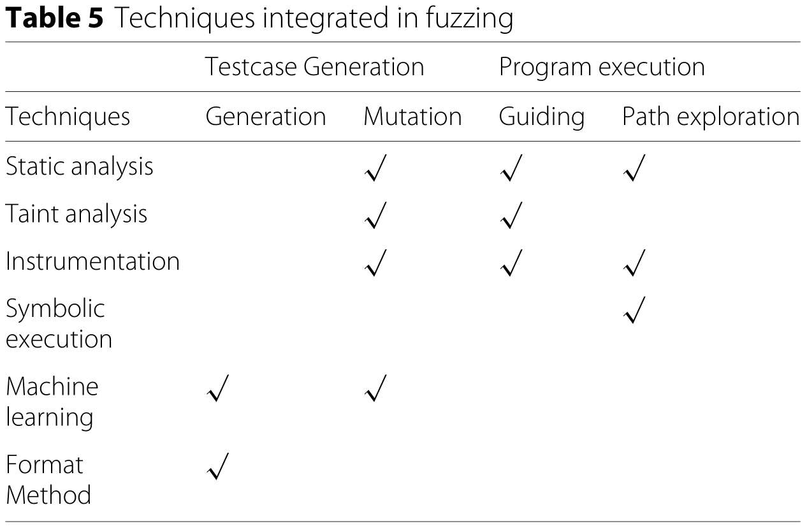

2018年CyberSecurity收录的一篇关于软件测试中模糊测试的综述。作者来自清华大学。文章名越短越霸气。
<!--more--->

> 警告！本文在写作过程中大量使用了谷歌翻译。

# 一、引言

模糊测试几乎不需要了解目标，并且可以轻松扩展到大型应用程序，因此已成为最受欢迎的漏洞发现解决方案

模糊的随机性和盲目性导致发现错误的效率低下

反馈驱动的模糊模式（feedback-driven fuzzing mode）和遗传算法（genetic algorithms）的结合提供了更灵活和可自定义的模糊框架，并使模糊过程更加智能和高效。

 # 二、背景

 ## 1.静态分析

静态分析（Static Analysis）是对在没有实际执行程序的情况下执行的程序的分析。

通常对源代码执行静态分析，有时还对目标代码执行静态分析。通过分析词法，语法，语义特征以及数据流分析，模型检查，静态分析，可以检测到隐藏的错误。

静态分析的优点是检测速度快。
 
由于缺乏易于使用的漏洞检测模型，因此静态分析工具容易产生大量误报。因此，确定静态分析的结果仍然是一项艰巨的工作。

## 2.动态分析

动态分析（Dynamic Analysis）与静态分析相比，分析人员需要在实际系统或仿真器中执行目标程序。

通过监视运行状态并分析运行时知识，动态分析工具可以精确地检测程序错误。

动态分析的优点是精度高，缺点是速度慢，效率低，对测试人员的技术水平要求高，可扩展性差，并且难以进行大规模测试。

## 3.符号执行

符号执行（Symbolic Execution）是另一种发现漏洞的技术。

通过符号化程序输入，符号执行为每个执行路径维护了一组约束（constraint）。

执行之后，约束求解器（constraint solvers）将用于求解约束并确定导致执行的输入。

从技术上讲，符号执行可以覆盖程序中的任何执行路径，并且在小型程序的测试中已显示出良好的效果，但也存在许多限制。

首先，路径爆炸问题。随着程序规模的增长，执行状态会爆炸，这超出了约束求解器的求解能力。

第二，环境的相互作用。在符号执行中，当目标程序执行与符号执行环境之外的组件交互时，例如系统调用，处理信号等，可能会出现一致性问题。

因此符号执行仍然很难扩展到大型应用程序。

## 4.模糊测试

模糊测试（Fuzzing）是目前最流行的漏洞发现技术。

从概念上讲，模糊测试从为目标应用程序生成大量正常和异常输入开始，并尝试通过将生成的输入提供给目标应用程序并监视执行状态来检测异常。

与其他技术相比，模糊测试易于部署并且具有良好的可扩展性和适用性，并且可以在有或没有源代码的情况下执行。

此外，由于模糊测试是在实际执行中执行的，因此它具有很高的准确性。

而且，模糊测试几乎不需要了解目标应用程序，并且可以轻松扩展到大型应用程序。

尽管模糊测试存在许多缺点，例如效率低和代码覆盖率低，但是，缺点却胜过缺点，模糊处理已成为当前最有效，最高效的最新漏洞发现技术。

# 三、模糊测试介绍

## 1.模糊测试的工作过程

模糊测试包括四个主要阶段，即测试用例生成阶段，测试用例运行阶段，程序执行状态监视和异常分析。

模糊测试从生成一堆程序输入（即测试用例）开始。生成的测试用例的质量直接影响测试效果。

一方面，输入应尽可能满足测试程序对输入格式的要求。

另一方面，应充分破坏输入，以便对这些输入进行处理很可能会使程序失败。

根据目标程序，输入可以是具有不同文件格式的文件，网络通信数据，具有指定特征的可执行二进制文件等。

如何生成足够多的测试用例是Fuzzer面临的主要挑战。

在上一阶段生成测试用例后，将它们馈送到目标程序。

模糊测试器自动开始和完成目标程序的过程，并驱动目标程序的测试用例处理过程。

在执行之前，分析人员可以配置目标程序的启动和完成方式，并预定义参数和环境变量。

通常，模糊处理过程在预定义的超时、程序执行挂起或崩溃时停止。

模糊器在目标程序执行期间监视执行状态，以防异常和崩溃。

常用的异常监视方法包括监视特定的系统信号，崩溃和其他违规（violations）。

当捕获到违规时，模糊器将存储相应的测试用例，以供以后重播和分析。

在分析阶段，分析人员尝试确定捕获的违规的位置和根本原因。

自动崩溃分析是另一个重要的研究领域。

## 2.模糊测试器的种类

### A.基于生成和基于突变

模糊器可以分为基于生成（generation based）和基于突变（mutation based）两类。

对于基于生成的模糊器，需要有关程序输入的知识。

对于文件格式模糊测试（file format fuzzing），通常会提供一个预定义文件格式的配置文件。测试用例根据配置文件生成。

有了给定的文件格式知识（file format knowledge），基于生成的模糊器生成的测试用例就可以更轻松地通过程序的验证，并且更有可能测试目标程序的更深层代码。

但是，如果没有友好的文档，分析文件格式将是一项艰巨的工作。

因此，基于变异的模糊器更容易启动并且更适用，并且被最新的模糊器广泛使用。

对于基于突变的模糊器，需要一组有效的初始输入（a set of valid initial inputs）。

测试用例是通过对初始输入和测试过程中产生的测试用例进行变异而生成的。

### B.黑盒白盒灰盒

关于对程序源代码的依赖性（the dependence on program source
code）和程序分析的程度（the degree of program analysis），模糊器可以分为白盒，灰盒和黑盒（white box, gray box and black box）。

白盒模糊测试器可以访问程序的源代码，因此可以通过对源代码进行分析以及测试用例如何影响程序运行状态来收集更多信息。

黑盒模糊器会在不了解目标程序内部的情况下进行模糊测试。

灰箱模糊器也不使用源代码，但可以通过程序分析获得目标程序的内部信息。

### C.定向模糊和基于覆盖的模糊

根据探索程序的策略（the strategies of exploring the programs），模糊器可以分为定向模糊（directed fuzzing）和基于覆盖的模糊（coverage-based fuzzing）。

定向模糊器旨在生成覆盖目标代码和程序目标路径的测试用例（cover target code and target paths of programs），而基于覆盖率的模糊器旨在生成覆盖尽可能多的程序代码的测试用例（cover as much code of programs as possible）。

定向模糊器期望对程序进行更快的测试，而基于覆盖率的模糊器期望进行更彻底的测试并检测到尽可能多的错误。

对于定向模糊器和基于覆盖的模糊器，如何提取执行路径的信息是一个关键问题。

### D.哑模糊和智能模糊

根据对程序执行状态的监视和测试用例的生成之间是否存在反馈（whether there is a feedback between the monitoring of program execution state and testcase generation），模糊器可以分为哑类（dumb fuzz）和智能类（smart fuzz）。

智能模糊器会根据收集的信息（测试用例如何影响程序行为）来调整测试用例的生成。

对于基于变异的模糊测试器，反馈信息可用于确定应该对测试用例的哪一部分进行变异以及对它们进行变异的方式。

哑模糊测试器（Dumb fuzzers）具有更好的测试速度（speed），而智能模糊测试器可以生成更好的测试用例并获得更高的效率（efficiency）。

## 3.模糊测试面临的挑战

### A.如何改变种子输入的挑战

基于变异的模糊测试工具在进行变异时需要回答两个问题：（1）变异的位置，以及（2）变异的方式。

只有几个关键位置的突变会影响执行的控制流程。因此，如何在测试用例中定位这些关键位置非常重要。

此外，模糊器改变关键位置的方式是另一个关键问题，即如何确定可以将测试定向到程序有趣路径的值。

简而言之，测试用例的盲目突变会严重浪费测试资源，更好的变异策略可以显着提高模糊测试的效率。

### B.低代码覆盖率的挑战

较高的代码覆盖率表示对程序执行状态的覆盖率更高，并且测试更加彻底。发现错误的可能性更高。

但是，大多数测试用例仅涵盖相同的少数路径。

因此，仅通过大量生成测试用例并投入测试资源来实现高覆盖率是不明智的选择。

基于覆盖率的模糊器试图借助程序分析技术（例如程序检测，program instrumentation）来解决问题。

### C.通过验证的挑战

程序通常在解析和处理之前验证（Validation）输入。

验证可以保护程序，节省计算资源，并保护程序免受无效输入和恶意构造输入造成的损坏。

黑盒和灰盒模糊器生成的测试用例很难通过盲目生成策略（blind generation strategy）的验证，从而导致效率很低。

# 四、覆盖引导的模糊测试

为了实现深入而彻底的程序模糊测试，模糊测试人员应尝试**遍历尽可能多的程序运行状态**。

但是，由于程序行为的不确定性，因此**没有用于程序状态的简单度量**。

测量代码覆盖率成为一种近似的替代解决方案。代码覆盖率的增加代表了新的程序状态。此外，代码覆盖率很容易测量。

但是，代码覆盖率是一种近似的度量，因为在实践中，恒定的代码覆盖率并不表示恒定的程序状态数。使用此指标可能会导致某些信息丢失。

## 1.代码覆盖率计数

在程序分析中，程序由基本块（basic blocks）组成。基本块是具有单个入口和出口点的代码段，基本块中的指令将顺序执行，并且只会执行一次。

在代码覆盖率测量中，最新技术将基本块作为最佳粒度（granularity）。原因包括：（1）基本块是程序执行的最小连贯单位；（2）测量功能或指令会导致信息丢失或冗余；（3）基本块可以由第一条指令的地址标识；以及基本块信息可通过代码检测轻松提取。

当前，有两种基于基本块的基本测量选择：简单地计算已执行的基本块和计算基本块的跃迁（transitions）。

在后一种方法中，程序被解释为图，顶点用于表示基本块，边用于表示基本块之间的跃迁。

后一种方法记录边缘，而前一种方法记录顶点。

但是实验表明仅对已执行的基本块进行计数将导致严重的信息丢失。

如图所示，如果首先执行程序路径（BB1，BB2，BB3，BB4），然后执行时遇到路径（BB1，BB2，BB4），则新边（BB2，BB4）信息为丢失。

## 2.基于覆盖的模糊测试的工作过程

算法1显示了基于覆盖的模糊器的一般工作过程。

测试从初始给定的种子输入开始。

在主模糊循环中，模糊器反复选择一个有趣的种子来进行后续的突变和测试用例的生成。然后在模糊器的监视下驱动目标程序以执行生成的测试用例。

收集触发崩溃的测试用例，并将其他有趣的用例添加到种子库中。

对于基于覆盖的模糊测试，达到新控制流**边缘的测试用例**被认为很有趣。

主模糊循环在预先配置的超时或中止信号时停止。

在模糊测试过程中，模糊器通过各种方法跟踪执行情况。

基本上，模糊器出于两个目的跟踪执行，即**代码覆盖率**和**安全性违规**（security violations）。

代码覆盖率信息用于进行彻底的程序状态探索，而安全违规跟踪则用于更好地发现错误。

下图显示了AFL（American Fuzzy Lop，一个非常有代表性的基于覆盖的模糊器）的工作过程。

在执行覆盖范围收集之前，模糊器将对目标应用程序进行检测。

在主模糊循环中，提供初始种子输入后，（1）模糊器根据种子选择策略从种子库中选择喜欢的种子，比如AFL则选择最快和最小的种子。（2）根据变异策略对种子文件进行变异，并生成一堆测试用例。

AFL当前采用一些随机修改和测试用例拼接方法，包括长度和步长变化的顺序位翻转，小整数的顺序加法和减法以及已知有趣的整数（如0、1，INT_MAX等）的顺序插入。（3）测试用例已执行，并且执行情况正在跟踪中。

收集覆盖率信息以确定有趣的测试用例，即达到新控制流边缘的测试用例。

有趣的测试用例将添加到种子池中，以进行下一轮运行。

## 3.关键问题

前面的介绍表明，要运行一个高效的、基于覆盖的模糊，需要解决很多问题。最近一些研究如下表。

### A.如何获得初始输入？

大多数最先进的基于覆盖的模糊器都采用了基于突变的测试用例生成策略，这在很大程度上取决于初始种子输入的质量。

良好的初始种子输入可以显著提高模糊的效率和效果。

具体来说，

(1)提供格式良好的种子输入可以节省构建一个种子输入所消耗的大量cpu时间；

(2)良好的初始输入可以满足复杂文件格式的要求，而复杂文件格式在突变阶段是很难猜测的；

(3)基于格式良好的种子输入的突变更容易产生测试用例，可以达到更深层次和难以达到的路径；

(4)良好的种子输入可以在多次测试中重复使用。

常用的收集种子输入的方法包括使用标准基准、从互联网上抓取和使用现有的POC（Proof of Concept）样本。

考虑到目标应用输入的多样性，从互联网上抓取是最直观的方法。

过量的种子输入会导致第一次干运行的时间浪费，从而带来另一个问题，即如何提炼初始语料。

AFL提供了一个工具，它可以提取一个最小的输入集，以达到相同的代码覆盖率。

### B.如何生成测试用例？

testcases的质量是影响模糊测试效率和效果的重要因素。

首先，好的testcases可以在较短的时间内探索更多的程序执行状态，覆盖更多的代码。

此外，好的测试用例可以针对潜在的脆弱位置，带来更快的程序bug发现。

因此，如何基于种子输入生成好的测试用例是一个重要的问题。

种子输入的突变涉及两个关键问题：在哪里突变和用什么值进行突变。

随着机器学习技术的发展和广泛应用，一些研究尝试使用机器学习技术来辅助生成testcases。

微软研究院的Godefroid等（2017）利用基于神经网络的统计机器学习技术来自动生成testcases。

具体来说，他们首先通过机器学习技术从一堆有效输入中学习输入格式，然后利用学习到的知识指导测试用例的生成。

他们介绍了微软Edge浏览器中PDF解析器的模糊过程。

虽然实验并没有给出一个令人鼓舞的结果，但仍是一个不错的尝试。

微软的Rajpal等人（2017）使用神经网络从过去的模糊探索中学习，并预测输入文件中哪些字节要突变。

Nichols等人（2017）使用生成对抗网络（GAN）模型来帮助用新颖的种子文件重新初始化系统。

实验表明，GAN比LSTM更快、更有效，并且有助于发现更多的代码路径。

### C.如何从种子池中选择种子？

模糊器在主模糊循环中新一轮测试开始时，反复从种子池中选择种子进行突变。

以往的工作已经证明，良好的种子选择策略可以显著提高模糊效率，并帮助更快地找到更多的Bugs。

通过良好的种子选择策略，模糊器可以
- （1）优先选择更有帮助的种子，包括覆盖更多的代码，更容易触发漏洞；
- （2）减少重复执行路径的浪费，节省计算资源；
- （3）优化选择覆盖更深、更易受攻击的代码的种子，帮助更快地识别隐藏的漏洞。

Böhme等人（2017）提出了AFLFast，一个基于覆盖的灰盒模糊器。在模糊过程中，AFLFast会测量执行路径的频率，优先处理被模糊次数较少的种子，并为行使低频路径的种子分配更多的能量。

Rawat等(2017)综合了静态和动态分析来识别难以到达的深层路径，并对到达深层路径的种子进行优先级排序。

AFLGo将一些易受攻击的代码定义为目标位置，并优化选择离目标位置较近的测试case。

已知漏洞的特征也可用于种子选择策略。然而，收集耗费资源的信息带来了沉重的开销，降低了模糊的效率。

### D.如何高效地测试应用程序？

目标应用程序由主模糊循环中的模糊器反复启动和完成。

对于用户区应用程序的模糊处理，程序的创建和完成将消耗大量的cpu时间。频繁创建和完成该程序将严重降低模糊测试的效率。

AFL使用forkserver方法，该方法创建一个已加载程序的完全相同的克隆，并在每次运行时重复使用该克隆。

# 五、模糊集成技术

使用随机突变方法的模糊模糊测试策略会导致大量无效测试用例，并且模糊测试效率较低。

当前，最先进的模糊器通常采用智能模糊策略。

智能模糊器通过程序分析技术来收集程序控制流和数据流信息，并因此利用收集到的信息来改进测试用例的生成。

由智能模糊器生成的测试用例具有更好的针对性，更有可能满足程序对数据结构和逻辑判断的要求。

下图描绘了智能模糊的示意图。

表5中总结了模糊测试中集成的主要技术。

## 1.测试用例生成

如前所述，模糊测试中的测试用例是基于生成的方法或基于变异的方法生成的。

如何生成满足复杂数据结构要求并更有可能触发难以到达的路径的测试用例是一个关键挑战。

在基于生成的模糊测试中，生成器根据输入数据格式的知识生成测试用例。

Work（Godefroid et al.2017）使用机器学习技术（特别是递归神经网络）来学习输入文件的语法，并因此使用所学的语法来生成满足格式要求的测试用例。

更多的最先进的模糊器采用基于变异的模糊策略。通过在突变过程中修改部分种子输入来生成测试用例。

在盲目的突变模糊化过程中，变异者使用随机值或几个特殊值随机修改种子字节，这被证明是效率很低的。因此，如何确定要修改的位置以及修改中使用的值是另一个关键挑战。

## 2.程序执行

执行阶段涉及的两个关键问题是**如何指导模糊测试过程**以及**如何探索新路径**。

仪表（Instrumentation）技术用于记录路径执行情况并计算基于覆盖率的模糊测试中的覆盖率信息。

测试执行过程中的另一个问题是探索新路径。符号执行技术在路径探索中具有天然的优势。

通过求解约束集，符号执行技术可以计算出满足特定条件要求的值。

反馈驱动的模糊测试提供了一种有效的引导测试方法，传统和新技术都可以发挥传感器的作用，以在测试执行过程中获取各种信息，并准确地指导模糊测试。

# 六、总结

* 反馈驱动的模糊模式（feedback-driven fuzzing mode）和遗传算法（genetic algorithms）的结合
* 测试用例生成阶段，测试用例运行阶段，程序执行状态监视和异常分析
* 根据探索程序的策略（the strategies of exploring the programs），模糊器可以分为定向模糊（directed fuzzing）和基于覆盖的模糊（coverage-based fuzzing）。
* 定向模糊器期望对程序进行更快的测试，而基于覆盖率的模糊器期望进行更彻底的测试并检测到尽可能多的错误。
* 对于定向模糊器和基于覆盖的模糊器，如何提取执行路径的信息是一个关键问题。
* 根据对程序执行状态的监视和测试用例的生成之间是否存在反馈（whether there is a feedback between the monitoring of program execution state and testcase generation），模糊器可以分为哑类（dumb fuzz）和智能类（smart fuzz）。
* 智能模糊器会根据收集的信息（测试用例如何影响程序行为）来调整测试用例的生成。
* 对于基于变异的模糊测试器，反馈信息可用于确定应该对测试用例的哪一部分进行变异以及对它们进行变异的方式。
* 基于变异的模糊测试工具在进行变异时需要回答两个问题：（1）变异的位置，以及（2）变异的方式。
* 覆盖率的定义。定义覆盖率时要防止信息丢失。代码覆盖率的增加代表了新的程序状态。此外，代码覆盖率很容易测量。边缘的测试用例被认为很有趣
* 通过验证的挑战。验证可以保护程序，节省计算资源，并保护程序免受无效输入和恶意构造输入造成的损坏。
* 一些研究尝试使用机器学习技术来辅助生成testcases。GAN比LSTM更快、更有效，并且有助于发现更多的代码路径。
* 如何从种子池中选择种子？
* 如何高效地测试应用程序？