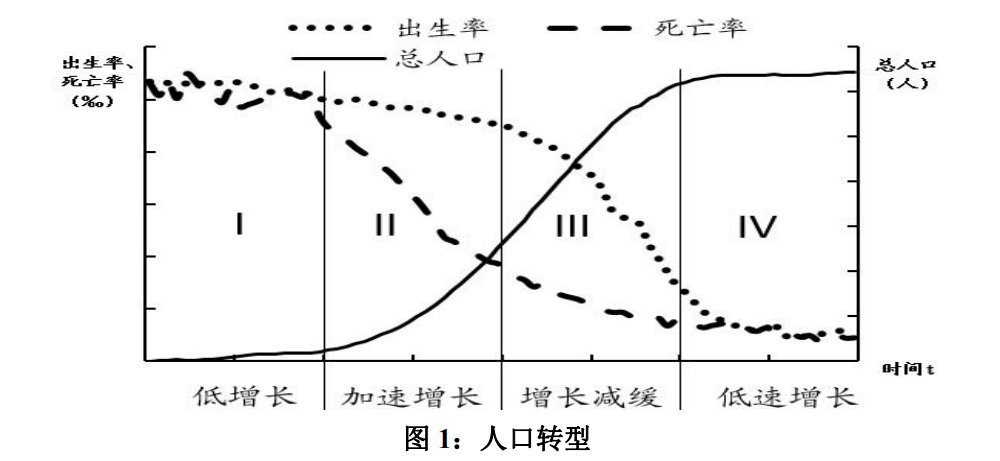

央行（中国人民银行）在2021年3月26日发表了一篇工作论文《关于我国人口转型的认识和应对之策》。论文一经发表便引起了全网的大讨论，新浪微博上的相关点击量达到3.2亿次。然而网络上的消息难免囿于其碎片话叙事风格，使人产生偏见。因此我抱着批判性学习的心态，拜读了该篇论文，并试图梳理主要内容，最后就相关观点提出自己的评论。
<!--more--->

声明：本文并非学术文章，而是代表个人见解的社会评论；针对的也仅限于该篇文章，而不能涵盖文章所涉及的所有相关议题。本文写作目的仅出于学习和交流。本文作者并非研究人口与社会问题的专业人士，因此观点未免存在疏漏和幼稚之处，望读者海涵。

所有的中国人民银行工作论文可在如下网站查看：
http://www.pbc.gov.cn/yanjiuju/124427/133100/index.html

# 论文原文内容概括

## 一、世界人口的转型

该部分讨论了经济社会发展和出生率与死亡率的关系问题。文章认为，经济社会的发展将导致出生率和死亡率下降，但是死亡率会先于出生率下降，因此该文将人口增长状态分为四个阶段：低增长（I）、加速增长（II）、增长减缓（III）和恢复低增长（IV）。

本节最终的结论是发达经济体已经位于IV阶段，而大多数发展中经济体位于II或III阶段。

什么是人口红利？人口红利是指生育率下降带来的劳动人口占比提升的现象。在人口红利时期，因为抚养子女和老人的压力变小，更多的人口能够从事经济发展有关的工作，因此这个地区相较于其他地区增长快。具体表现为居民储蓄率高、投资高等。

人口红利是一个地区发展的机会，但是能否利用这个机会，则有赖于社会和政治条件所创造的生产性就业和投资环境。

但是劳动适龄人口占多数的时期是短暂的（约50年），这一部分劳动人口终究会老去并成为负担，届时新一代人将成为社会发展的主力。这种人口红利之后的现象称之为人口转型。

## 二、如何应对人口转型？

发达经济体早在工业革命时期就已经积累了一定的人口转型方面的经验和教训。比如TODO

# 一些观点的批判

## 文笔

从行文上来看，本片工作论文与其说是一篇论文，不如说是一篇由央行背书的社会评论。从其观点的严谨程度到行文的文笔上都不够“学术”，更加口语化。

例如在第三章第二小节中的一段关于人口与经济的关系的论述如下所示：

* 人口与经济的关系**似乎有点像**物价。过快增长不好，萎缩更糟糕，**也许就像**温和的通胀一样，适度、可持续的人口增长才有利于经济社会发展。

再比如论文第14页的脚注中，关于日本“失去的二十年”的相关注解：

* **有人说**，日本失去的二十年的主要原因是日本泡沫经济，而非人口老龄化。……（即便是上世纪三十年代的大萧条，持续时间即使算满，**也就**十年）。**还有人说**，……。 

并且“有人说”之后也没有跟随参考文献，不由得让人怀疑该“人”的存在性。如此种种不一而足。

我认为无论是学术论文还是工作论文都应当尽可能避免这种模棱两可的文风。如果《转型》和本文一样是一篇社论倒无可厚非；然而本文的作者为央行经验丰富的四位经济学家，发表在国家机关的学术刊物上，不得不令人感到遗憾。

# 总结

该篇文章既没有经过充分的调研，又充斥着不成熟的观点和不严谨的论述。

TODO