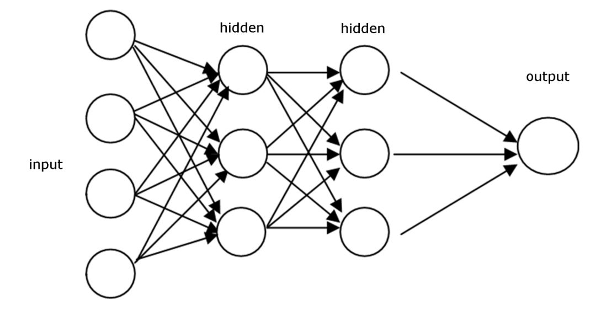
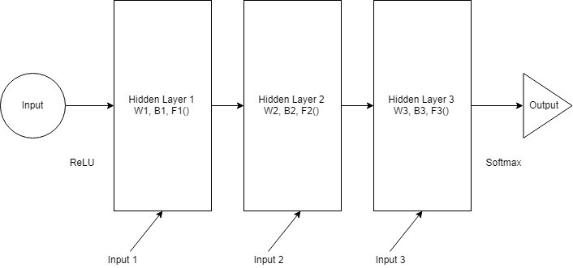
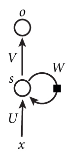
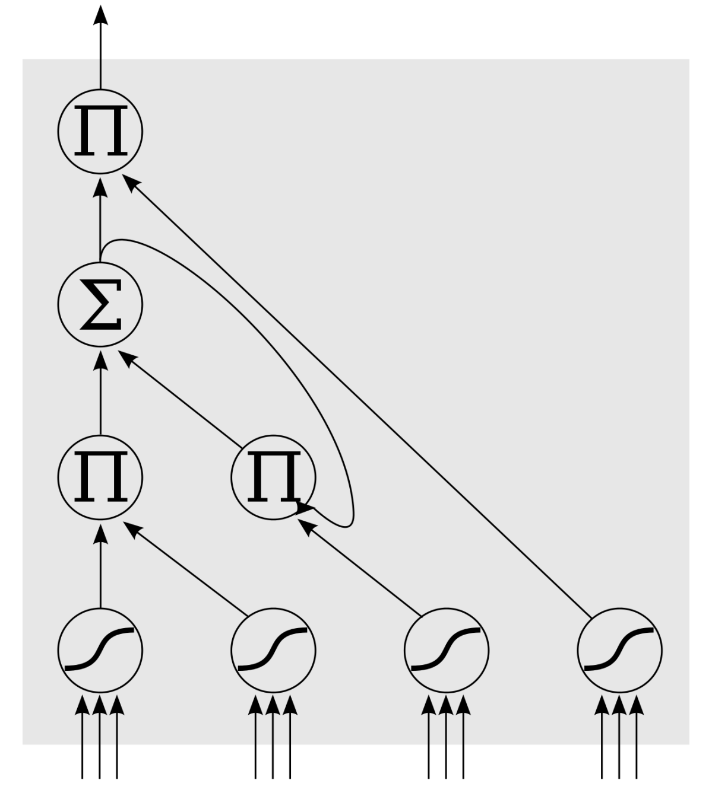
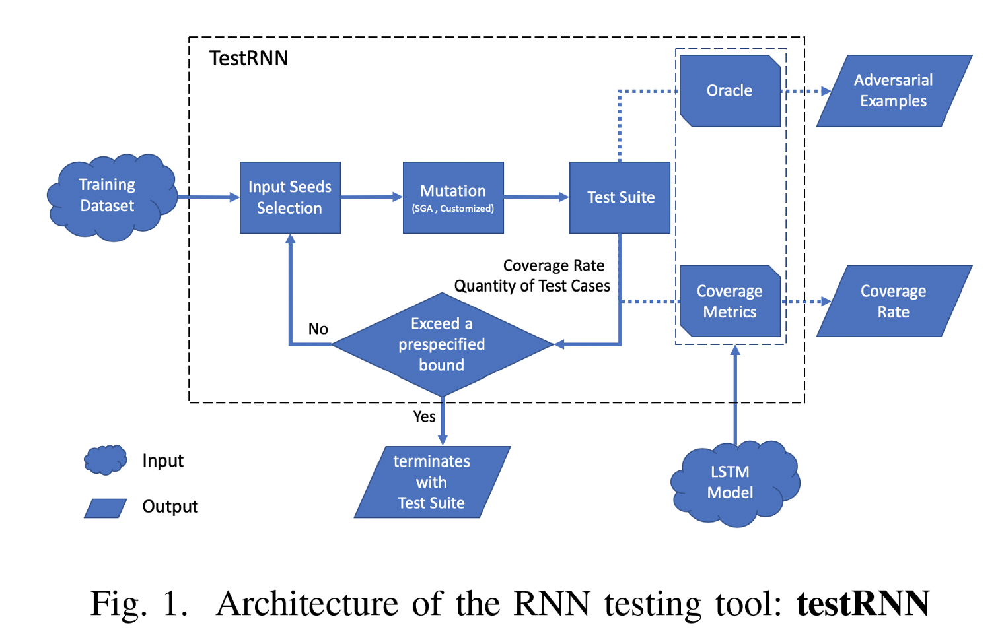

# 循环神经网络模型的覆盖率调研

## 1. 背景

### 1.1 循环神经网络

循环神经网络（Recurrent neural network：RNN）是神经网络的一种。

单纯的RNN因为无法处理随着递归，权重指数级爆炸或梯度消失问题，难以捕捉长期时间关联；而结合不同的LSTM可以很好解决这个问题。循环神经网络可以描述动态时间行为。和前馈神经网络（feedforward neural network）接受较特定结构的输入不同，RNN将状态在自身网络中循环传递，因此可以接受更广泛的时间序列结构输入。手写识别是最早成功利用RNN的研究结果。

为了更好地理解循环神经网络，首先需要介绍前馈神经网络。

#### 1) 前馈神经网络

前馈网络通过在网络的每个节点上做出的一系列操作传递信息。前馈网络每次通过每个层直接向后传递信息。这与循环神经网络不同。一般而言，前馈网络接受一个输入并据此产生输出，这也是大多数监督学习的步骤，输出结果可能是一个分类结果。输出可以是以猫狗等作为标签的类别。我们常见的卷积神经网络（CNN）就是一类经典的前馈网络。

前馈网络是基于一系列预先标注过的数据训练的。训练阶段的目的是减少前馈网络猜类别时的误差。一旦训练完成，我们就可以用训练后的权重对新批次的数据进行分类。

在前馈网络中，在**测试阶段**无论展示给分类器的图像是什么，都不会改变权重，所以也不会影响第二个决策。这是前馈网络和循环网络之间一个非常大的不同。也就是说，前馈网络**在测试时**不会记得之前的输入数据。它们只会**在训练阶段**记得历史输入数据。

与前馈神经网络不同，循环网络不仅将当前的输入样例作为网络输入，还将它们之前感知到的一并作为输入。

#### 2) 前馈网络到循环网络的转变

下图是一个多层感知机示意图，该图所示的模型只拥有一个隐藏层（Hidden Layer），其接受来自输入层经过ReLU处理后的信号，输出的信号再经过Softmax层，从而产生一个分类结果。

如果在上述示例中的层数增加了，并且我们令隐藏层也接收输入，那么第一个隐藏层将激活传递到第二个隐藏层上，以此类推，最后到达输出层，每一层都有自己的权重（W）、偏置项（B）和激活函数（F）。

我们令所有隐藏层的权重和偏置项替换成相同的值，从而能使得隐藏层在某种意义上“合并”，如下图所示（注意图中方框内部隐藏层的参数）：

现在我们就可以将所有层合并在一起了。所有的隐藏层都可以结合在一个循环层中，如下图：

我们在每一步都会向隐藏层提供输入。现在一个循环神经元存储了所有之前步的输入，并将这些信息和当前步的输入合并。因此，它还捕获到一些当前数据步和之前步的相关性信息。t-1 步的决策影响到第 t 步做的决策。

如果我们在向网络输入 7 个字母后试着找出第 8 个字母，隐藏层会经历 8 次迭代。如果展开网络的话就是一个 8 层的网络，每一层对应一个字母。所以一个普通的神经网络被重复了多次。展开的次数与它记得多久之前的数据是直接相关的。

#### 3) 循环神经网络基本结构

下图是一个简单的循环神经网络如，它由输入层、一个隐藏层和一个输出层组成：

- x是一个向量，它表示输入层的值；
s是一个向量，它表示隐藏层的值（你也可以想象这一层其实是多个节点，节点数与向量s的维度相同）；
U是输入层到隐藏层的权重矩阵；
o也是一个向量，它表示输出层的值；
V是隐藏层到输出层的权重矩阵；
W是隐藏层上一次的值作为这一次的输入的权重。

把上面的图展开，循环神经网络也可以画成下面这个样子：

网络在t时刻接收到输入$x_t$之后，隐藏层的值是$s_t$，输出值是$o_t$。关键一点是，$s_t$的值不仅仅取决于$x_t$，还取决于$s_{t-1}$。

我们可以用下面的公式来表示循环神经网络的计算方法：
$$
\begin{aligned}
\mathbf{o}_{t} &=g\left(V \mathbf{s}_{t}\right) \tag{1}
\end{aligned}
$$
$$
\begin{aligned}
\mathbf{s}_{t} &=f\left(U \mathbf{x}_{t}+W \mathbf{s}_{t-1}\right) \tag{2}
\end{aligned}
$$

(1)是输出层的计算公式，输出层是一个全连接层，它的每个节点都和隐藏层的各个节点相连。V是输出层的权重矩阵，g是激活函数。(2)是隐藏层的计算公式，它是循环层。U是输入x的权重矩阵，W是上一次的值作为这一次的输入的权重矩阵，f是激活函数。

从上面的公式我们可以看出，循环层和全连接层的区别就是循环层多了一个权重矩阵 W。

#### 4) 长短期记忆网络

长短期记忆（英语：Long Short-Term Memory，LSTM）是一种时间循环神经网络（RNN），论文首次发表于1997年。由于独特的设计结构，LSTM适合于处理和预测时间序列中间隔和延迟非常长的重要事件。

LSTM是一种含有LSTM区块（blocks）或其他的一种类神经网络，文献或其他资料中LSTM区块可能被描述成智能网络单元，因为它可以记忆不定时间长度的数值，区块中有一个gate能够决定input是否重要到能被记住及能不能被输出output。

下图中，底下是四个S函数单元，最左边的单元为input，右边三个gate决定input是否能传入下个；左边第二个为input gate，如果这里gate近似于零，将把这里的值挡住，不会进到下一层。左数第三个是forget gate，当这产生值近似于零，将把过去记住的值忘掉。第四个也就是最右边的input为output gate，他可以决定在区块记忆中的input是否能输出 。

LSTM有很多个版本，其中一个重要的版本是GRU（Gated Recurrent Unit），根据谷歌的测试表明，LSTM中最重要的是Forget gate，其次是Input gate，最次是Output gate。

### 1.2 循环神经网络测试的机遇和挑战

当前研究大多集中于针对前馈神经网络的测试，诸如DeepXplore、DeepGauge针对CNN的测试等，而对RNN鲜有研究。由于RNN的循环特性，适用于CNN的分析方法不能简单地迁移到RNN上。目前学者大多采用模糊测试的方法，通过随机干扰数据集产生对抗性样本，而后分析RNN内部状态信息，引导数据集的扰动方向的方法，快速生成能使得RNN模型判断错误的对抗测试用例集合，达到模型测试的目的。

根据此思路，一方面可以针对数据集添加干扰的方式进行优化，采用启发式搜索改善对测试样本的Mutation过程；另一方面则是针对RNN内部状态信息的分析，引导算法快速找到有效的、难以察觉变化的对抗样本，这个思路类似于模型攻击。

目前RNN的对抗性测试主要面临三方面的挑战：
1. 对于非分类模型而言，没有较好的标准识别对抗样本能不能让模型发生错误。

> For the sequential outputs not then applied to classification, there is no standard to decide the outputs as wrong outputs with respect to the changing degree.

2. 对于序列输入的Mutation来说，很难保证添加的扰动是最小的

> Applying the perturbations to words in a discrete space always cannot obtain a legal input and the explicit modification is distinguishable for humans.

3. 现有应用于CNN等的覆盖率指标没有考虑到RNN内部结构特性，因此不能直接应用到RNN上。

## 2. 覆盖指标调研

目前针对循环神经网络的测试 (testing) 和验证 (verification) 等工作的研究还十分有限，根据目前调研取得的结果，现有学者的研究思路大体分成两类：抽象替代模型法和门覆盖率法。下文分别对这两个模型进行简述。

### 2.1 抽象替代模型法

#### 2.1.1 代表论文：

> Du, X., Xie, X., Li, Y., Ma, L., Liu, Y., & Zhao, J. (2019, August). **Deepstellar: model-based quantitative analysis of stateful deep learning systems.** In Proceedings of the 2019 27th ACM Joint Meeting on European Software Engineering Conference and Symposium on the Foundations of Software Engineering (pp. 477-487).

> Du, X., Xie, X., Li, Y., Ma, L., Liu, Y., & Zhao, J. (2019, November). **A Quantitative Analysis Framework for Recurrent Neural Network.** In 2019 34th IEEE/ACM International Conference on Automated Software Engineering (ASE) (pp. 1062-1065). IEEE.

#### 2.1.2 关键方法

由于直接分析RNN内部结构具有状态转移的特性，因此DeepStellar一文提出**将RNN建模成马尔科夫链**，来模拟其内部状态和动态行为特性。基于马尔科夫链的抽象，该文设计了两个相似度指标和五个覆盖率标准，来衡量输入测试用例差异和测试用例的测试充分性。

- 抽象模型结构模块：输入训练好的RNN，通过Profiling，分析其内部行为。一系列的RNN状态向量叫做trace。每个输入序列会通过Profiling分析得到一个trace。profiling结束之后就可以得到一系列的trace，记载着RNN训练过程访问过的和经过的状态。

- 分析内部状态空间和被训练集激活的trace的过程计算量很大，因此进一步抽象模型来简化状态和trace。首先对状态向量采用主成分分析，以保留其前k个主成分，并将这k个主成分等分成m部分。在状态转换方面，根据抽象状态将具体的转换概括成为抽象的转换。并且根据每个状态向不同方向转换的频率，导出了训练RNN的离散时间Markov链（DTMC）模型。

- 设计了两个相似度指标，用于衡量不同输入下激活的两个trace的相似度。分别是state-based trace similarity和transition-based trace similarity，简写为SBTSIM和TBTSIM。

- 五个覆盖率包括basic state coverage/n-step state boundary coverage, weighted state coverage/ basic transition coverage/weighted transition coverage，简写为BSCov/n-SBCov/WSCov/BTCov/WTCov。

- 将两个指标和五个标准应用于对抗样本检测和覆盖引导的测试上，来缓解来自对抗样本的威胁。运用两个相似度，即可在运行时检测对抗样本（**Monitor**）；运用五个覆盖率，我们将其用于指导测试用例生成上，生成的测试用例以提升覆盖率和找到更多的未被发现的defects为目标。这两个应用互相补充。

#### 2.1.3 实验效果及评价

DeepStellar在精心的调参下，通过trace相似度检测算法能够很好地检测出当前输入样本是否为对抗样本（音频），准确度达到了89%。

DeepStellar提出的测试方法本质上是对一个等价模型进行分析的方法，抽象掉了RNN模型的很多细节，只保留了主干部分。思路值得借鉴。

DeepStellar的缺点也很明显，其高识别率的背后是精心的调参，并且作者也提到，面对更复杂的模型，结果未必会这么好。

> With finer-grained model, the result is not necessarily better.

### 2.2 门覆盖率法

#### 2.2.1 代表论文：

> Huang, W., Sun, Y., Huang, X., & Sharp, J. (2019). **testRNN: Coverage-guided Testing on Recurrent Neural Networks.** arXiv preprint arXiv:1906.08557.

#### 2.2.2 关键方法

testRNN关注LSTM和其鲁棒性，鲁棒性指对输入添加小的扰动并不影响LSTM的判断结果的特性。注意，该工具只针对LSTM及相似的网络结构进行分析，原因在于其算法依赖于内部门结构的实现，而这种门结构只存在于LSTM类型的网络中。

testRNN的特色在于，其直接分析RNN内部结构并加以分析的思路非常类似于其前辈DeepXplore分析前馈神经网络的思路。但由于RNN网络内部关于“层”和“节点”的概念不同于CNN，因此对如何实现CNN中覆盖率迁移到RNN的应用中，testRNN提出了自己的方法。

- Cell覆盖率。Cell（后文称之为**单元**）覆盖旨在覆盖每个时间步的隐藏状态发生的显著变化$\Delta\xi_t$。当单元值$\Delta\xi_t$大于用户定义的阈值参数$\alpha_h$时，该单元将被激活并被测试用例覆盖。然后使用覆盖率来衡量由生成的测试用例激活至少一次的单元的百分比。（单元的隐藏状态变化大了，超过了用户定义的某个阈值，就算激活，测试用例激活的单元个数占总个数的比例就是该测试用例的覆盖率）

- Gate覆盖率。门的覆盖率类似于单元覆盖率，但是信息是从LSTM单元的门中筛选的。上文提到，Google的研究团队发现，LSTM的四种门中最重要的门是忘记门（forget gate），因此testRNN专注于统计忘记门的覆盖率。忘记门的值$Rt(f，x)$表示可以从最后一个单元继承多少信息。由于LSTM以其长期的存储能力而闻名，因此检查一个单元格是否丢弃了从先前输入中学习到的适当数量的信息非常有意义。（忘记们忘记的信息量用Rt函数表示，则Rt太大了就激活？）

下图是testRNN的具体处理流程。

#### 2.2.3 实验效果

testRNN着眼于门覆盖率，成功将分析CNN的那一套迁移了过来。但是testRNN的实验结果仅限于小数据集训练下的小网络，诸如MNIST分类数据集训练的双层LSTM网络等。因此能否将此方法推广到更加复杂的大型网络中，还有待探究。

### 2.3 优化引导法

#### 2.3.1 代表论文：

> Guo, J., Zhao, Y., Han, X., Jiang, Y., & Sun, J. (2019). **RNN-Test: Adversarial Testing Framework for Recurrent Neural Network Systems.** arXiv preprint arXiv:1911.06155.

#### 2.3.2 关键方法

RNN-Test一方面采用了和testRNN类似的“门覆盖率”方法来引导测试用例生成，另一方面采用了一种全新的优化函数思想，计算能同时使得扰动添加最小并且最有可能令模型发生判断错误的扰动方向。RNN-Test将二者结合起来，但正是因为该文仅仅是将这两种方法求得的偏移方向简单的加和，让人不禁怀疑其工作是否没有进行完全。

- 状态不连续方向（State inconsistency orientation）：
$$obj_{orient} = h_{t-1}^l + c_t^l - h_t^l$$
该优化函数的设计思想是，若一个样本能使得从隐状态t-1时刻输入的信息尽量大，而输出尽量小，那么这种样本更容易出现问题。这是因为t时刻$h_t^l$的值完全取决于$h_{t-1}^l $和$ c_t^l$，让这两部分产生大小差异更容易引发不确定行为。

- 损失函数优化方向（Cost orientation）:
$$obj_{orient} = L_{seq}(y, \hat{y})$$
这一部分引用自FGSM的优化算法，该论文是对抗样本生成领域的开山之作。讲的是如何通过梯度上升算法求得添加扰动的方向，从而使得扰动最小的同时模型的变化最大。

- 决策边界方向（Decision boundary orientation）：
$$obj_{orient} = (\sum_{i=0}^{k}\hat{y_{t_i}}) - \hat{y_t}$$
这一部分的灵感来自于RNN内部结构，由于每个时间步的隐状态事实上都会产生中间输出$y=o_t^l$，但一般我们认为只有最后阶段的输出向量才是有意义的。该优化函数将除了原来预测的最大值y之外前k个最大的y加起来，并减去原来的y。

#### 2.3.3 实验效果

该文章使用自己生成的对抗样本集合，对模型进行重新训练，模型的复杂度（Perplexity）有大约1.159%的降低。这说明模型更稳定了。

然而提升不大，运行效率却很低，计算代价较大。并且原文为了提升算法运行性能，Mutation过程采用了一遍Mutation，若不成功直接放弃的做法，原来的测试用例利用率较低、为了达到较高的突变利用率，算法不得不放宽添加干扰力度，这就导致生成太多无用的假测试用例。算法本身可以被优化。
