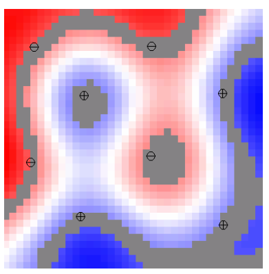
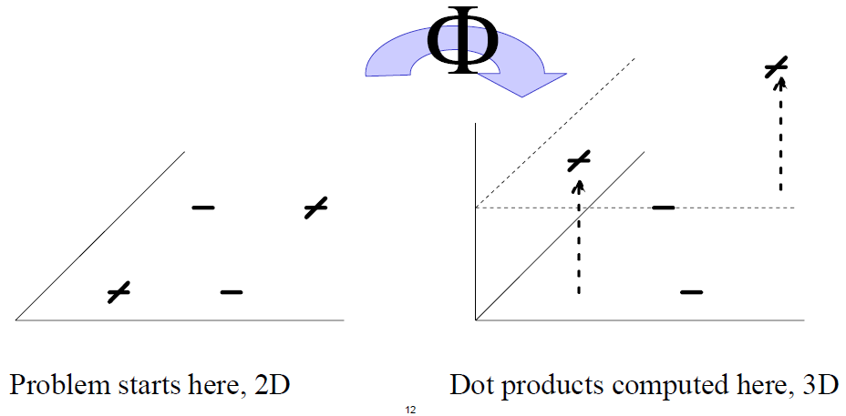

# 支持向量机

## 1. 思想
SVM的思想，即对于平面上的二分类问题，找到一条直线，不但能够将两类数据恰好分开，而且要分的越开越好。即最大化不同类别的（关键）样本点之间的距离。

**我们的目的是找到一条河，让这条河的河岸恰恰经过正负样本的同时，尽可能宽。**

上图蓝线是最终确定的超平面，红线则是正例和反例的“楚河汉界”。这“楚河汉界”与超平面平行，并且距超平面相同距离。

**我们不妨定义这段距离为1。**

## 2. 最大化距离的方法

假设已经找到了这样一条超平面，它的法向量为$\bold{w}$.

对于任意样本$\bold{u}$，如果
$$f(u)=w\cdot u+b > 0$$则把样本u归为正例，反之为负例。

现在想要找到一条河，让这条河的河岸恰恰经过正负样本的同时，尽可能宽。这样我们对正例和负例的划分做出了更高的要求：不仅仅大于0，更要大于河的宽度（的一半），即大于1。
$$
f\left(\mathbf{x}_{+}\right)=\mathbf{w} \cdot \mathbf{x}_{+}+b \geq 1
$$

$$
f\left(\mathbf{x}_{-}\right)=\mathbf{w} \cdot \mathbf{x}_{-}+b \leq-1
$$

设想一下，我们有两个样本，一个小红，一个小蓝，他们站在河的对岸相望。

$$
\begin{aligned} \mathbf{w} \cdot \mathbf{x}_{1}+b &=+1 \\ \mathbf{w} \cdot \mathbf{x}_{2}+b &=-1 \end{aligned}
$$

那我现在问你，求河的长度。WTF？这样就能求出河的长度了吗？是的，想一下，从小红指向小蓝的那一条向量$x_1-x_2$，向超平面的法向量$w$方向投影，然后得到的向量长度不就是河的长度了吗？

河的长度：$\mathbf{w} \cdot\left(\mathbf{x}_{1}-\mathbf{x}_{2}\right)=2$。还记得两个向量投影就是求点积吗？蛤蛤。

忘了，法向量也是有长度的，为了把法向量标准化，我们需要除以法向量的长度：

$$
\frac{\mathbf{w}}{\|\mathbf{w}\|} \cdot\left(\mathbf{x}_{1}-\mathbf{x}_{2}\right)=\frac{2}{\|\mathbf{w}\|}
$$

问题就转化为将$\frac{2}{\|\mathbf{w}\|}$求最大。这就是一个最优化问题，按理说利用拉格朗日乘子法，对分量挨个求导即可求出极值点。但是现在这副模样连求导都做不到。我们想办法变形一下：

常数项肯定就不要了，问题就变成了最小化$\frac{1}{2}\|\mathbf{w}\|^{2}$。这一切都是为了方便数学处理呀。

不要忘了，还有一个（其实是i个）限制条件：

$$
y_{i}\left(\mathbf{w} \cdot \mathbf{x}_{i}+b\right) \geq 1
$$

y取1或-1，用来标记样本类别。

## 3. 二次优化问题

所谓拉格朗日，就是在限制条件前面加个参数，然后附加在要求的优化方程式中，从而将问题转化成无约束优化问题。被拉格朗日之后，我们加了i个参数，组成参数向量a

$$
L=\frac{1}{2}\|\mathbf{w}\|^{2}-\sum_{i=1}^{l} a_{i}\left(y_{i}\left(\mathbf{x}_{i} \cdot \mathbf{w}+b\right)-1\right)
$$

接下来要对向量求导了。害怕吗？有如下公式：$\frac{\partial\|\mathbf{w}\|^{2}}{\partial \mathbf{w}}=2 \mathbf{w}$和$\frac{\partial \mathbf{x} \cdot \mathbf{w}}{\partial \mathbf{w}}=\mathbf{x}$

我们分别对w和b求导，看看拉格朗日函数对w和b的变化分别有什么反应：

$\begin{aligned} \frac{\partial L}{\partial \mathbf{w}} &=\mathbf{w}-\sum_{i=1}^{l} a_{i} y_{i} \mathbf{x}_{i}=0 \\ \frac{\partial L}{\partial b} &=\sum_{i=1}^{l} a_{i} y_{i}=0 \end{aligned}$

现在合适的$w^*=\sum_{i=1}^{l} a_{i} y_{i} \mathbf{x}_{i}$也都找到了，将他们回代到拉格朗日函数中去，看看他的最小点长什么样子。

$$
L=\sum_{i=1}^{l} a_{i}-\frac{1}{2} \sum_{i, j=1}^{l} a_{i} a_{j} y_{i} y_{j} \mathbf{x}_{i} \cdot \mathbf{x}_{j}
$$

我们可以看到啊，这个L的大小，取决于样本之间的点积，也就是我们选的两个小红和小蓝，他们站的位置。他们的位置要是不好，那距离就会不够大，那我们的拉格朗日同学就要重新选人。因此呢，最终被选择的样本，那一定是具有代表性的，我们称它们为**支持向量**。这就是支持向量机一词的由来。

## 4. 核方法的运用

有时候我们会碰到一些样本，他们本来就不是线性可分的，比如

但我们还是将他们利用支持向量机分开了。怎么做到的？怎么“以直为曲”？那是因为有一个道理，**高维空间比低维空间更广阔的**，更难出现线性不可分的状况。所以很自然的，我们人为添加一些分量，比如将二维点添加z轴分量到三维啊，甚至无限维。之后我们可以找到一个超平面，将他们分开就是轻而易举的事情啦。

我们需要一种神秘变换$\Phi$，接受一个样本向量，输出提升维度之后的样本向量。

$\Phi$很难找，但是我们不必找。因为根据前面的结论，拉格朗日函数根我们选取的关键向量的**内积**有关，直接表示出$\Phi\left(\mathbf{x}_{1}\right) \cdot \Phi\left(\mathbf{x}_{2}\right)$，一步到位哦。

正好有这种专门表示两个向量运算的函数，叫做核函数。

$$
\Phi\left(\mathbf{x}_{1}\right) \cdot \Phi\left(\mathbf{x}_{2}\right)=K\left(\mathbf{x}_{1}, \mathbf{x}_{2}\right)
$$

举个例子，线性核函数：

$$
K(x, y) = x\cdot y
$$

多项式核函数：

$$
K\left(\mathbf{x}_{1}, \mathbf{x}_{2}\right)=\left(\mathbf{x}_{1} \cdot \mathbf{x}_{2}+1\right)^{n}
$$

高斯核函数：

$$
K\left(\mathbf{x}_{1}, \mathbf{x}_{2}\right)=e^{\frac{-|| x_{1}+x_{2} ||^{2}}{2 \sigma^{2}}}
$$

有的时候我们会碰到一些样本，他们很难缠，甚至根本线性不可分。类似于红军打入了蓝军内部，根本无法找到一条直线将他们分开。这时候我们就需要放低要求。

引入松弛变量，出现的错误样本在一定程度范围内越小越好。

$$
\xi_i =  1-y_{i}\left(w^{T} x_{i}+b\right)
$$

则有下式

$$
y_{i}\left(w^{T} x_{i}+b\right) \geq 1-\xi_{i}, \quad i=1, \dots, n
$$

最终的优化问题就变成了

$$
\begin{array}{l}{\min \frac{1}{2}\|w\|^{2}+C \sum_{i=1}^{n} \xi_{i}} \\ {\text {s.t.}, y_{i}\left(w^{T} x_{i}+b\right) \geq 1-\xi_{i}, i=1, \ldots, n} \\ {\xi_{i} \geq 0, i=1, \ldots, n}\end{array}
$$

C为经验参数，调参侠必备。您想让误差少点，C就大点。

接下来的套路就和之前一样了，拉格朗日啊之类的，略去不表。