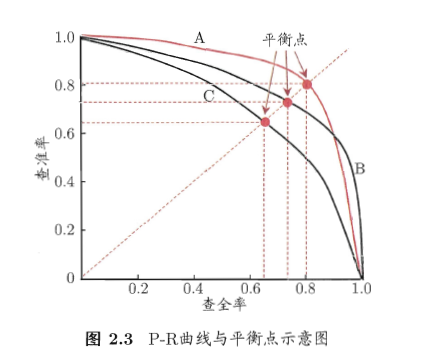
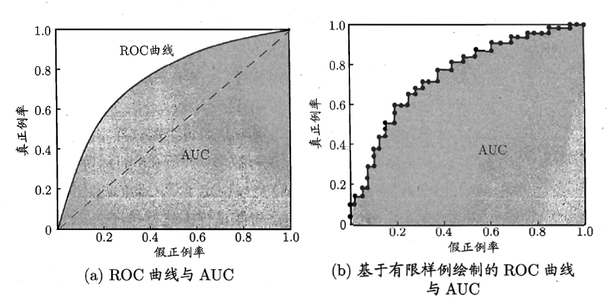

模型如何评估，选择标准是什么？
先让我们了解一下常见的衡量标准

错误率+精度=1

### 误差：

**训练误差/经验误差** training/empirical error
**泛化误差** generalization error

训练误差低，泛化误差不一定低。这其中牵扯到过拟合和欠拟合的问题。

**过拟合**：过分学习，将训练样本中不属于规律的的噪声也一并学习的现象。
防止过拟合，一般采用将数据集分成训练集和测试集，利用训练集训练模型，利用测试集拟合泛化误差的办法。

**测试误差** testing error

### 划分数据集的方法

#### 样本划分之留出法 hold-out

将样本分成互斥的两部分S,T
用S训练，用T测试。分割比例自己确定。
需要注意的是，必须保证S、T同分布，建议采用**分层采样**stratified sampling，即数据集中的每个类别雨露均沾。
另外可以随机划分若干次，防止单次划分出现极端采样结果。随机次数越高，结果的**保真性**fidelity越高。

#### 样本划分之交叉验证 cross validation

将数据集采用分层划分，分成若干个互斥的小数据集。每个小数据集都当一次测试集，其他数据集组成新训练集。如果分割成k个小数据集，则这种验证方法会做k个不同的划分。因此又称为k-fold 交叉验证。

极端情况是留一法 leave one out，即k=|D|。

#### 样本划分之自助法 bootstrapping

从D中进行m次**放回抽样**，形成新的小数据集D',理所应当地，新数据集内可能有重复元素，即$$|unique(D')|\leq m$$

大数据集中的一个元素x不被选中的概率是$$\mathbb{P}\{x\in \mathit{D}\cap x\notin \mathit{D}'\}=(1-\frac{1}{m})^m$$，此时如果m取得越多，概率就越趋近于$$\lim_{m\rightarrow\infty}(1-\frac{1}{m})^m=\frac{1}{e}$$。

最后可以利用D'训练，用D/D'测试。此种抽样方法又称为**包外估计** out of bag estimate，适用于|D|很小的情况。

### 如何判断模型的好坏？

为防止专有名词混淆，此处主要采用英文术语。
对于二分类模型，有以下评价模型的标准：

accuracy：模型结果与真实值相同的比率。中文称之为**精度**。

precision：模型所得结果中正例比率。中文称之为**准确率**。若想准确率提升，直观的方法是只挑选自己十分确定的样本。所谓不打无准备之仗。不过这样肯定会放过很多原本是正例的样本。

recall：正例中模型结果占比。中文称为**查全率**、**召回率**。想提高查全率，就要把所有疑似样本全都收集进来，所谓宁杀一千不放一个。这样显然也会提高误杀率。

**PR曲线**：即准确率-查全率曲线。对于预测模型来说，对未知样本的预测，准确率和查全率往往不可兼得。呈现一个这种曲线：

模型对每个样本会给出自己的判断，并且还会有自己的置信度。我们可以按照置信度排序，就可以做出PR曲线。

只有PR曲线，我们可以说模型C最差，因为这条曲线完全被A或B模型的曲线所包围。但是不好判断A红线与B黑线的性能，因为二者有交叉。这种情况有三种度量：

求**曲线下面积**是一种思路，不过有比较高的计算成本，更喜欢采用的是**平衡点**Break-Even point，可以看到我们挑了三个小红点。靠外的模型好。另外可以采用F1度量。计算公式是$$F_1=\frac{2PR}{P+R}$$这个公式就是准确率和查全率的调和平均$$\frac{1}{F_1}=\frac{1}{2}(\frac{1}{P}+\frac{1}{R})$$。之所以取调和平均，是因为调和平均在四种平均中最小，因此更重视较小值。

对于实际问题，准确率和查全率的意义不一样。超市小偷识别系统更害怕冤枉好人，因此可能更注重准确率；而地铁检查系统可能抱着“宁查一千不放一个”的态度，更追求查全率。因此对F1评价稍作修改，我们就得到了F_beta度量指标：$$F_{\beta}=\frac{(1+\beta^2)PR}{\beta^2P+R}$$，其实这个公式就是加了权重后的调和平均$$\frac{1}{F_{\beta}}=\frac{1}{1+\beta^2}(\frac{1}{P}+\frac{\beta^2}{R})$$。$\beta>1$则更注重查全率R，$\beta<1$则更注重查准率P。

**ROC曲线**是另外一个思路的评价标准，横坐标是假正例，纵坐标是真正例。其绘制方法也是将样本按照置信度排序，如果样本是真正例，则垂直向y轴正方向绘制一个单位；如果样本是假正例，则水平向x轴正方向绘制一个单位。

理想状态下，模型将所有正例排在反例前面，因此曲线应该一直往上升，升到m个正例穷尽之后，再水平到|D|-m个反例。但是往往模型会判断失误，于是就出现了这种图像：

左图是无限样例下，才可能达到的光滑ROC曲线。右图是实际可能的ROC曲线。ROC曲线围成的面积称之为**AUC**。ROC越丰满，AUC越大，模型的判别效果越好。

**AUC**同样也可判断模型的好坏。而且AUC实际上可以通过数值方法来近似求解，有如下公式：$$AUC=\frac{1}{2}\sum_{i=1}^{m-1}(x_{i+1}-x_i)(y_i+y_{i+1})$$

若预测正误代价不同，可参考西瓜书“**代价曲线**”，此处不再赘述。

**假设检验**模块，数学味道太浓，写成博客实用度不高。而且西瓜书上讲的也不甚明了，真正想了解假设检验的朋友，可参考《统计推断》一书或其他的数理统计教材。

### 偏差方差分解 bias variance decomposition

这种分解可以解释泛化性能为什么会下降到一定程度后上升，越训练越差。

偏差 bias
方差 var
$$E(f) = bias^2(x)+var(x)+\epsilon^2$$，我们想令Ef最小。事实上训练越充分，偏差bias越小，但是方差var会提高。所以并不是训练越多越好。