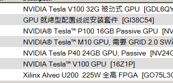
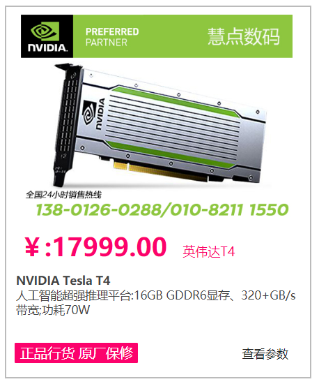
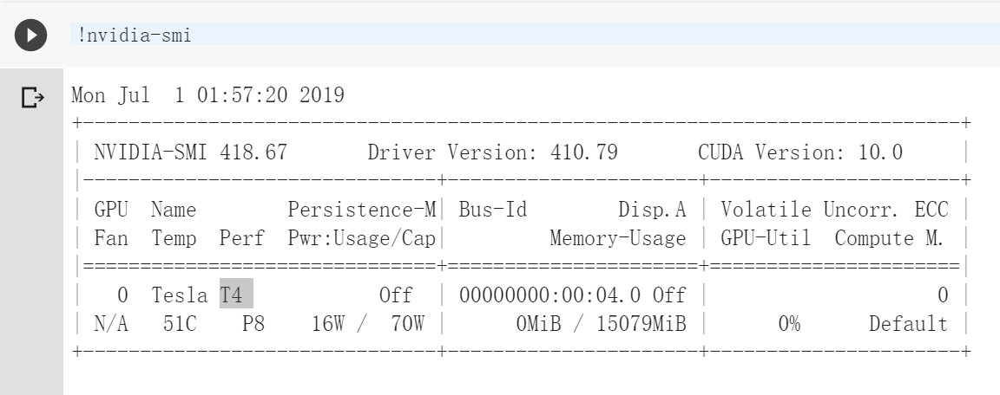
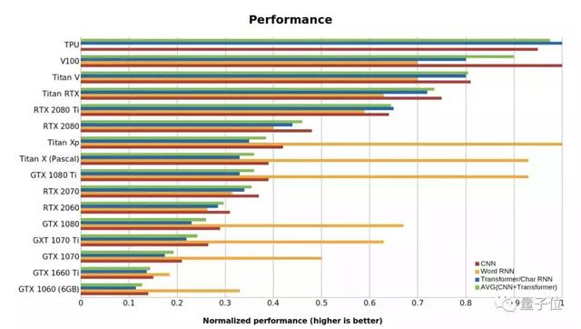
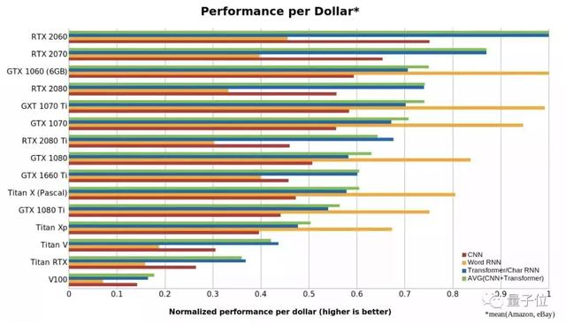
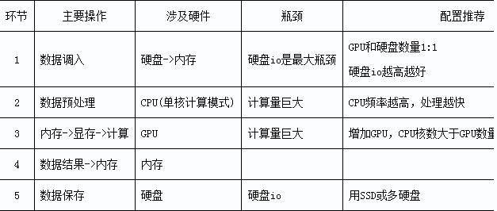

实验室最近要采购一批显卡，需要调研显卡的型号和价格。

## 需求分析

首先说一下需求：

- 首先显卡的用途是科学计算，更具体一点是深度学习，有人做图像，有人做NLP；
- 其次预算有限，得买性价比最好的；
- 然后可能会有很多人要用服务器训练模型。

然后这是戴尔服务器的售后人员发来的建议采购清单：

其中M10：19999￥ P100： 49999￥ V100：59999￥ P40：49999￥

值得一提的是，谷歌的Colab上面用的是这款：

但是一个从事深度学习研究的学长建议我买1080Ti。他好像提都没提过Tesla啊？难道显卡水这么深？

## GPU参数

GPU的性能主要由下面三个主要参数构成：

**计算能力**。通常我们关心的是32位浮点计算能力。当然，对于高玩来说也可以考虑16位浮点用来训练，8位整数来预测。

**内存大小**。神经网络越深，或者训练时批量大小越大，所需要的GPU内存就越多。

**内存带宽**。内存带宽要足够才能发挥出所有计算能力。

此外，针对不同深度学习架构，GPU参数的选择优先级是不一样的，总体来说分两条路线：

**卷积网络和Transformer**：张量核心>FLOPs（每秒浮点运算次数）>显存带宽>16位浮点计算能力

**循环神经网络**：显存带宽>16位浮点计算能力>张量核心>FLOPs

这个排序背后有一套逻辑，下面将详细解释一下。

在说清楚哪个GPU参数对速度尤为重要之前，先看看两个最重要的张量运算：矩阵乘法和卷积。

举个栗子，以运算矩阵乘法A×B=C为例，将A、B复制到显存上比直接计算A×B更耗费资源。也就是说，如果你想用LSTM等处理大量小型矩阵乘法的循环神经网络，显存带宽是GPU最重要的属性。

矩阵乘法越小，内存带宽就越重要。

相反，卷积运算受计算速度的约束比较大。因此，要衡量GPU运行ResNets等卷积架构的性能，最佳指标就是FLOPs。张量核心可以明显增加FLOPs。

Transformer中用到的大型矩阵乘法介于卷积运算和RNN的小型矩阵乘法之间，16位存储、张量核心和TFLOPs都对大型矩阵乘法有好处，但它仍需要较大的显存带宽。

## 性价比分析

下面总结了一张GPU和TPU的标准性能数据，值越高代表性能越好。RTX系列假定用了16位计算，Word RNN数值是指长度<100的段序列的biLSTM性能。

这项基准测试是用PyTorch 1.0.1和CUDA 10完成的。

性价比可能是选择一张GPU最重要的考虑指标。

性价比可能是选择一张GPU最重要的考虑指标。在攻略中，小哥进行了如下运算测试各显卡的性能：

- 用语言模型Transformer-XL和BERT进行Transformer性能的基准测试。
- 用最先进的biLSTM进行了单词和字符级RNN的基准测试。
- 上述两种测试是针对Titan Xp、Titan RTX和RTX 2080 Ti进行的，对于其他GPU则线性缩放了性能差异。
- 借用了现有的CNN基准测试。
- 用了亚马逊和eBay上显卡的平均售价作为GPU的参考成本。
最后，可以得出CNN、RNN和Transformer的归一化性能/成本比值，如下所示：

在上面这张图中，数字越大代表每一美元能买到的性能越强。可以看出， RTX 2060比RTX 2070，RTX 2080或RTX 2080 Ti更具成本效益，**甚至是Tesla V100性价比的5倍以上**。

所以此轮的性价比之王已经确定，是RTX 2060无疑了。

下图是李沐老师画了900和1000系列里各个卡的32位浮点计算能力和价格的对比（价格是wikipedia的推荐价格，真实价格通常会有浮动）。

由于GPU的功耗，散热和体积，需要一些额外考虑。

- 机箱体积
GPU尺寸较大，通常不考虑太小的机箱。而且机箱自带的风扇要好。
- 电源
购买GPU时需要查下GPU的功耗，50w到300w不等。因此买电源时需要功率足够的。
- 主板的PCIe卡槽
推荐使用PCIe 3.0 16x来保证足够的GPU到主内存带宽。如果是多卡的话，要仔细看主板说明，保证多卡一起使用时仍然是16x带宽。（有些主板插4卡时会降到8x甚至4x）

## Tesla为什么那么贵？

英伟达现在有一项非常坑爹的政策，如果在数据中心使用CUDA，那么只允许使用Tesla GPU而不能用GTX或RTX GPU。

由于担心法律问题，研究机构和大学经常被迫购买低性价比的Tesla GPU。**然而，Tesla与GTX和RTX相比并没有真正的优势，价格却高出10倍。**

Nvidia卡有面向个人用户（例如GTX系列）和企业用户（例如Tesla系列）两种。企业用户卡通常使用被动散热和增加了内存校验从而更加适合数据中心。但计算能力上两者相当。**企业卡通常要贵上10倍**。

Tesla显卡那么贵，其实是贵在双精度浮点数运算能力上了，外加一个鸡肋的ECC校验功能，实在不值。

## 总结建议：

**最佳GPU**：RTX 2070

**避免的坑**：所有Tesla、Quadro、创始人版（Founders Edition）的显卡，还有Titan RTX、Titan V、Titan XP

**高性价比**：RTX 2070（高端），RTX 2060或GTX 1060 (6GB)（中低端）

**计算机视觉或机器翻译研究人员**：采用鼓风设计的GTX 2080 Ti，如果训练非常大的网络，请选择RTX Titans

**NLP研究人员**：RTX 2080 Ti

**已经开始研究深度学习**：RTX 2070起步，以后按需添置更多RTX 2070

## 其他配件要求：

- CPU:
因为主要使用显卡进行cuda计算，因此对CPU的要求并不是很高，频率越高、线程数越多越好，一般最低要求cpu核心数大于显卡个数。其中一个制约因素：cpu的最大PCI-E 通道数。每张显卡占用16条pcie通道才能达到最大性能，而单cpu最大支持40条pcie，也就是即使有4个pcie x16接口，只能最多达到2路x16加一路x8，插上的显卡不能发挥全部性能。不过，主板芯片组其实也可以扩充一部分pcie通道。（x99主板可以扩宽2.0的8lanes，z170可以扩充3.0的20lanes）

- 主板:
前面提到了cpu提供的pcie通道数的限制，如果要使用多块显卡，就需要主板提供额外的pcie通道，一般只有服务器级别的主板才会提供扩展pcie通道如x99、x299等主板，但是使用此类主板必须搭配具有该接口的服务器级cpu（xeon系列、i7 7900x以上、i9系列等），如果不需要三块以上的显卡，使用cpu提供的40lane pcie即可。

- 内存：
深度学习需要大量数据，中间计算过程也会临时储存大量数据，一般要求具有显存2~3倍的内存，32G或64G乃至更高。内存频率越高越好。
最低建议32G DDR4 3200MHz内存(16G*2)约2000元，预算宽裕可升级到64G（约4000元）

- 硬盘：
深度学习需要大量数据，和较快的访问速度，一般使用一个较大的固态硬盘作为系统盘和训练数据仓储盘，另外使用hdd机械硬盘作为仓储盘。
建议使用512G以上nVME固态硬盘（800元）搭配几TB(2TB约300元）Hdd作为储存空间

- 电源、机箱：电源其实还是要买个比较稳定的，因为要保证长期稳定运行会有“无休止”的training。一般使用大品牌的经过80PLUS金牌或铂金认证的电源。只搭配一张显卡700w即可，每多一张增加400w。4*titan V大概使用1600w电源。

深度学习实验室共享服务器，7x24小时运行  2080ti或者4titan V ，预算充裕可以专门购置一台高性能多显卡深度学习服务器，24*7小时运行，其他用户可以在自己的笔记本电脑和台式机上编写和初步调试卷积神经网络，本地验证无误后，上传至服务器进行训练任务。这样做可以极大的节省设备开支，最大限度的利用计算资源，也避免了每个用户单独配置复杂的软件环境。