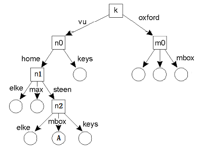
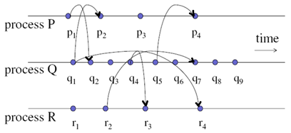
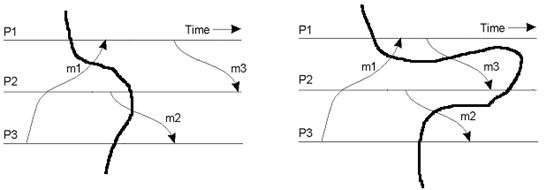

## 第一章作业

### 1. 什么是分布式系统？请举例说明分布式系统的特点。
定义1：分布式系统是多个独立计算机的集合，该系统用户认为它是一个单独的一致的系统
定义2：由在通过消息进行通信和协作操作的网络计算机上的软件硬件部件组成的任何系统
分布式系统的特点：
（1）隐藏性，隐藏了计算机之间的不同，隐藏了计算机之间的通信过程。
（2）统一性和一致性，无论何时何地，用户都采用统一和一致的方法访问分布式系统。
（3）可扩展性，隐藏一个独立的计算机如何参与系统的运作；在系统的一部分不能工作的情况下整个系统仍然能持续提供服务；当系统的某些部件被替换或被修改或是系统提供了新的服务时，不应让用户注意到这些改变。
（4）并发性，在共享资源的情况下，协调不同的程序并发执行。
（5）没有全局时钟，很难在网络中精确地同步所有的时钟，更重要的是发现动作发生的先后顺序。
举例部分略。

### 2. 有一个简单的C/S系统，此系统只用一台服务器来响应所有客户的请求。
（1）请解释为什么在这种情况下不能对服务器的响应时间进行限制（例如，这个限制可能是要求服务器一定要在10ms内对客户的请求进行响应）；
因为服务器过于简单，处理能力差，对于多线程高并发情况，当服务器发生堵塞时造成的服务等待问题会造成服务器响应不及时的情况。并且一台服务器性能有限，不能保证服务端高效性和高的容错性。因此在这种情况下不能对服务器的响应时间进行限制。

（2）如果我们想限制服务器的响应时间，应该如何修改设计？
可以通过增加服务器的数量或提高服务器的处理能力。

（3）在现实世界中使用的系统中，这种限制是否是必须的？为什么？
是必须的。因为如果不加限制，那么就会导致用户使用系统的体验降低，从而放弃这个系统。

### 3. 当年12306订票系统在2011年第一次上线的时候出现了很多的问题。如果你是12306的设计师，请问应该注意哪几个方面的内容？
（答案略）

## 第二章作业

### 1.	网络协议分层有什么好处？
每层协议可以单独设计，只依赖于底层协议工作，增加了灵活性。

### 2.	一个客户向服务器发出RPC。客户花5ms时间计算每个请求的参数，服务器花10ms处理每个请求。本地操作系统每次发送和接收的时间是5ms，网络传递或者应答消息的时间是3ms。编码、解码每个消息需要0.5ms。计算一个 RPC实现所需要的时间。
答：
5ms 准备参数
0.5ms 打包参数
5ms 发送
3ms 网络传送
5ms 接收
0.5ms 解包参数
10ms 处理请求
0.5ms 结果打包
5ms 发送
3ms 网络传送
5ms 接收
0.5ms 解包结果
共43ms

### 3.	举例说明RPC在异构系统中实现时进行参数传递会遇到什么问题？
（例子见PPT，略）

### 4.	暂时通信和永久通信有什么区别？
(答案见PPT)

### 5.	什么是复杂流？如何实现复杂流同步？
(答案见PPT)

## 第三章作业

### 1. 设计一个并发服务器，它为每个到来的请求创建一个服务器进程。请分析这种设计与多线程服务器之间的利弊。
多线程服务器实现了并发性并可以充分利用服务器端的资源。虽然采用多进程的方式可以获得这些好处，但是进程的创建和消亡需要更大的开销，进程之间的通信也比一个进程内部多个线程之间的开销大。

### 2. 假设一个单线程服务器需要花6ms的时间接受一个请求，并使用20ms的时间计算出请求结果并将结果返回。请问，对于一个拥有10个CPU的服务器，若同时到来4个请求，则
（1）如果使用单线程服务器，需要多少时间完成这4个请求？（2）如果设计一个dispatcher/worker形式的多线程服务器，需要dispatcher线程在接受请求后多耗费1ms进行任务的分配工作。使用此多线程服务器，一个CPU专门负责执行dispatcher线程，最短需要多少时间能够将这些请求处理完？（线程创建的开销和线程之间传递数据的时间忽略不计）
答:
(1)	因为只有一个线程，所以四个请求串行完成，一共需要（6ms+20ms）*4=26ms*4=104ms
(2)	因为有10个CPU，所以可以dispatcher占用一个CPU，余下的四个worker线程各占用一个CPU。所以一共需要：（6ms+1ms）*4+20ms=28ms+20ms=48ms

### 3. 迭代服务器和并发服务器有何区别？
迭代服务器负责处理请求并将结果返回给客户端。并发服务器本身并不处理客户端的请求，它将请求发送给一个线程或者进程，并等待下一个请求。
### 4. 如果要设计一个购物网站，在进行服务器设计的时候应该采用有状态服务器还是无状态服务器？说明你做出此种的选择的原因。
采用有状态服务器。因为有状态服务器维护客户信息，如果服务器失败，其上的所有状态必须恢复。在购物时，服务器需要记录客户很多的相关信息。

### 5. 什么是软件代理？若要设计一个个人秘书系统，希望根据用户的需求搜集用户感兴趣的信息，可以选择怎样的软件代理实现什么样的功能（至少设计出3个功能）
软件代理是一个自治的进程，能够在其所在环境中创建并初始化变化，并可以与用户或者其他代理进行协作。
可以选择的代理，比如接口代理，可以提供用户使用方便舒适的接口；或者选择数据代理，可以为用户提供数据的分类和过滤等等。

### 6. (8分)假设处理器P有一个新任务T，可以有下面的三个算法来实现处理器任务分配
算法A：
（i）搜集所有处理器（包括P自己）的负载信息；
（ii）选择负载最低的处理器，并将任务分配给负载最低的处理器；
（iii）算法结束。
算法B:
（i）随机选择一个处理器Q，询问其负载情况;
（ii）若Q欠载，则将T分配给Q，算法结束；
（iii）否则继续执行（i）
算法C:
（i）随机选择一个处理器Q，询问其负载情况;
（ii）若Q欠载，则将T分配给Q，算法结束； 
（iii）否则，如果已经执行（i）K次，则将T留在本地执行，否则继续执行（i）
请问：
（1）（2分）上面三个算法哪个是确定性算法？哪个是启发式算法？
算法A是确定性算法，B和C是启发式算法。
（2）（4分）算法B和算法C很相似，请问哪个算法可行性更强？为什么？
算法B有可能不能在有限步骤内结束，因此是个错误的算法。而算法C则可以在有限步骤内结束，可行性强。
（3）（2分）算法C是否还可以优化？
可以有各种优化方式。比如，只有在本地机器过载的情况下才开始询问其他机器；或者用多播机制发送K个消息询问K台机器的负载情况，然后选择负载最小的机器执行进程。

## 第四章作业

### 1. 在分布式系统中，扁平式命名方式（flat naming）和名字空间的命名方式（name space）的主要区别是什么？
扁平式命名方式使用ID唯一表示实体，没有结构，不包含任何关于如何定位实体访问点的任何信息。
名字空间是一个有标签的有向图，它是结构化的名字。

### 2. 在扁平式命名方式中使用的层次化方法来定位一个实体的时候，为什么其插入和查找可以体现局部性？
因为在层次化方法中，网络被分为了若干个域，顶层与扩展整个网络，每个域切分为多个更小的域，每个域D中的每个实体E都在dir(D)中有位置记录。因此在修改或者查找的时候，所有的操作都可以在饱含了操作发起点和目标点的最小域里解决，因此体现了局部性。

### 3. 在图中给出的名字空间中，请为标记为A的实体给出一个绝对路径名和任意一个相对路径名。

绝对路径名：k: /vu/home/steen/mbox
相对路径名：n0: /home/steen/mbox

### 4. 为什么缓存可以提升名字服务的可用性？
名字解析过程中，很多步骤的结果都是不变化的，因此使用缓存可以大大提升名字服务的可用性。

### 5. 为什么要删除不被引用的实体？请解释纯粹采用引用图的方式来解决这个问题时会遇到什么问题？
因为删除无引用实体可以节省资源。
当纯粹采用引用图方式解决问题时，很难维护一个全局的引用图，并且需要确定根集，由根集负责发起算法，这些集中式的特点不适用于分布式系统的扩展性。

### 6. 什么是幂等操作？为什么在删除不被引用的实体的时候采用引用列表方式来可以利用到幂等操作的特性，而采用简单引用计数的方法就不可以？
一个操作多次执行的结果和一次执行的结果是一样的，不会因为多次执行而产生副作用。
使用简单计数法时计数增加和减少的操作都不是幂等操作；而采用引用列表时插入和删除操作都是幂等操作。因此在分布式系统中因为通信的不可靠性的存在，幂等操作的存在可以非常适应。

### 7. 在使用标记不可达对象的跟踪方案删除不被引用的实体时，可以使用两个方案：一个是从根集出发，标记所有可达实体，从而删除所有不可达实体；一个是采用组内跟踪方案，先在一个进程组中标记所有外部可达实体，删除垃圾，然后再扩大组的范围。请解释这两种方案各有何利弊。

第一种方法伸缩性很差，因为需要跟踪分布式系统中的所有对象，是个集中式算法。
第二种方法可以适应于分布式系统，可以解决伸缩性问题

## 第五章作业

### 1. Cristian算法和Berkeley算法哪一个算法可以保证系统中所有的时钟可以与UTC一致？ 
答：只有Cristian算法维持了一个拥有WWV接收器的Time server，让所有其他的机器与Time server一致。而Berkeley算法只是维持所有机器时间一致。

### 2. 在下图中，有三个进程，每个进程上的圆点表示这个进程上发生的事件，事件之间的有箭头的线表示一个消息的发送和接收，请在括号中写出下面四对事件之间的关系【用a -> b表示事件a与事件b有happens before关系，否则用a x b表示事件a和b之间没有happens before关系】

（1）P1和q1	【    p1 x q1           】
（2）p4和q4	【    q4 -> p4           】
（3）p1和r4 	【    p1 -> r4           】
（4）P4和r1	【    p4 x r1           】
 
### 3. （分）下面的两个全局快照的切口是否是一致的切口？
 
   			（a）											（b）
（a）是一致的切口
（m1）p3已发送给p1的消息，p1还未接收到；（m2）p2已发送给p3的消息，p3还未收到；（m3）代表的事件还未发生。
（b）是不一致的切口
（m1）p3已发送给p1的消息，p1还未接收到，此事件没有问题；（m2）p2已发送给p3的消息，p3还未接收到，此事件也没有问题；（m3）p2已接收到p1给其发送的消息，而p1还未发送该消息，不符合事情发展的顺序，因此图（b）不是一致的切口。

### 4. （分）假设有一个事务用于在一个银行的两个账户A和B之间进行转账100元钱。写法如下：
Begin-Transaction
A=A-100;
B=B+100;
End-Transaction
请使用这个例子来说明一个事务的ACID特性。

事物的ACID特性为：原子性（A）、一致性（C）、独立性（I）、永久性（D）
（1）原子性：Begin-Transaction和End-Transaction之间的操作要么全部正常执行完毕，要么不执行，若中间该事物出现错误需要全部回滚到Begin-Transaction之前的状态
（2）一致性：一个事物不能破坏系统的一致性，事务发生之前、之后系统应该维持一个稳定的平衡状态，在此例中，银行的总资产可看作是这个稳定的平衡状态（系统的一致性），即A+B的和维持不变
（3）独立性：例如与此例一同并发的还有另一个事务：
Begin-Transaction
A=A+B*0.1;
C=C-B*0.1;
End-Transaction
两个事务并发，第一个事务的第二条语句执行之前和执行之后B的值是不一样的，这样就导致了最终第二个事务执行之前和之后A+C的值不一样。这就导致一个事务的执行影响了另一个事务的执行结果，独立性没有了。
（4）永久性：事务中的操作成功执行完毕后事务便会提交，提交所带来的变化是永久性的。

### 5. 为实现事务回滚，请分析Private Workspace方法和Writeahead Log方法分别应该在怎样的环境下使用。
Private workspace应该在事务冲突很多发生的时候使用，而writeahead log应该在事务冲突发生很少的时候使用。

### 6. 什么是串行性？
如果多个事务的并发执行结果与所有事务按照某个顺序串行执行是一样的，那么就是串行一致的。并发事务的调度要符合串行性就是正确的调度。

### 7. 请举例说明为何2PL方法会导致死锁？
如果有两个事务用相反的顺序申请两个共享数据A和B，采用2PL的方法，如果第一个事务先访问了A，于是给A加锁；然后第二个事务访问了B，于是给B加锁。再后来两个事务就都不能执行下去，因为都申请不到下一个数据的锁，导致死锁。

### 8.为什么会出现假死锁？请举例说明。
在用一台机器（协调者）维护整个系统的资源图，来描述进程和资源关系时，协调者检测出循环则认为是死锁。机器之间的消息传递有延时，可能会造成先发送的消息后收到，如课件中的例子：首先B想要归还资源R，随后发生B申请资源T，但后一条消息首先到达Coordinator，Coordinator增加了一条B-> T的边，此时本应该没有R->B，由于还未收到该消息，Coordinator判断资源图有循环，呈现假死锁状态。

## 第六章作业

### 1. 在分布式系统中为什么要对一些实体建立副本？
可靠性：分布在各个机器上的备份可以防止其中某几台机器文件的损坏甚至宕机带来的影响；
性能：建立副本性能上得以提升，获取资源可以从地域近的、不繁忙的机器上获取需要的数据，减少通信的开销，实现负载均衡；
容错：由于其可大大降低单机文件损坏的影响，因此其容错性高
### 2. 为何严格的一致性模型在分布式系统中很难实现？
由于严格一致性需要每个读操作都返回最新的写操作的结果，因此需要存在全局的时钟来确定哪个操作时最新的写操作。这在分布式系统中是很难实现的。

### 3. 假设在一个分布式系统中有下面四个进程：
P1：a=5；a=6；
P2：a=7；
P3：printf(a); printf(a); printf(a);
P4: printf(a); printf(a); printf(a);
最后P3和P4的运行结果都是6 5 7。
请问这个运行结果在顺序一致性模型中是可以接受的吗？为什么？
顺序一致性不能够接受这个结果，因为这个结果不符合P1的程序中语句的执行次序。

### 4.请写出在维护副本一致性的时候进行修改传播的三种方法。
三种方法是：
（1）传播无效性消息
（2）传播修改了的数据
（3）传播修改操作

### 5.为了实现副本的一致性可以采用push的协议，也可以使用pull的协议。请问两种协议都适用于哪种类型的系统
push的协议会把修改积极推送到各个副本上。在这种情况下，服务器需维护副本的信息，在读写频率高时性能较好，免去了多个副本不断询问的开销；
pull的协议副本向服务器轮询是否有修改，当读写频率低时使用较好，不用维护副本信息表，服务器开销小。

### 6.（8分）假设在网络中为了提升数据的有效性，为一个数据保存了10个副本。若使用基于法定数量的数据一致性策略，学生A、B、C采用了不同的方案。学生A的方案为读法定数量为1，写法定数量为9；学生B的方案为读法定数量为6，写法定数量为5；学生C的方案为读法定数量为2，写法定数量为9。请回答：（1）这三个方案中哪个方案是正确的？
（2）对于每种错误的方案给出一个例子说明错误发生的原因。
（1）三个方案中C的是正确的
（2）如果按照A的方案，读法定数量为1，写法定数量为9，读者会读到一个旧版本的数据；如果按照C的方案，读法定数量为6，写法定数量为5，读者永远读不到6个版本一致的数据。

